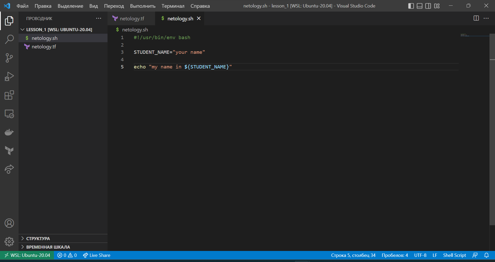

## Задание 1. Подготовка рабочей среды.

Вы пришли на новое место работы или приобрели новый компьютер. Первым делом надо настроить окружение для дальнейшей работы.

1. Установить [Py Charm Community Edition](https://www.jetbrains.com/ru-ru/pycharm/download/) - это бесплатная версия IDE.
В качестве альтернативы можно установить [Visual Studio Code](https://code.visualstudio.com/Download) и дальнейшие шаги проделать с ним. Таким образом вы сможете выбрать для себя более удобный инструмент.

2. Установить плагины:

- Terraform,
- MarkDown,
- Yaml/Ansible Support,
- Jsonnet.

3. Склонировать текущий репозиторий (команда `git clone`) или просто создать файлы для проверки плагинов:

- [netology.tf](https://github.com/netology-code/sysadm-homeworks/blob/devsys10/01-intro-01/netology.tf) – terraform,
- [netology.sh](https://github.com/netology-code/sysadm-homeworks/blob/devsys10/01-intro-01/netology.sh) – bash,
- [netology.md](https://github.com/netology-code/sysadm-homeworks/blob/devsys10/01-intro-01/netology.md) – markdown,
- [netology.yaml](https://github.com/netology-code/sysadm-homeworks/blob/devsys10/01-intro-01/netology.yaml) – yaml,
- [netology.jsonnet](https://github.com/netology-code/sysadm-homeworks/blob/devsys10/01-intro-01/netology.jsonnet)  – jsonnet.

4. Убедитесь, что работает подсветка синтаксиса.

*В качестве выполненного задания приведите скриншоты установленной IDE с плагинами в файле readme.md собственного репозитория в GitHub или в Google Doc*

## Ответ 1. Подготовка рабочей среды

- terraform 
- bash 
- markdown 
- yaml 
- jsonnet 

----

## Задание 2. Описание жизненного цикла задачи (разработки нового функционала)

Чтобы лучше понимать предназначение дальнейших инструментов, с которыми нам предстоит работать, давайте 
составим схему жизненного цикла задачи в идеальном для вас случае.

### Описание истории

Представьте, что вы работаете в стартапе, который запустил интернет-магазин. Ваш интернет-магазин достаточно успешно развивался, и вот пришло время налаживать процессы: у вас стало больше конечных клиентов, менеджеров и разработчиков.Сейчас от клиентов вам приходят задачи, связанные с разработкой нового функционала. Задач много, и все они требуют выкладки на тестовые среды, одобрения тестировщика, проверки менеджером перед показом клиенту. В случае необходимости, вам будет необходим откат изменений. 

### Решение задачи

Вам необходимо описать процесс решения задачи в соответствии с жизненным циклом разработки программного обеспечения. Использование какого-либо конкретного метода разработки не обязательно. Для решения главное - прописать по пунктам шаги решения задачи (релизации в конечный результат) с участием менеджера, разработчика (или команды разработчиков), тестировщика (или команды тестировщиков) и себя как DevOps-инженера. 

*Ответ приведите в свободной форме*

## Ответ 2. Описание жизненного цикла задачи (разработки нового функционала)

1. Анализ полученной задачи с командой разработки.
2. Согласовать с командами разработчиков и тестировщиков процесс тестирования.
3. Подготовить тестовую среду (максимально приближенную к production.) (Например: виртуальные машины)
4. Подготовить механизм отката (Например: делать backup'ы)
5. Организовать доставку кода до тестовых сред (Например: Jenkins)
6. Согласовать с менеджером процесс демонстрации нового функционала (Например: демо стенд)
7. Организовать доставку протестированного кода на демо стенд
8. Организовать доставку протестированного кода на production