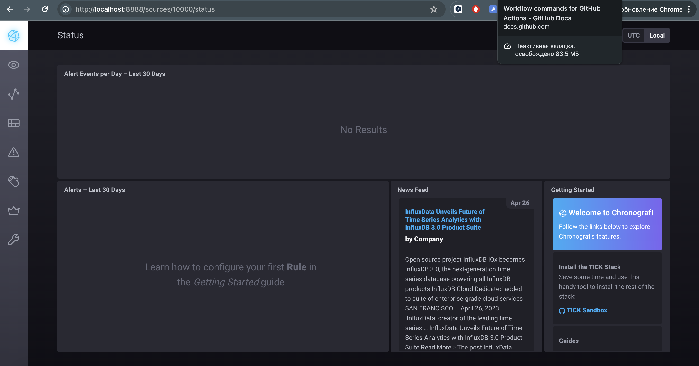
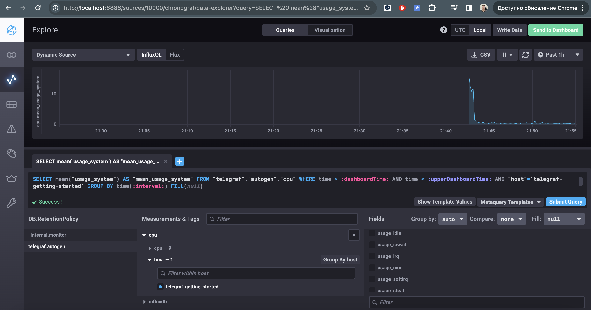
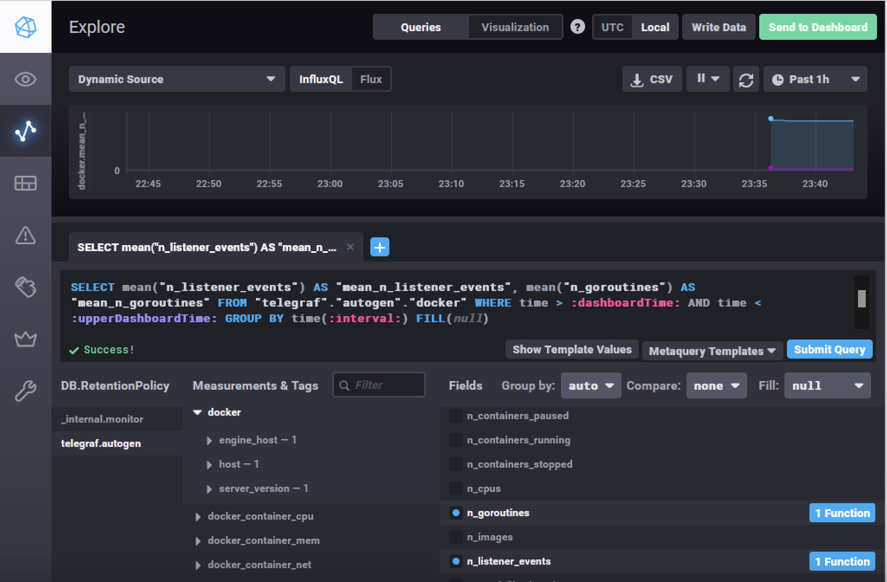

# Домашнее задание к занятию 13 «Введение в мониторинг»

## Обязательные задания

1. Вас пригласили настроить мониторинг на проект. На онбординге вам рассказали, что проект представляет из себя платформу для вычислений с выдачей текстовых отчётов, которые сохраняются на диск. 
Взаимодействие с платформой осуществляется по протоколу http. Также вам отметили, что вычисления загружают ЦПУ. Какой минимальный набор метрик вы выведите в мониторинг и почему?

### Ответ:
---

- **CPU Usage**: Поскольку вычисления интенсивно используют ЦПУ, важно отслеживать загрузку ЦПУ, чтобы определить, не становится ли система узким местом на этом уровне.
  
- **RAM Usage**: Мониторинг использования оперативной памяти необходим для определения, достаточно ли памяти для текущих вычислений.
  
- **Disk Usage и Inode Usage**: Поскольку отчеты сохраняются на диск, важно следить за доступным пространством и использованием inodes, чтобы избежать ошибок из-за нехватки дискового пространства.
- **HTTP Response Time**: Мониторинг времени ответа HTTP-запросов позволяет оценить производительность и доступность платформы.
- **Error Rates**: Отслеживание ошибок, возникающих при обработке запросов, чтобы быстро реагировать на возможные проблемы в приложении
---

2. Менеджер продукта, посмотрев на ваши метрики, сказал, что ему непонятно, что такое RAM/inodes/CPUla. Также он сказал, что хочет понимать, насколько мы выполняем свои обязанности перед клиентами и какое качество обслуживания. Что вы можете ему предложить?

### Ответ:
---
Объяснение технических терминов:
- **CPUla**: Обозначение загрузки ЦПУ (CPU Load Average). Это показатель, который отражает среднюю загрузку процессора за определенный период времени.
- **RAM**: Это оперативная память, используемая для временного хранения данных, которыми оперирует процессор во время выполнения программ.
- **Inodes**: Это структуры данных на файловой системе, которые содержат информацию о файлах и каталогах.
Важно провести сессию или серию встреч, на которых подробно разъяснить эти и другие технические понятия, используемые в мониторинге. Это поможет менеджеру лучше понять, как эти параметры влияют на работу платформы и качество обслуживания.

Введение SLA и KPI:
- **Service Level Agreement (SLA)**: Определить вместе с менеджером ключевые показатели (KPI), которые будут отражать обязательства перед клиентами. Это могут быть такие параметры, как процент доступности сервиса, время отклика на запросы, и процент успешно обработанных запросов.
- **Key Performance Indicators (KPIs**): Разработать и внедрить систему отслеживания KPI, которые помогут оценить качество обслуживания и производительность сервиса.

Примеры KPI могут включать:
- **Время ответа на запросы (Response Time)**: среднее, максимальное и минимальное время ответа на HTTP-запросы.
Процент успешных запросов (Success Rate): доля запросов, которые завершились статусом 2xx.
- **Доступность сервиса (Uptime)**: процент времени, когда сервис доступен для использования без сбоев.
  
Разработка дашбордов и отчетов:

- Создать дашборды, которые наглядно показывают текущее состояние и тренды по основным показателям. Эти дашборды должны быть легко понятны и доступны для менеджеров.
- Регулярно готовить отчеты, которые детализируют выполнение SLA и изменения в KPI. Отчеты могут включать анализ причин отклонений и рекомендации по улучшению сервиса.

Обратная связь и адаптация:
- Установить регулярный процесс сбора обратной связи от менеджера продукта и других заинтересованных сторон для постоянного улучшения мониторинга и отчетности.
- Быть готовым к тому, чтобы адаптировать метрики и методы отчетности в соответствии с изменяющимися потребностями бизнеса и клиентов.

---

1. Вашей DevOps-команде в этом году не выделили финансирование на построение системы сбора логов. Разработчики, в свою очередь, хотят видеть все ошибки, которые выдают их приложения. Какое решение вы можете предпринять в этой ситуации, чтобы разработчики получали ошибки приложения?

### Ответ:
---
- **Локальное Хранение Логов**: Разработать систему, в которой логи будут сохраняться локально на серверах, где выполняются приложения. Это базовое решение поможет хранить логи без значительных затрат.
- **Использование Открытых Решений**: Рассмотреть использование открытых и бесплатных инструментов для сбора и агрегации логов, например, ELK Stack (Elasticsearch, Logstash, Kibana), который может быть развернут с минимальными затратами на существующих серверах.
---

4. Вы, как опытный SRE, сделали мониторинг, куда вывели отображения выполнения SLA = 99% по http-кодам ответов. 
Этот параметр вычисляется по формуле: summ_2xx_requests/summ_all_requests. Он не поднимается выше 70%, но при этом в вашей системе нет кодов ответа 5xx и 4xx. Где у вас ошибка?

### Ответ:
---
Скорей всего проблема в том, что не учитываются 1хх и 3хх коды. Правильная формула должна быть такой:
```
(summ_2xx_requests + summ_1xx_requests + summ_3xx_requests)/summ_all_requests
```
---

5. Опишите основные плюсы и минусы pull и push систем мониторинга.
### Ответ:
---
#### Pull системы
Плюсы:

- Контроль: Централизованный сервер сам запросит данные у мониторинговых агентов, что обеспечивает больший контроль над периодичностью и точностью сбора данных.
- Безопасность: Обычно безопаснее, так как агенты не нуждаются в открытии внешних портов для отправки данных.
- Конфигурация: Легче управлять конфигурацией, поскольку большинство настроек централизовано.
  
Минусы:

- Масштабируемость: Может страдать масштабируемость при большом количестве узлов, так как центральный сервер должен активно опрашивать каждый узел.
- Латентность: Может возникать задержка в отображении данных из-за интервала опроса.
  
#### Push системы
Плюсы:

- Масштабируемость: Хорошо масштабируются, так как нагрузка по передаче данных распределена между узлами.
- Текущие данные: Данные обновляются в реальном времени, уменьшая задержку между получением метрики и её отображением.

Минусы:

- Безопасность: Требует, чтобы агенты имели возможность отправлять данные на сервер, что может включать настройку файрволов и безопасности.
- Управление: Может быть сложнее управлять настройками агентов, так как каждый агент конфигурируется индивидуально.

---

6. Какие из ниже перечисленных систем относятся к push модели, а какие к pull? А может есть гибридные?

    - Prometheus 
    - TICK
    - Zabbix
    - VictoriaMetrics
    - Nagios

### Ответ:
---
- Prometheus — Pull: Prometheus по умолчанию использует модель pull для сбора метрик, хотя может поддерживать push через "pushgateway" для сценариев, где устройства не могут быть опрошены напрямую.
- TICK (Telegraf, InfluxDB, Chronograf, Kapacitor) — Push: Основной компонент Telegraf собирает данные и отправляет их в InfluxDB, используя push-модель.
- Zabbix — Гибрид: Zabbix может использовать как push, так и pull модели. Агенты Zabbix могут как активно отправлять данные на сервер (push), так и отвечать на запросы сервера (pull).
- VictoriaMetrics — Гибрид: Использует как pull, так и push подходы. Может собирать метрики с Prometheus'а в режиме pull, а также принимать данные через push.
- Nagios — Pull: Настроен на активное опрашивание узлов для проверки их состояния, что соответствует pull-модели, хотя через NRPE (Nagios Remote Plugin Executor) возможно и push-взаимодействие.

---


7. Склонируйте себе [репозиторий](https://github.com/influxdata/sandbox/tree/master) и запустите TICK-стэк, 
используя технологии docker и docker-compose.

В виде решения на это упражнение приведите скриншот веб-интерфейса ПО chronograf (`http://localhost:8888`). 

P.S.: если при запуске некоторые контейнеры будут падать с ошибкой - проставьте им режим `Z`, например
`./data:/var/lib:Z`

### Ответ:
---


---

8. Перейдите в веб-интерфейс Chronograf (http://localhost:8888) и откройте вкладку Data explorer.
        
    - Нажмите на кнопку Add a query
    - Изучите вывод интерфейса и выберите БД telegraf.autogen
    - В `measurments` выберите cpu->host->telegraf-getting-started, а в `fields` выберите usage_system. Внизу появится график утилизации cpu.
    - Вверху вы можете увидеть запрос, аналогичный SQL-синтаксису. Поэкспериментируйте с запросом, попробуйте изменить группировку и интервал наблюдений.

### Ответ:
---

---

1. Изучите список [telegraf inputs](https://github.com/influxdata/telegraf/tree/master/plugins/inputs). 
Добавьте в конфигурацию telegraf следующий плагин - [docker](https://github.com/influxdata/telegraf/tree/master/plugins/inputs/docker):
```
[[inputs.docker]]
  endpoint = "unix:///var/run/docker.sock"
```

Дополнительно вам может потребоваться донастройка контейнера telegraf в `docker-compose.yml` дополнительного volume и 
режима privileged:
```
  telegraf:
    image: telegraf:1.4.0
    privileged: true
    volumes:
      - ./etc/telegraf.conf:/etc/telegraf/telegraf.conf:Z
      - /var/run/docker.sock:/var/run/docker.sock:Z
    links:
      - influxdb
    ports:
      - "8092:8092/udp"
      - "8094:8094"
      - "8125:8125/udp"
```

После настройке перезапустите telegraf, обновите веб интерфейс и приведите скриншотом список `measurments` в 
веб-интерфейсе базы telegraf.autogen . Там должны появиться метрики, связанные с docker.
### Ответ:
---

---