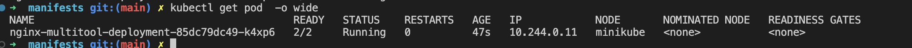
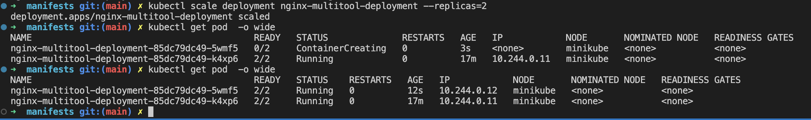
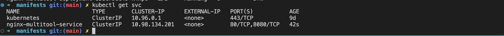
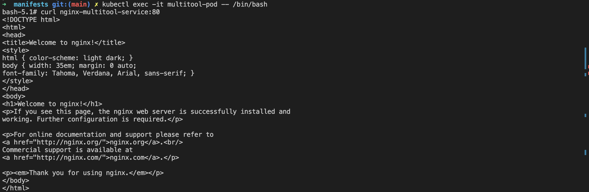
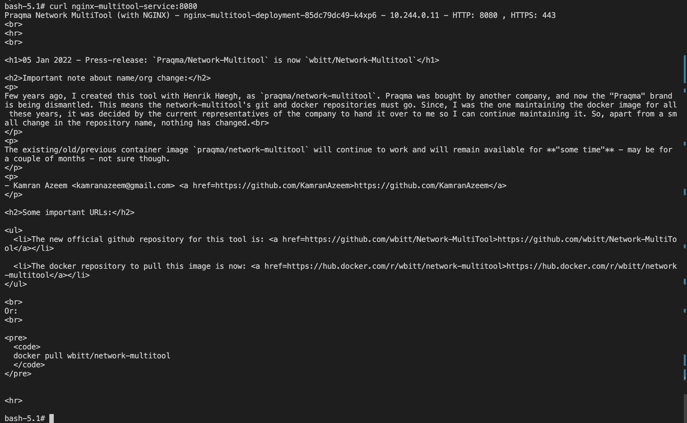
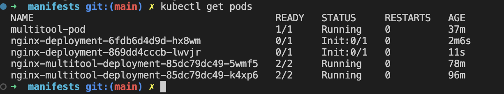
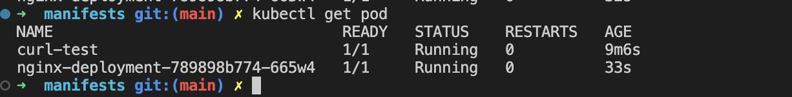

# Домашнее задание к занятию «Запуск приложений в K8S»


### Задание 1. Создать Deployment и обеспечить доступ к репликам приложения из другого Pod

1. Создать Deployment приложения, состоящего из двух контейнеров — nginx и multitool. Решить возникшую ошибку.
2. После запуска увеличить количество реплик работающего приложения до 2.
3. Продемонстрировать количество подов до и после масштабирования.
4. Создать Service, который обеспечит доступ до реплик приложений из п.1.
5. Создать отдельный Pod с приложением multitool и убедиться с помощью `curl`, что из пода есть доступ до приложений из п.1.

### Ответ:
---

1. Причина почему не запускался контейнер. Файл [deployment.yaml](assets/manifests/deployment.yaml)

`kubectl logs nginx-multitool-deployment-684b6c6cbf-6vgts -c multitool`

<details>

<summary>Log</summary>

```log
The directory /usr/share/nginx/html is not mounted.
Therefore, over-writing the default index.html file with some useful information:
Praqma Network MultiTool (with NGINX) - nginx-multitool-deployment-684b6c6cbf-6vgts - 10.244.0.10 - HTTP: 80 , HTTPS: 443

========================= IMPORTANT ==============================


# Press-release: `Praqma/Network-Multitool` is now `wbitt/Network-Multitool`

## 05 Jan 2022 - Important note about name/org change:
Few years ago, I created this tool with Henrik Høegh, as `praqma/network-multitool`. Praqma was bought by another company, and now the "Praqma" brand is being dismantled. This means the network-multitool's git and docker repositories must go. Since, I was the one maintaining the docker image for all these years, it was decided by the current representatives of the company to hand it over to me so I can continue maintaining it. So, apart from a small change in the repository name, nothing has changed. 

The existing/old/previous container image `praqma/network-multitool` will continue to work and will remain available for **"some time"** - may be for a couple of months - not sure though. 

- Kamran Azeem <kamranazeem@gmail.com> [https://github.com/KamranAzeem](https://github.com/KamranAzeem)


## Some important URLs:
* The new official github repository for this tool is: [https://github.com/wbitt/Network-MultiTool](https://github.com/wbitt/Network-MultiTool)
* The docker repository to pull this image is now: [https://hub.docker.com/r/wbitt/network-multitool](https://hub.docker.com/r/wbitt/network-multitool)

Or:

docker pull wbitt/network-multitool


==================================================================

2024/05/20 12:42:58 [emerg] 1#1: bind() to 0.0.0.0:80 failed (98: Address in use)
nginx: [emerg] bind() to 0.0.0.0:80 failed (98: Address in use)
2024/05/20 12:42:58 [emerg] 1#1: bind() to 0.0.0.0:80 failed (98: Address in use)
nginx: [emerg] bind() to 0.0.0.0:80 failed (98: Address in use)
2024/05/20 12:42:58 [emerg] 1#1: bind() to 0.0.0.0:80 failed (98: Address in use)
nginx: [emerg] bind() to 0.0.0.0:80 failed (98: Address in use)
2024/05/20 12:42:58 [emerg] 1#1: bind() to 0.0.0.0:80 failed (98: Address in use)
nginx: [emerg] bind() to 0.0.0.0:80 failed (98: Address in use)
2024/05/20 12:42:58 [emerg] 1#1: bind() to 0.0.0.0:80 failed (98: Address in use)
nginx: [emerg] bind() to 0.0.0.0:80 failed (98: Address in use)
2024/05/20 12:42:58 [emerg] 1#1: still could not bind()
nginx: [emerg] still could not bind()
```
</details>

Решение добавить переменную `HTTP_PORT` к контейнеру `multitool`

2. увеличить количество реплик работающего приложения до 2. Количество подов до и после масштабирования. Команда для увелечения реплик `kubectl scale deployment nginx-multitool-deployment --replicas=2`

   

   

3. Создать Service [service.yaml](assets/manifests/service.yaml)
   
   

4. Создать отдельный Pod с приложением multitool [pod.yaml](assets/manifests/pod.yaml)

  

  
---


### Задание 2. Создать Deployment и обеспечить старт основного контейнера при выполнении условий

1. Создать Deployment приложения nginx и обеспечить старт контейнера только после того, как будет запущен сервис этого приложения.
2. Убедиться, что nginx не стартует. В качестве Init-контейнера взять busybox.
3. Создать и запустить Service. Убедиться, что Init запустился.
4. Продемонстрировать состояние пода до и после запуска сервиса.

### Ответ:
---
Файлы [nginx-deployment.yaml](assets/manifests/nginx-deployment.yaml), [nginx-service.yaml](assets/manifests/nginx-service.yaml)



