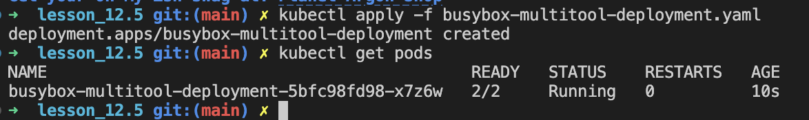
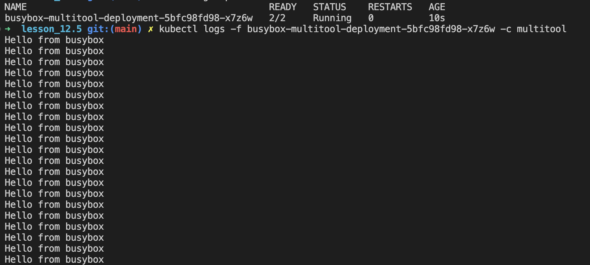
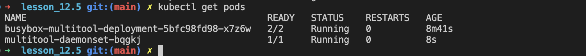
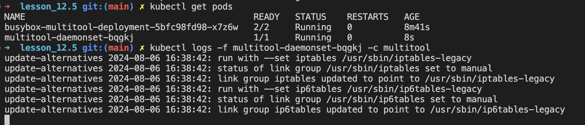

# Домашнее задание к занятию «Хранение в K8s. Часть 1»

### Цель задания

В тестовой среде Kubernetes нужно обеспечить обмен файлами между контейнерам пода и доступ к логам ноды.

### Задание 1 

**Что нужно сделать**

Создать Deployment приложения, состоящего из двух контейнеров и обменивающихся данными.

1. Создать Deployment приложения, состоящего из контейнеров busybox и multitool.
2. Сделать так, чтобы busybox писал каждые пять секунд в некий файл в общей директории.
3. Обеспечить возможность чтения файла контейнером multitool.
4. Продемонстрировать, что multitool может читать файл, который периодоически обновляется.
5. Предоставить манифесты Deployment в решении, а также скриншоты или вывод команды из п. 4.

### Ответ:

---
[Deployment](kube/busybox-multitool-deployment.yaml) манифест создает два контейнера: busybox и multitool, которые обмениваются данными через общий том.



Проверка логов:
```sh
kubectl logs -f <pod-name> -c multitool
```



Здесь `<pod-name>` - это имя pod-а, которое можно получить с помощью команды `kubectl get pods -l app=multitool`.

---

### Задание 2

**Что нужно сделать**

Создать DaemonSet приложения, которое может прочитать логи ноды.

1. Создать DaemonSet приложения, состоящего из multitool.
2. Обеспечить возможность чтения файла `/var/log/syslog` кластера MicroK8S.
3. Продемонстрировать возможность чтения файла изнутри пода.
4. Предоставить манифесты Deployment, а также скриншоты или вывод команды из п. 2.

### Ответ:

---
[DaemonSet](kube/multitool-daemonset.yaml) манифест запускает контейнер multitool на каждой ноде и предоставляет доступ к файлу `/var/log/alternatives.log`. (я использую `minikube` в нем есть `/var/log/alternatives.log`)



Проверка логов:
```sh
kubectl logs -f <pod-name> -c multitool
```



Здесь `<pod-name>` - это имя pod-а, которое можно получить с помощью команды `kubectl get pods -l app=multitool`.

---


