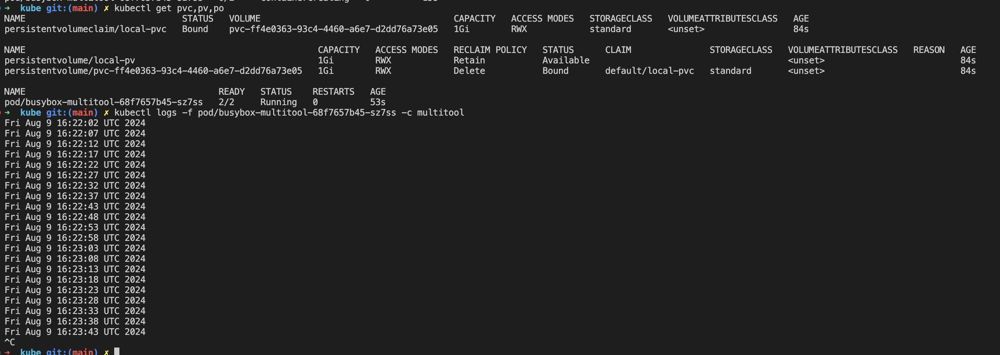
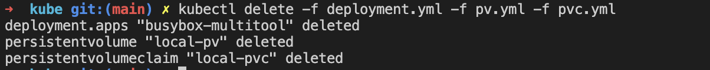
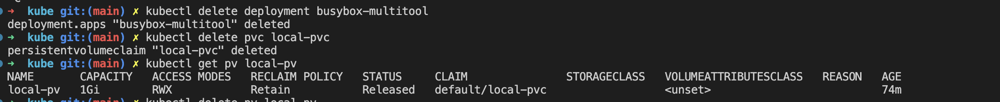
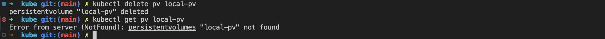
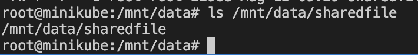
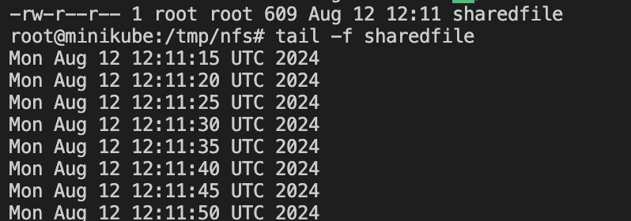
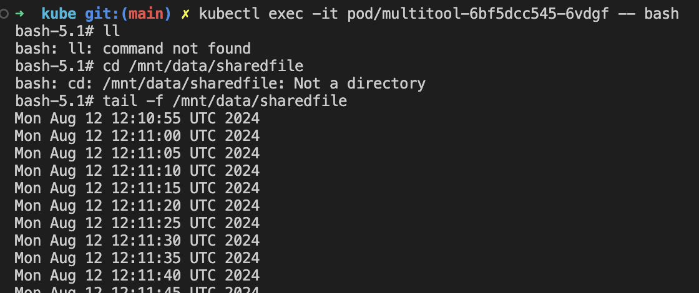

# Домашнее задание к занятию «Хранение в K8s. Часть 2»

### Цель задания

В тестовой среде Kubernetes нужно создать PV и продемострировать запись и хранение файлов.

------

### Задание 1

**Что нужно сделать**

Создать Deployment приложения, использующего локальный PV, созданный вручную.

1. Создать Deployment приложения, состоящего из контейнеров busybox и multitool.
2. Создать PV и PVC для подключения папки на локальной ноде, которая будет использована в поде.
3. Продемонстрировать, что multitool может читать файл, в который busybox пишет каждые пять секунд в общей директории. 
4. Удалить Deployment и PVC. Продемонстрировать, что после этого произошло с PV. Пояснить, почему.
5. Продемонстрировать, что файл сохранился на локальном диске ноды. Удалить PV.  Продемонстрировать что произошло с файлом после удаления PV. Пояснить, почему.
5. Предоставить манифесты, а также скриншоты или вывод необходимых команд.

### Ответ:

---
Манифест [Deployment](kube/deployment.yml) для контейнеров busybox и multitool.
Манифесты для [pv](kube/pv.yml) [pvc](kube/pvc.yml)

multitool может читать файл, в который busybox пишет каждые пять секунд в общей директории.


Удалить Deployment и PVC. Продемонстрировать, что после этого произошло с PV.


Удалить Deployment и PVC
```bash
kubectl delete deployment busybox-multitool
kubectl delete pvc local-pvc
kubectl get pv local-pv
```



Удалите PV и проверьте файл снова
```bash
kubectl delete pv local-pv
```





Доступ на хост-машине к папке сохранится. Это происходит из-за указания параметра persistentVolumeReclaimPolicy: Retain, который не предусматривает автоматического удаления ресурсов из внешних провайдеров (в нашем случае локальной папки на хост-машине). Папку в случае такой необходимости придется удалять вручную.

---

### Задание 2

**Что нужно сделать**

Создать Deployment приложения, которое может хранить файлы на NFS с динамическим созданием PV.

1. Включить и настроить NFS-сервер на MicroK8S.
2. Создать Deployment приложения состоящего из multitool, и подключить к нему PV, созданный автоматически на сервере NFS.
3. Продемонстрировать возможность чтения и записи файла изнутри пода. 
4. Предоставить манифесты, а также скриншоты или вывод необходимых команд.

### Ответ:
---
Так как я использовал minikube, nfs я настроил отдельно

Создать [Deployment](kube/nfs_deployment.yml) приложения состоящего из multitool, и подключить к нему [PV](kube/nfs_pv.yml) [nfs_pvc](kube/nfs_pvc.yml)





---