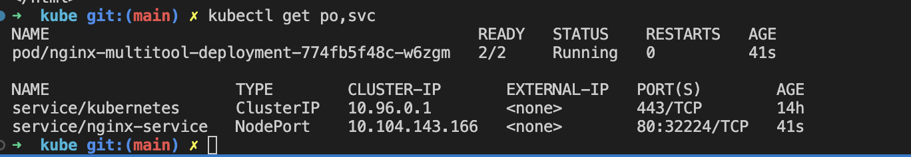
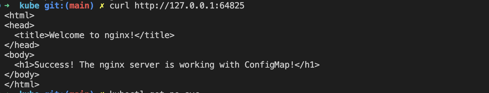
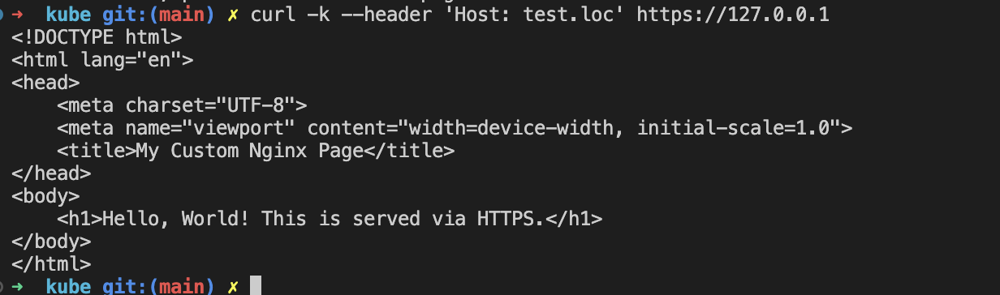

# Домашнее задание к занятию «Конфигурация приложений»

### Цель задания

В тестовой среде Kubernetes необходимо создать конфигурацию и продемонстрировать работу приложения.

------

### Задание 1. Создать Deployment приложения и решить возникшую проблему с помощью ConfigMap. Добавить веб-страницу

1. Создать Deployment приложения, состоящего из контейнеров nginx и multitool.
2. Решить возникшую проблему с помощью ConfigMap.
3. Продемонстрировать, что pod стартовал и оба конейнера работают.
4. Сделать простую веб-страницу и подключить её к Nginx с помощью ConfigMap. Подключить Service и показать вывод curl или в браузере.
5. Предоставить манифесты, а также скриншоты или вывод необходимых команд.

### Ответ:

---
[Deployment](kube/deployment.yaml) приложения.

[ConfigMap](kube/configmap.yaml)



[Service](kube/service.yaml)


---

### Задание 2. Создать приложение с вашей веб-страницей, доступной по HTTPS 

1. Создать Deployment приложения, состоящего из Nginx.
2. Создать собственную веб-страницу и подключить её как ConfigMap к приложению.
3. Выпустить самоподписной сертификат SSL. Создать Secret для использования сертификата.
4. Создать Ingress и необходимый Service, подключить к нему SSL в вид. Продемонстировать доступ к приложению по HTTPS. 
4. Предоставить манифесты, а также скриншоты или вывод необходимых команд.

### Ответ:

---
- Создать [Deployment](kube/nginx-deployment.yaml) приложения, состоящего из Nginx.
- Создать собственную веб-страницу и подключить её как [ConfigMap](kube/nginx-configmap.yaml) к приложению.
- Выпустить самоподписной сертификат SSL. Создать Secret для использования сертификата. Сертификат [tls.crt](kube/tls.crt), ключ [tls.key](kube/tls.key)

 ```bash
openssl req -x509 -nodes -days 365 -newkey rsa:2048 -keyout tls.key -out tls.crt -subj "/CN=test.loc/O=test"
```

- Создать [Ingress](kube/nginx-ingress.yaml) и необходимый [Service](kube/nginx-ingress.yaml), подключить к нему SSL в вид. Продемонстировать доступ к приложению по HTTPS. 


---