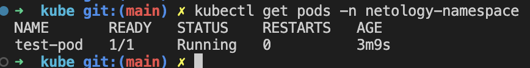
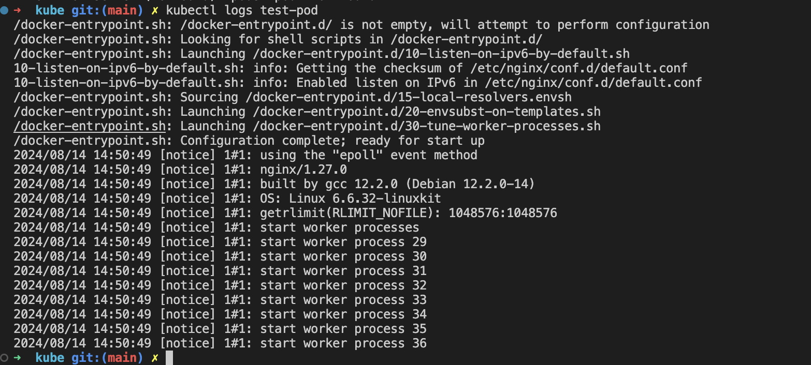
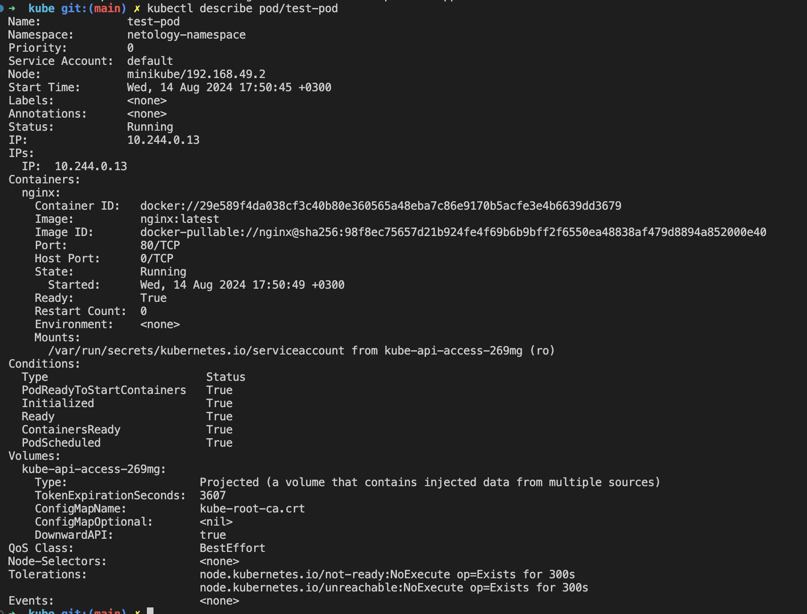
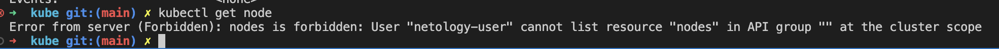

# Домашнее задание к занятию «Управление доступом»

### Цель задания

В тестовой среде Kubernetes нужно предоставить ограниченный доступ пользователю.

------

### Задание 1. Создайте конфигурацию для подключения пользователя

1. Создайте и подпишите SSL-сертификат для подключения к кластеру.
2. Настройте конфигурационный файл kubectl для подключения.
3. Создайте роли и все необходимые настройки для пользователя.
4. Предусмотрите права пользователя. Пользователь может просматривать логи подов и их конфигурацию (`kubectl logs pod <pod_id>`, `kubectl describe pod <pod_id>`).
5. Предоставьте манифесты и скриншоты и/или вывод необходимых команд.


### Ответ:
---

Создание SSL-сертификат для подключения к кластеру
```sh
openssl genrsa -out user.key 2048
openssl req -new -key user.key -out user.csr -subj "/CN=netology-user"
openssl x509 -req -in user.csr -CA ca.crt -CAkey ca.key -CAcreateserial -out user.crt -days 365
```

Настройка конфигурационного файла kubectl для подключения
```sh
kubectl config set-credentials netology-user --client-certificate=user.crt --client-key=user.key
kubectl config set-context netology-context --cluster=minikube --namespace=netology-namespace --user=netology-user
```

Создаем [namespace](kube/namespace.yaml)
```
kubectl apply -f namespace.yaml
```
Создаем [role](kube/role.yaml)
```
kubectl apply -f role.yaml
```
Привязываем [role](kube/rolebinding.yaml) к пользователю
```
kubectl apply -f rolebinding.yaml
```


Поднимаем тестовый [Pod](kube/test-pod.yml)
```
kubectl apply -f test-pod.yml -n netology-namespace 
```

Переключаемся на контекст с нашим новым пользователем
```
kubectl config use-context netology-context
```

Получение списка подов:


Просмотр логов конкретного пода:


Описание пода:


Демонстрация ограничения прав:


---
