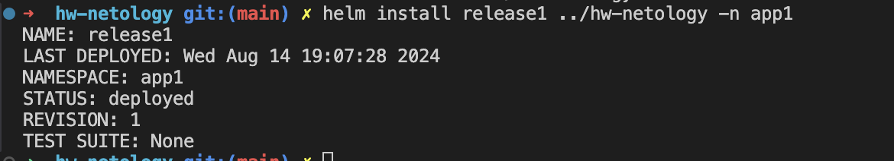
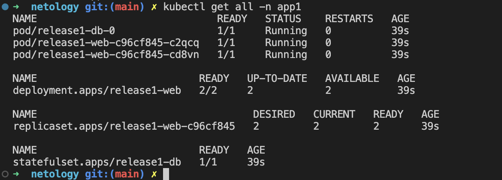
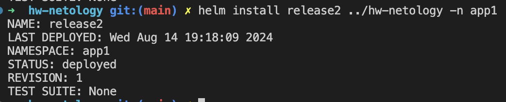
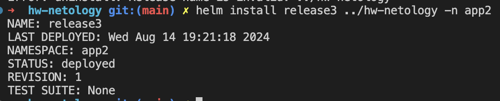
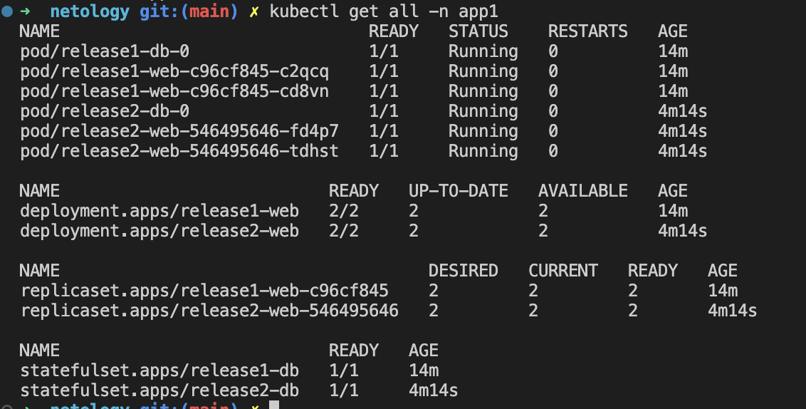
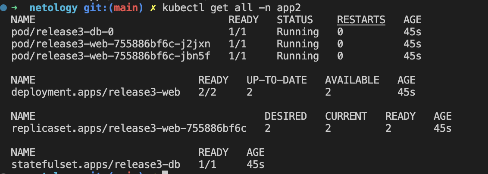

# Домашнее задание к занятию «Helm»

### Цель задания

В тестовой среде Kubernetes необходимо установить и обновить приложения с помощью Helm.

------

### Задание 1. Подготовить Helm-чарт для приложения

1. Необходимо упаковать приложение в чарт для деплоя в разные окружения. 
2. Каждый компонент приложения деплоится отдельным deployment’ом или statefulset’ом.
3. В переменных чарта измените образ приложения для изменения версии.


### Ответ:

---

Упаковать приложение в [чарт](helm/hw-netology/) для деплоя в разные окружения
Устанавливаем первую версию в app1 с именем release1.




---
### Задание 2. Запустить две версии в разных неймспейсах

1. Подготовив чарт, необходимо его проверить. Запуститe несколько копий приложения.
2. Одну версию в namespace=app1, вторую версию в том же неймспейсе, третью версию в namespace=app2.
3. Продемонстрируйте результат.

---
Подготовив [чарт](helm/hw-netology/), необходимо его проверить. Запуститe несколько копий приложения.

Создаем два namespace: `app1` и `app2`.
```sh
kubectl create namespace app1
kubectl create namespace app2
```

Устанавливаем первую версию в `app1` с именем `release1`.


Устанавливаем вторую версию в `app1` с именем `release2`. (Изменил версию nginx 1.19 -> 1.20)



Устанавливаем третью версию в `app2` с именем `release3`. (Изменил версию postgres 13 -> 14)



Результат:

namespace `app1`



namespace `app2`



---