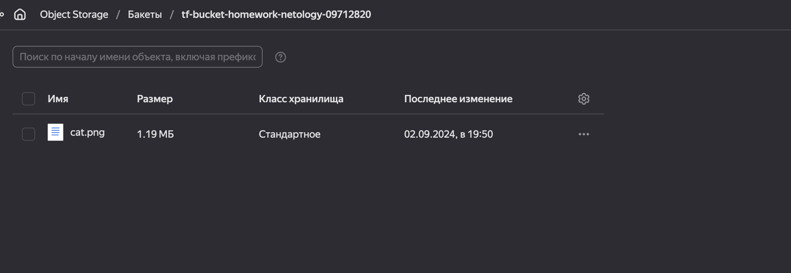
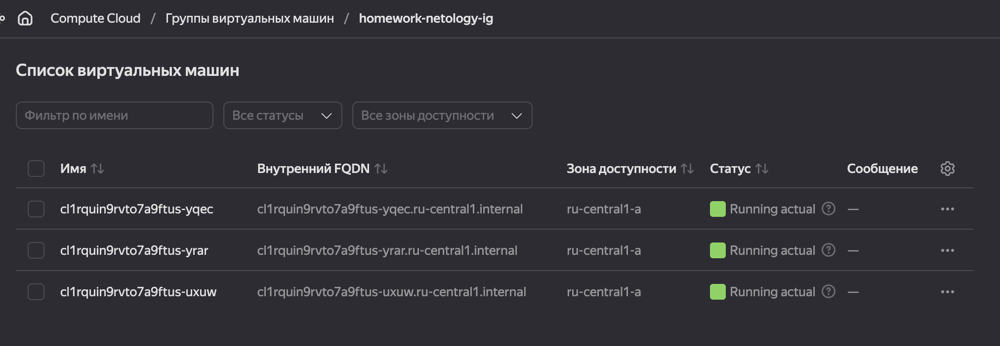
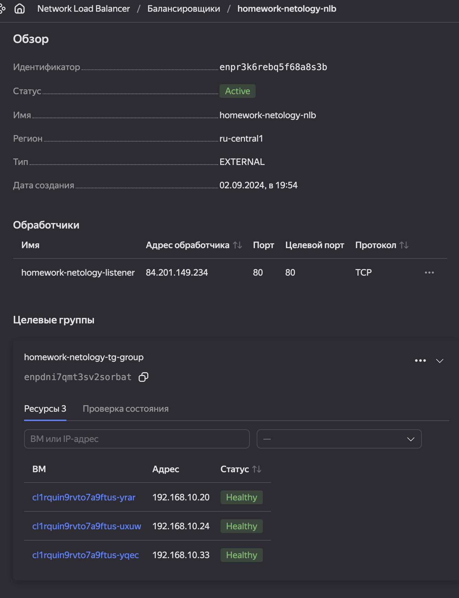
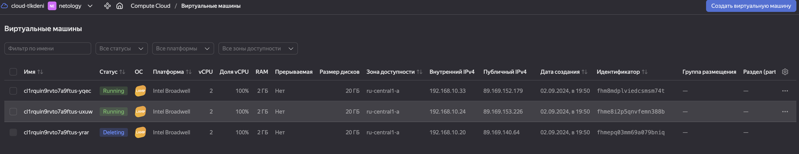
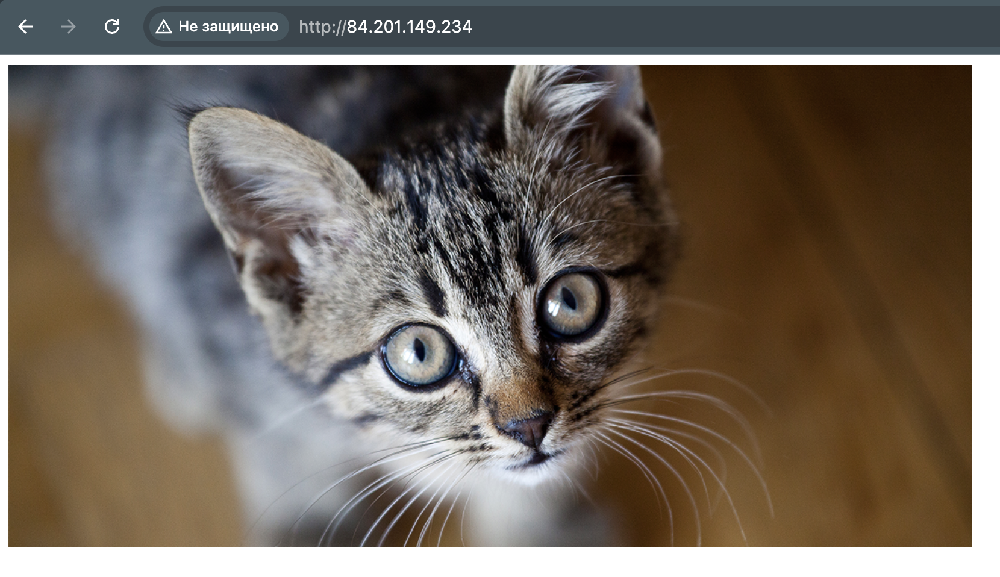

# Домашнее задание к занятию «Вычислительные мощности. Балансировщики нагрузки»  

## Задание 1. Yandex Cloud 

**Что нужно сделать**

1. Создать бакет Object Storage и разместить в нём файл с картинкой:

 - Создать бакет в Object Storage с произвольным именем (например, _имя_студента_дата_).
 - Положить в бакет файл с картинкой.
 - Сделать файл доступным из интернета.
 
2. Создать группу ВМ в public подсети фиксированного размера с шаблоном LAMP и веб-страницей, содержащей ссылку на картинку из бакета:

 - Создать Instance Group с тремя ВМ и шаблоном LAMP. Для LAMP рекомендуется использовать `image_id = fd827b91d99psvq5fjit`.
 - Для создания стартовой веб-страницы рекомендуется использовать раздел `user_data` в [meta_data](https://cloud.yandex.ru/docs/compute/concepts/vm-metadata).
 - Разместить в стартовой веб-странице шаблонной ВМ ссылку на картинку из бакета.
 - Настроить проверку состояния ВМ.
 
3. Подключить группу к сетевому балансировщику:

 - Создать сетевой балансировщик.
 - Проверить работоспособность, удалив одну или несколько ВМ.

### Ответ:
---
Создать бакет Object Storage и разместить в нём файл с картинкой. Модуль [s3_bucket](terraform/modules/s3_bucket/)

Создать группу ВМ. Модуль [compute_group](terraform/modules/compute_group/)

Подключить группу к сетевому балансировщику. Модуль [nlb](terraform/modules/nlb/)

Проверить работоспособность, удалив одну или несколько ВМ.

[Terraform](terraform/main.tf) конфигурация

---