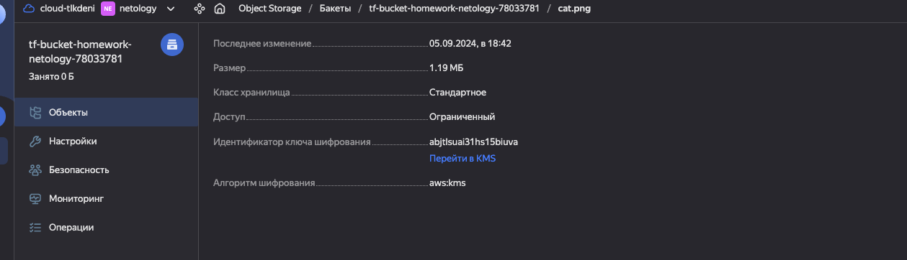

# Домашнее задание к занятию «Безопасность в облачных провайдерах»  

Используя конфигурации, выполненные в рамках предыдущих домашних заданий, нужно добавить возможность шифрования бакета.

---
## Задание 1. Yandex Cloud   

1. С помощью ключа в KMS необходимо зашифровать содержимое бакета:

 - создать ключ в KMS;
 - с помощью ключа зашифровать содержимое бакета, созданного ранее.

### Ответ:

---
создать ключ в KMS и также его нужно обязательно привязать к SA акаунту иначе будем получать ошибку при попытке загрузить файл
```
resource "yandex_kms_symmetric_key" "key-a" {
  name              = "${var.project_name}-symetric-key"
  description       = "kms key for tf-bucket-${var.project_name}-${local.postfix}"
  default_algorithm = "AES_128"
  rotation_period   = "8760h" // equal to 1 year
}

resource "yandex_kms_symmetric_key_iam_binding" "viewer" {
  symmetric_key_id = yandex_kms_symmetric_key.key-a.id
  role             = "viewer"

  members = [
    "serviceAccount:${yandex_iam_service_account.sa.id}",
  ]
}
```

Файлы манифестов [terraform](terraform)



---