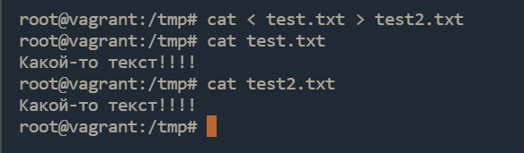
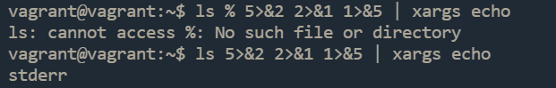
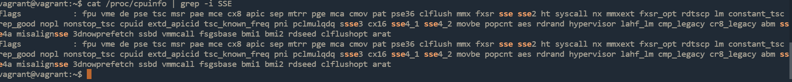

# Домашнее задание к занятию «Работа в терминале. Лекция 2»

------

## Задание

Ответьте на вопросы:

1. Какого типа команда `cd`? Попробуйте объяснить, почему она именно такого типа: опишите ход своих мыслей и поясните, если считаете, что она могла бы быть другого типа.
---
### Ответ:
Команда `cd` являтся встроеной командной в `bash`.


Я думаю что данная команда встроена по нескольким причинам:
* Изменение рабочего каталога - это базовый функционал.
* Для обеспечения совместимости в приложения(скриптах и т.д.).

Команда `cd` могла бы быть и не встроенной, но тогда была бы усложнена поддержка совместимости с приложениями(скриптами и т.д.) которые используют данную команду в своих целях.

---
2. Какая альтернатива без pipe для команды `grep <some_string> <some_file> | wc -l`?   

	<details>
	<summary>Подсказка.</summary>

	`man grep` поможет в ответе на этот вопрос. 

	</details>
	
	Изучите [документ](http://www.smallo.ruhr.de/award.html) о других подобных некорректных вариантах использования pipe.
---
### Ответ:
`grep <some_string> <some_file> -c`

---

3. Какой процесс с PID `1` является родителем для всех процессов в вашей виртуальной машине Ubuntu 20.04?
---
### Ответ:
Процесс с PID `1` являеться `systemd`

---
4. Как будет выглядеть команда, которая перенаправит вывод stderr `ls` на другую сессию терминала?
---
### Ответ:
`ls 2>/dev/pts/1`
для проверки можем использовать следующую конструкцию
`ls % 2>/dev/pts/1`

---
5. Получится ли одновременно передать команде файл на stdin и вывести её stdout в другой файл? Приведите работающий пример.
---
### Ответ:



---

6. Получится ли, находясь в графическом режиме, вывести данные из PTY в какой-либо из эмуляторов TTY? Сможете ли вы наблюдать выводимые данные?
---
### Ответ:
Да, например,
`echo "test" > /dev/tty1`

---
7. Выполните команду `bash 5>&1`. К чему она приведёт? Что будет, если вы выполните `echo netology > /proc/$$/fd/5`? Почему так происходит?
---
### Ответ:
Выполнив команду `bash 5>&1`, мы перенаправили поток файлового дескриптора `5` на `stdout` тем самым при выполнение `echo netology > /proc/$$/fd/5` мы увидим в консоле слово `netology`,
которое было перенаправлено с *fd 5* на *fd 1*.

---
8. Получится ли в качестве входного потока для pipe использовать только stderr команды, не потеряв отображение stdout на pty?  
	Напоминаем: по умолчанию через pipe передаётся только stdout команды слева от `|` на stdin команды справа.
Это можно сделать, поменяв стандартные потоки местами через промежуточный новый дескриптор, который вы научились создавать в предыдущем вопросе.

---
### Ответ:


---
9. Что выведет команда `cat /proc/$$/environ`? Как ещё можно получить аналогичный по содержанию вывод?
---
### Ответ:
Аналогичный вид можно получить командой `env`.

---
10. Используя `man`, опишите, что доступно по адресам `/proc/<PID>/cmdline`, `/proc/<PID>/exe`.
---
### Ответ:
* `/proc/<PID>/cmdline` - Этот файл содержит полную командную строку запуска процесса, кроме тех процессов, что полностью ушли в своппинг, а также тех, что превратились в зомби. В этих двух случаях в файле ничего нет, то есть чтение этого файла вернет 0 символов. Аргументы командной строки в этом файле указаны как список строк, каждая из которых завешается нулевым символом, с добавочным нулевым байтом после последней строки.
* `/proc/<PID>/exe` - Под Linux 2.2 и 2.4 exe является символьной ссылкой, содержащей фактическое полное имя выполняемого файла. Символьная ссылка exe может использоваться обычным образом - при попытке открыть exe будет открыт исполняемый файл. Вы можете даже ввести /proc/[pid]/exe чтобы запустить другую копию процесса такого же как и процесс с номером [pid].
Под Linux 2.0 и в более ранних версиях exe является указателем на запущенный файл и является символьной ссылкой. Вызов readlink(2) на этот специальный файл exe под Linux 2.0 и более ранних версий возвращает строку формата:

[device]:inode

Например, строка [0301]:1502 означает индексный дескриптор 1502 на устройстве со старшим номером устройства 03 (IDE, MFM и т. д.) и младшим номером устройства 01 (первый раздел на первом диске).
Для того, чтобы найти этот файл, может быть использована команда find(1) с опцией -inum.

---
11. Узнайте, какую наиболее старшую версию набора инструкций SSE поддерживает ваш процессор с помощью `/proc/cpuinfo`.
---
### Ответ:
Искал командой `cat /proc/cpuinfo | grep -i SSE`
самая старшая версия котора я поддерживет мой процессор SSE 4.2


---
12. При открытии нового окна терминала и `vagrant ssh` создаётся новая сессия и выделяется pty.  
	Это можно подтвердить командой `tty`, которая упоминалась в лекции 3.2.  
	
	Однако:

    ```bash
	vagrant@netology1:~$ ssh localhost 'tty'
	not a tty
    ```

	Почитайте, почему так происходит и как изменить поведение.
---
### Ответ:
При выполнение `ssh localhost 'tty'` ssh выполняет команду удаленно и ему не требуеться tty, что бы решить эту проблему нужно явно указать создание tty `ssh localhost -t 'tty'`

---
13. Бывает, что есть необходимость переместить запущенный процесс из одной сессии в другую. Попробуйте сделать это, воспользовавшись `reptyr`. Например, так можно перенести в `screen` процесс, который вы запустили по ошибке в обычной SSH-сессии.
---
### Ответ:
```
vi /etc/sysctl.d/10-ptrace.conf
kernel.yama.ptrace_scope = 0
reboot

top
CTRL+Z
jobs
ps -a (копируем PID запущенного top)
screen -S test_top
reptyr PID
```
---
14. `sudo echo string > /root/new_file` не даст выполнить перенаправление под обычным пользователем, так как перенаправлением занимается процесс shell, который запущен без `sudo` под вашим пользователем. Для решения этой проблемы можно использовать конструкцию `echo string | sudo tee /root/new_file`. Узнайте, что делает команда `tee` и почему в отличие от `sudo echo` команда с `sudo tee` будет работать.
---
### Ответ:
`tee` - получает значения из *stdin* и записывает их в *stdout* и файл. Так как `tee` запускается отдельным процессом из-под *sudo*, то получая в *stdin* через *pipe* данные от `echo` - у нее есть права записать в файл.

----