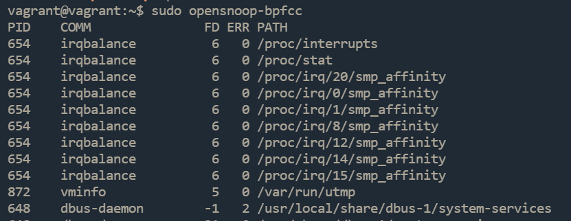

# Домашнее задание к занятию «Операционные системы. Лекция 1»
---

## Задание

1. Какой системный вызов делает команда `cd`? 

    В прошлом ДЗ вы выяснили, что `cd` не является самостоятельной  программой. Это `shell builtin`, поэтому запустить `strace` непосредственно на `cd` не получится. Вы можете запустить `strace` на `/bin/bash -c 'cd /tmp'`. В этом случае увидите полный список системных вызовов, которые делает сам `bash` при старте. 

    Вам нужно найти тот единственный, который относится именно к `cd`. Обратите внимание, что `strace` выдаёт результат своей работы в поток stderr, а не в stdout.
    
    ---
    ### Ответ:
    

    ---

1. Попробуйте использовать команду `file` на объекты разных типов в файловой системе. Например:

    ```bash
    vagrant@netology1:~$ file /dev/tty
    /dev/tty: character special (5/0)
    vagrant@netology1:~$ file /dev/sda
    /dev/sda: block special (8/0)
    vagrant@netology1:~$ file /bin/bash
    /bin/bash: ELF 64-bit LSB shared object, x86-64
    ```
    
    Используя `strace`, выясните, где находится база данных `file`, на основании которой она делает свои догадки.
    
    ---
    ### Ответ:
    По стеку видно что утилита `file` попыталась опбратиться на данные файлы
    ```
    /home/vagrant/.magic.mgc
    /home/vagrant/.magic
    /etc/magic.mgc
    ```
    но их не оказалось, далее обращение было на 
    ```
    /etc/magic
    /usr/share/misc/magic.mgc
    ```
    Это и есть база на которую операеться `file`
    
    ---
1. Предположим, приложение пишет лог в текстовый файл. Этот файл оказался удалён (deleted в lsof), но сказать сигналом приложению переоткрыть файлы или просто перезапустить приложение возможности нет. Так как приложение продолжает писать в удалённый файл, место на диске постепенно заканчивается. Основываясь на знаниях о перенаправлении потоков, предложите способ обнуления открытого удалённого файла, чтобы освободить место на файловой системе.

---
### Ответ:
`echo "" | sudo tee /proc/PID/fd/DESCRIPTOR`,
где `PID` - это `PID` процесса, который записывает в удаленный файл, а `DESRIPTOR` - дескриптор, удаленного файла

---

1. Занимают ли зомби-процессы ресурсы в ОС (CPU, RAM, IO)?
---
### Ответ:
Зомби-процессы не занимают какие-либо системные ресурсы, но сохраняют свой ID процесса в таблице процессов (есть риск исчерпания доступных идентификаторов)

---
1. В IO Visor BCC есть утилита `opensnoop`:

    ```bash
    root@vagrant:~# dpkg -L bpfcc-tools | grep sbin/opensnoop
    /usr/sbin/opensnoop-bpfcc
    ```
    
    На какие файлы вы увидели вызовы группы `open` за первую секунду работы утилиты? Воспользуйтесь пакетом `bpfcc-tools` для Ubuntu 20.04. Дополнительные сведения по установке [по ссылке](https://github.com/iovisor/bcc/blob/master/INSTALL.md).

    ---
    ### Ответ:
    

    ---
1. Какой системный вызов использует `uname -a`? Приведите цитату из man по этому системному вызову, где описывается альтернативное местоположение в `/proc` и где можно узнать версию ядра и релиз ОС.

---
### Ответ:
* Системный вызов uname().

* Part of the utsname information is also accessible via /proc/sys/kernel/{ostype, hostname, osrelease, version, domainname}.

---

1. Чем отличается последовательность команд через `;` и через `&&` в bash? Например:

    ```bash
    root@netology1:~# test -d /tmp/some_dir; echo Hi
    Hi
    root@netology1:~# test -d /tmp/some_dir && echo Hi
    root@netology1:~#
    ```
    
    Есть ли смысл использовать в bash `&&`, если применить `set -e`?

    ---
    ### Ответ:
    `;` - выполелнение команд последовательно.

    `&&` - команда после `&&` выполняется только если команда до `&&` завершилась успешно (статус выхода 0)

    `test -d /tmp/some_dir && echo Hi` - так как каталога `/tmp/some_dir` не существует, то статус выхода не равен `0` и `echo Hi` не будет выполняться

    Есть ли смысл использовать в bash `&&`, если применить `set -e`?

    `set -e` - останавливает выполнение скрипта при ошибке. Я думаю, в скриптах имеет смысл применять `set -e` с `&&`, так как она прекращает действие скрипта (не игнорирует ошибку) при ошибке в команде после `&&`

    ---

1. Из каких опций состоит режим bash `set -euxo pipefail`, и почему его хорошо было бы использовать в сценариях?

---
### Ответ:


```
-e  Exit immediately if a command exits with a non-zero status.
-u  Treat unset variables as an error when substituting.
-x  Print commands and their arguments as they are executed.
-o pipefail     the return value of a pipeline is the status of
                           the last command to exit with a non-zero status,
                           or zero if no command exited with a non-zero status
```

Данный режим обеспечит прекращение выполнения скрипта в случае ошибок и выведет необходимую для траблшутинга информацию (по сути логирование выполнения)

---
1. Используя `-o stat` для `ps`, определите, какой наиболее часто встречающийся статус у процессов в системе. В `man ps` изучите (`/PROCESS STATE CODES`), что значат дополнительные к основной заглавной букве статуса процессов. Его можно не учитывать при расчёте (считать S, Ss или Ssl равнозначными).
---
### Ответ:


```
Here are the different values that the s, stat and state output specifiers (header "STAT" or "S") will display to describe the state of a process:

               D    uninterruptible sleep (usually IO)
               I    Idle kernel thread
               R    running or runnable (on run queue)
               S    interruptible sleep (waiting for an event to complete)
               T    stopped by job control signal
               t    stopped by debugger during the tracing
               W    paging (not valid since the 2.6.xx kernel)
               X    dead (should never be seen)
               Z    defunct ("zombie") process, terminated but not reaped by its parent

       For BSD formats and when the stat keyword is used, additional characters may be displayed:

               <    high-priority (not nice to other users)
               N    low-priority (nice to other users)
               L    has pages locked into memory (for real-time and custom IO)
               s    is a session leader
               l    is multi-threaded (using CLONE_THREAD, like NPTL pthreads do)
               +    is in the foreground process group
```
----