# Домашнее задание к занятию «Операционные системы. Лекция 2»

## Задание

1. На лекции вы познакомились с [node_exporter](https://github.com/prometheus/node_exporter/releases). В демонстрации его исполняемый файл запускался в background. Этого достаточно для демо, но не для настоящей production-системы, где процессы должны находиться под внешним управлением. Используя знания из лекции по systemd, создайте самостоятельно простой [unit-файл](https://www.freedesktop.org/software/systemd/man/systemd.service.html) для node_exporter:

    * поместите его в автозагрузку;
    * предусмотрите возможность добавления опций к запускаемому процессу через внешний файл (посмотрите, например, на `systemctl cat cron`);
    * удостоверьтесь, что с помощью systemctl процесс корректно стартует, завершается, а после перезагрузки автоматически поднимается.

---

### Ответ:
*unit*-файл
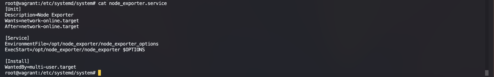

Старт, статус, автостарт
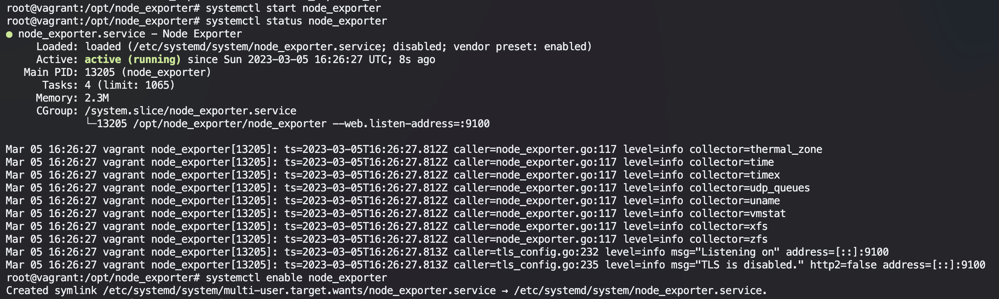

----

1. Изучите опции node_exporter и вывод `/metrics` по умолчанию. Приведите несколько опций, которые вы бы выбрали для базового мониторинга хоста по CPU, памяти, диску и сети.

---
### Ответ:

```
CPU:
   - node_cpu_seconds_total{*};
   - process_cpu_seconds_total;
Memory:
   - node_memory_MemAvailable_bytes;
   - node_memory_MemTotal_bytes;
   - node_vmstat_pgmajfault;
Disk:
   - node_disk_read_bytes_total{*};
   - node_disk_written_bytes_total{*};
   - node_filesystem_size_bytes{*};
   - node_filesystem_avail_bytes{*};
   - node_filesystem_files_free{*};
   - node_disk_read_time_seconds_total{*};
   - node_disk_write_time_seconds_total{*};
Network:
   - node_network_receive_bytes_total{*};
   - node_network_transmit_bytes_total{*};
   - node_network_receive_errs_total{*};
   - node_network_transmit_errs_total{*};
   - node_network_transmit_drop_total{*};
   - node_network_receive_drop_total{*};
```

---

3. Установите в свою виртуальную машину [Netdata](https://github.com/netdata/netdata). Воспользуйтесь [готовыми пакетами](https://packagecloud.io/netdata/netdata/install) для установки (`sudo apt install -y netdata`). 
   
   После успешной установки:
   
    * в конфигурационном файле `/etc/netdata/netdata.conf` в секции [web] замените значение с localhost на `bind to = 0.0.0.0`;
    * добавьте в Vagrantfile проброс порта Netdata на свой локальный компьютер и сделайте `vagrant reload`:

    ```bash
    config.vm.network "forwarded_port", guest: 19999, host: 19999
    ```

    После успешной перезагрузки в браузере на своём ПК (не в виртуальной машине) вы должны суметь зайти на `localhost:19999`. Ознакомьтесь с метриками, которые по умолчанию собираются Netdata, и с комментариями, которые даны к этим метрикам.

---
### Ответ:
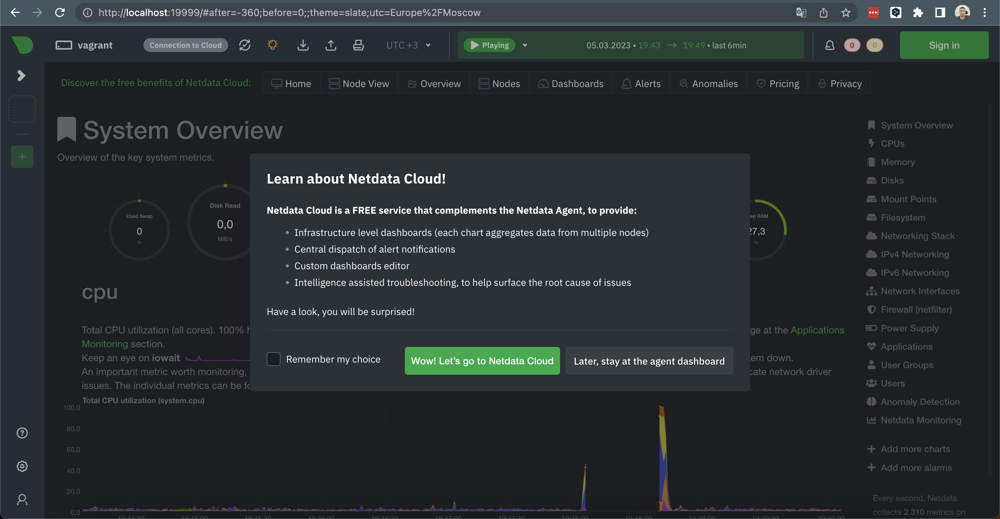
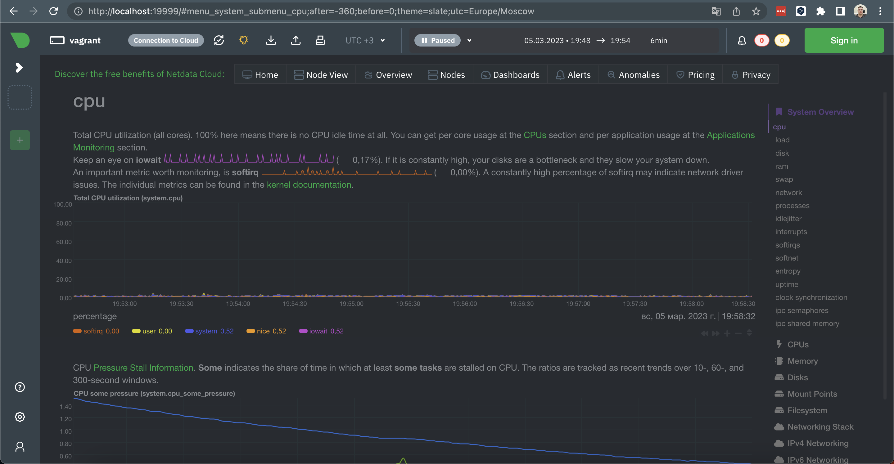
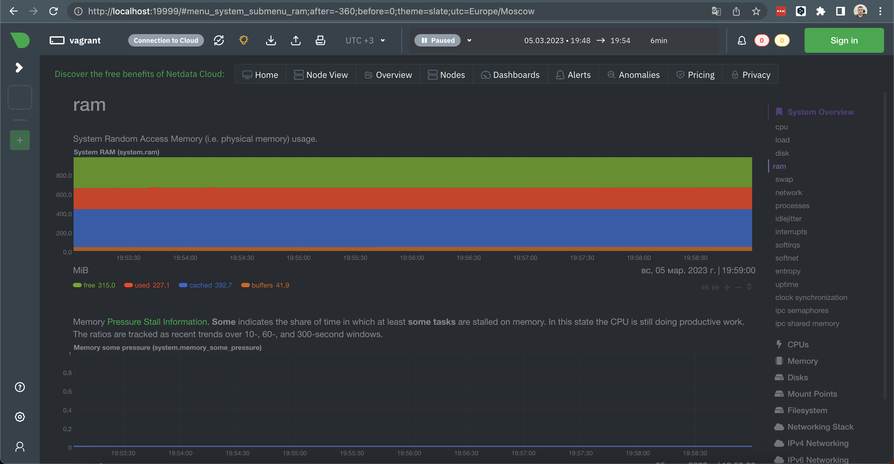
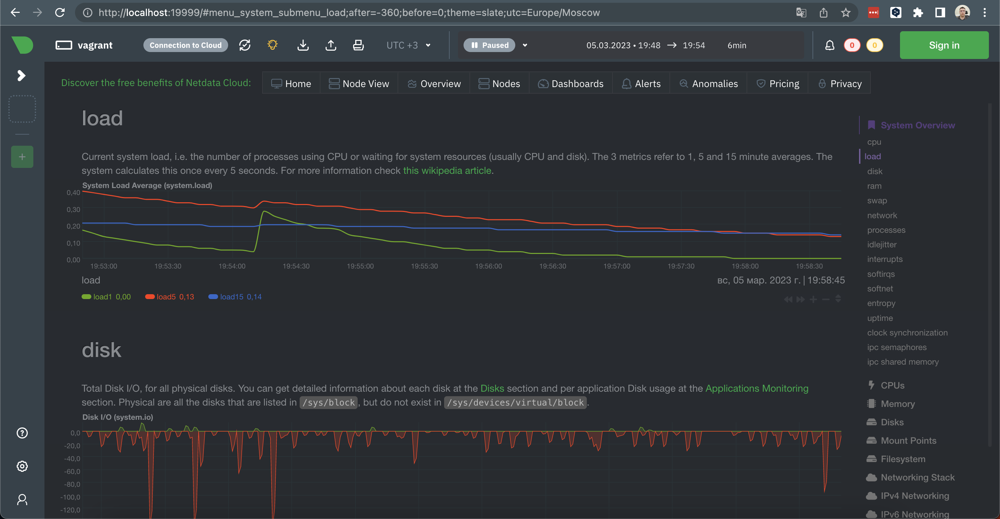

---

4. Можно ли по выводу `dmesg` понять, осознаёт ли ОС, что загружена не на настоящем оборудовании, а на системе виртуализации?

---

### Ответ:
ОС осознает, что она установлена на виртуальной машине
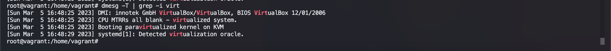

---
5. Как настроен sysctl `fs.nr_open` на системе по умолчанию? Определите, что означает этот параметр. Какой другой существующий лимит не позволит достичь такого числа (`ulimit --help`)?

---
### Ответ:
`fs.nr_open` - это системное ограние на количество открытых дескрипторов
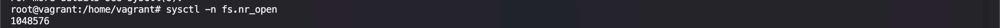

так же можно посмотреть через `unlimit` "жёсткий" лимит:


так же в `unlimit` существует "мягкий" лимит, который распространяется на текущюю `shell` ссесию он и не дает достич "жесткого" лимита


---

6. Запустите любой долгоживущий процесс (не `ls`, который отработает мгновенно, а, например, `sleep 1h`) в отдельном неймспейсе процессов; покажите, что ваш процесс работает под PID 1 через `nsenter`. Для простоты работайте в этом задании под root (`sudo -i`). Под обычным пользователем требуются дополнительные опции (`--map-root-user`) и т. д.

---
### Ответ:
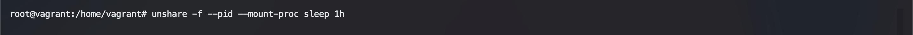
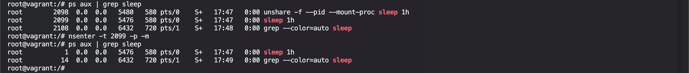
---

7. Найдите информацию о том, что такое `:(){ :|:& };:`. Запустите эту команду в своей виртуальной машине Vagrant с Ubuntu 20.04 (**это важно, поведение в других ОС не проверялось**). Некоторое время всё будет плохо, после чего (спустя минуты) — ОС должна стабилизироваться. Вызов `dmesg` расскажет, какой механизм помог автоматической стабилизации.  
Как настроен этот механизм по умолчанию, и как изменить число процессов, которое можно создать в сессии?

*В качестве решения отправьте ответы на вопросы и опишите, как эти ответы были получены.*

---
### Ответ:
`:(){ :|:& };:` - это так называемая *fork* бомба. Суть её в том что, каждый раз она вызвает сама себя два раза, таким образом уходит в рекурсию до тех пор пока не исчерпает лимит процессов.

Сама запись данной фенкции может выглядить так:
```bash
func(){
    func|func&
};
func
```
А выглядит она так, потому что в *bash* можно называть функции с `:`

С помощью команды `dmesg` мы видим кто завершил процесс
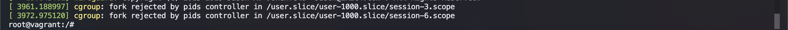
Посмотреть лимит на процессы пользователя можно так:
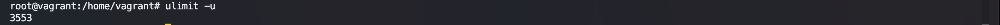
Изменить с помощью `ulimit -u 500`


----