## Задание

1. Узнайте о [sparse-файлах](https://ru.wikipedia.org/wiki/%D0%A0%D0%B0%D0%B7%D1%80%D0%B5%D0%B6%D1%91%D0%BD%D0%BD%D1%8B%D0%B9_%D1%84%D0%B0%D0%B9%D0%BB) (разряженных).
   
   ---
   ### Ответ:
   *Ознакомился*

   ---
2. Могут ли файлы, являющиеся жёсткой ссылкой на один объект, иметь разные права доступа и владельца? Почему?
   
   ---
   ### Ответ:
   *Не могут, так как жесткие ссылки имеют один и тот же `inode` что и обект*

   ---

3. Сделайте `vagrant destroy` на имеющийся инстанс Ubuntu. Замените содержимое Vagrantfile следующим:

    ```ruby
    path_to_disk_folder = './disks'

    host_params = {
        'disk_size' => 2560,
        'disks'=>[1, 2],
        'cpus'=>2,
        'memory'=>2048,
        'hostname'=>'sysadm-fs',
        'vm_name'=>'sysadm-fs'
    }
    Vagrant.configure("2") do |config|
        config.vm.box = "bento/ubuntu-20.04"
        config.vm.hostname=host_params['hostname']
        config.vm.provider :virtualbox do |v|

            v.name=host_params['vm_name']
            v.cpus=host_params['cpus']
            v.memory=host_params['memory']

            host_params['disks'].each do |disk|
                file_to_disk=path_to_disk_folder+'/disk'+disk.to_s+'.vdi'
                unless File.exist?(file_to_disk)
                    v.customize ['createmedium', '--filename', file_to_disk, '--size', host_params['disk_size']]
                end
                v.customize ['storageattach', :id, '--storagectl', 'SATA Controller', '--port', disk.to_s, '--device', 0, '--type', 'hdd', '--medium', file_to_disk]
            end
        end
        config.vm.network "private_network", type: "dhcp"
    end
    ```

    Эта конфигурация создаст новую виртуальную машину с двумя дополнительными неразмеченными дисками по 2,5 Гб.

   ---
   ### Ответ:
   Измененный *Vagrantfile*

   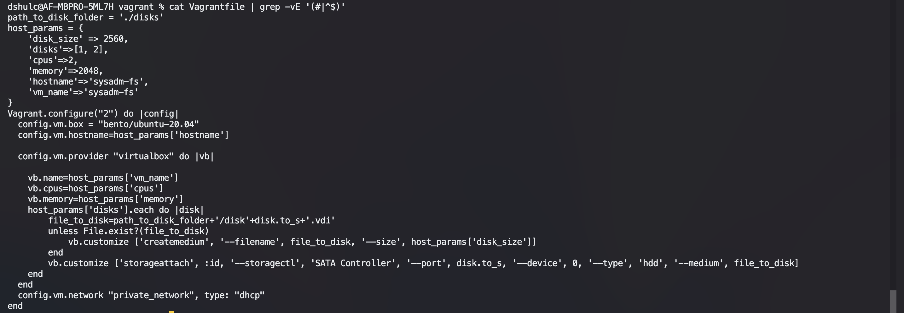

   Новые диски в системе

   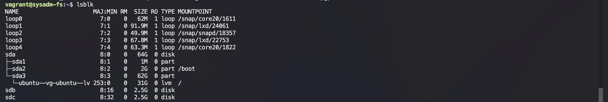

   ---

4. Используя `fdisk`, разбейте первый диск на два раздела: 2 Гб и оставшееся пространство.

   ---
   ### Ответ:
   Саздание разделов с помощью `fdisk`

   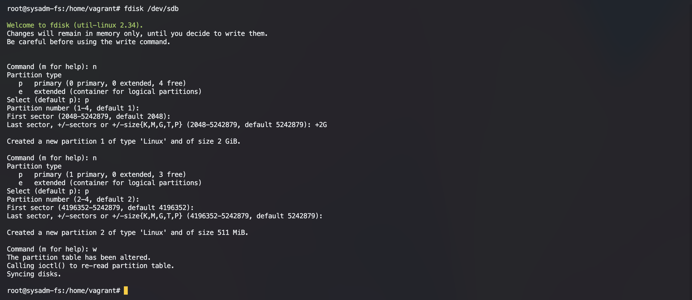

   Новые разделы

   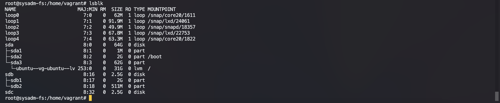

   ---

5. Используя `sfdisk`, перенесите эту таблицу разделов на второй диск.
   
   ---
   ### Ответ:

   Перенос разделов

   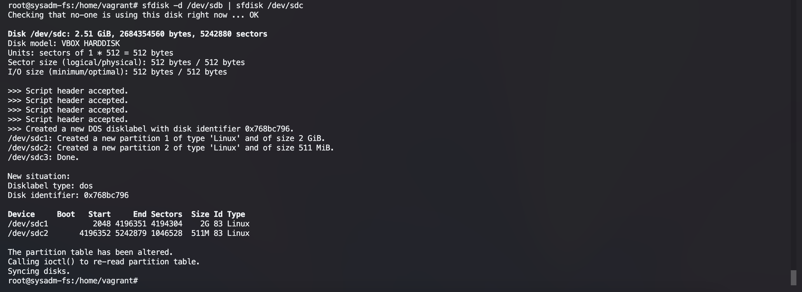

   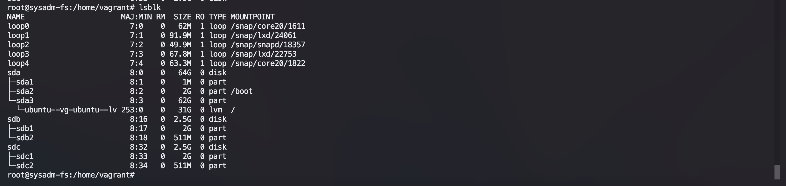

   ---

6. Соберите `mdadm` RAID1 на паре разделов 2 Гб.
   
   ---
   ### Ответ:

   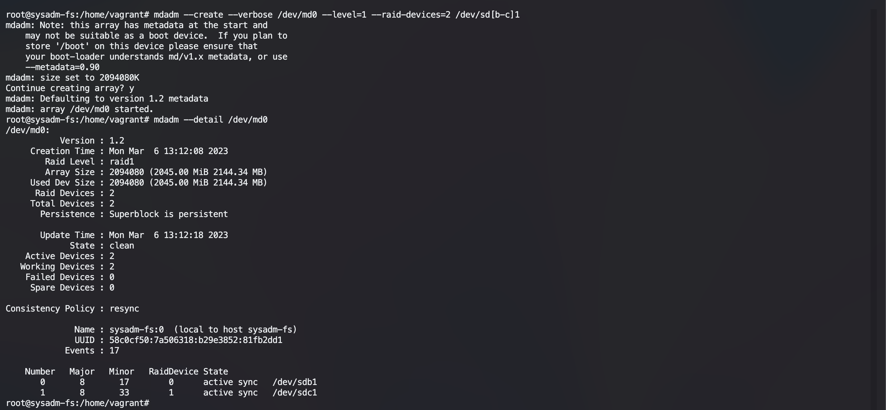
   
   ---

7. Соберите `mdadm` RAID0 на второй паре маленьких разделов.
   
   ---
   ### Ответ:

   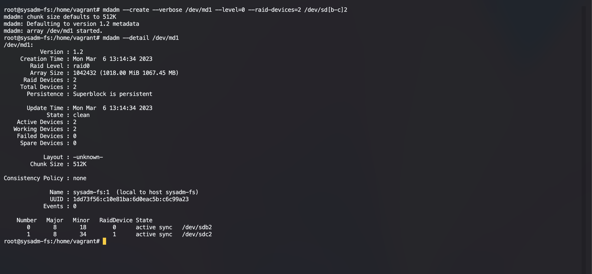

   ---

8. Создайте два независимых PV на получившихся md-устройствах.
   
   ---
   ### Ответ:

   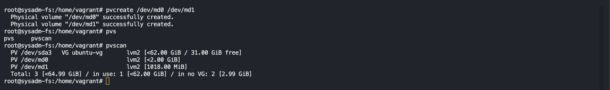

   ---

9.  Создайте общую volume-group на этих двух PV.

   ---
   ### Ответ:

   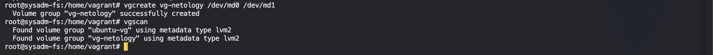

   ---

10. Создайте LV размером 100 Мб, указав его расположение на PV с RAID0.

   ---
   ### Ответ:
   
   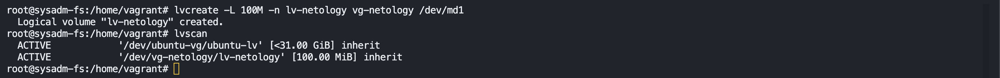

   ---

11. Создайте `mkfs.ext4` ФС на получившемся LV.

   ---
   ### Ответ:
   
   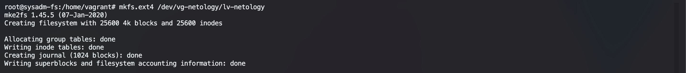

   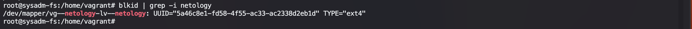

   ---

12. Смонтируйте этот раздел в любую директорию, например, `/tmp/new`.

   ---
   ### Ответ:
   
   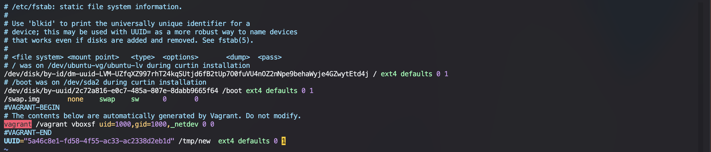

   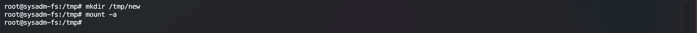

   Так же можно воспользоваться `mount /dev/vg-netology/lv-netology/tmp/new `, но тогда после перезагрузки нужно будет монтировать заново.
   
   ---

13. Поместите туда тестовый файл, например, `wget https://mirror.yandex.ru/ubuntu/ls-lR.gz -O /tmp/new/test.gz`.

   ---
   ### Ответ:
   У меня возникли проблемы с со скачиванием файла
   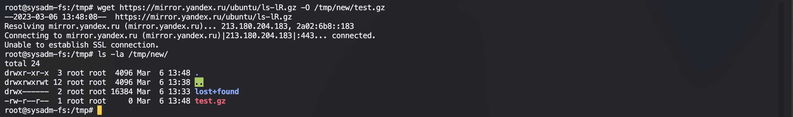

   Поэтому я воспользовался плагином `vagrant scp`

   ---

14. Прикрепите вывод `lsblk`.

   ---
   ### Ответ:

   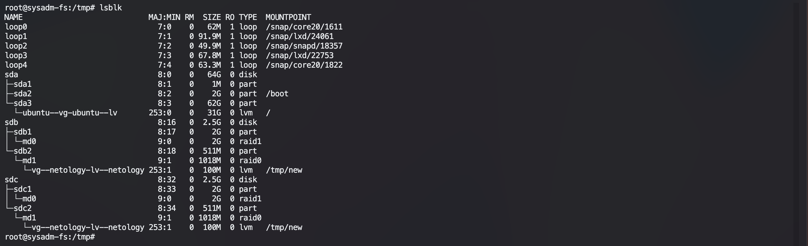

   ---

15. Протестируйте целостность файла:

    ```bash
    root@vagrant:~# gzip -t /tmp/new/test.gz
    root@vagrant:~# echo $?
    0
    ```

   ---
   ### Ответ:
   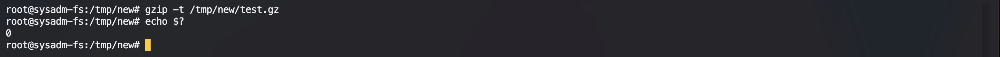

   ---

16. Используя pvmove, переместите содержимое PV с RAID0 на RAID1.

   ---
   ### Ответ:
   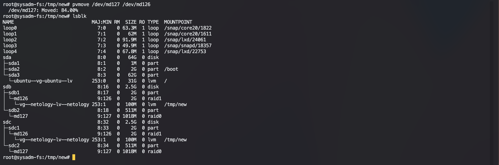

   ---

17. Сделайте `--fail` на устройство в вашем RAID1 md.

   ---
   ### Ответ:

   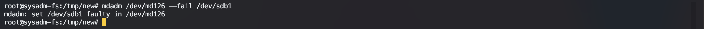
   
   ---

18. Подтвердите выводом `dmesg`, что RAID1 работает в деградированном состоянии.

   ---
   ### Ответ:

   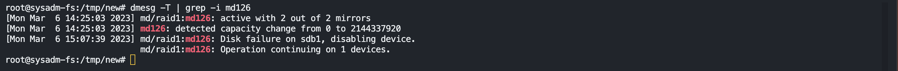
   
   ---

19. Протестируйте целостность файла — он должен быть доступен несмотря на «сбойный» диск:

    ```bash
    root@vagrant:~# gzip -t /tmp/new/test.gz
    root@vagrant:~# echo $?
    0
    ```
   ---

   ### Ответ:
   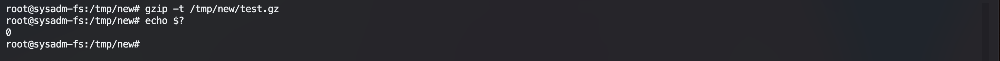

   ---

20. Погасите тестовый хост — `vagrant destroy`.

   ---
   ### Ответ:
   *Погасил.*
   
   ---