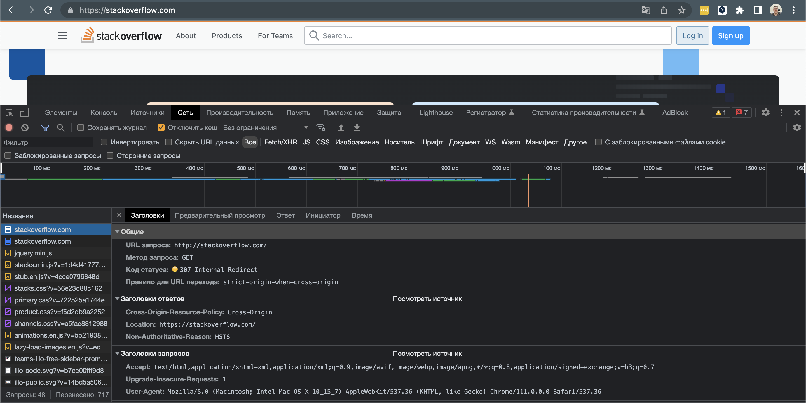
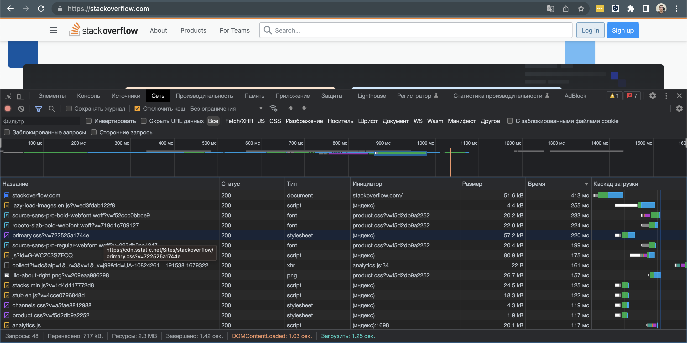
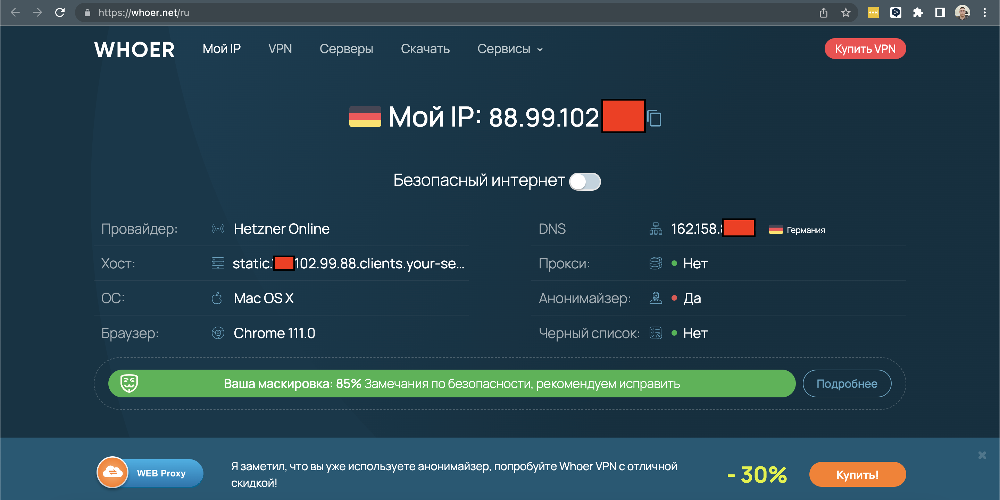

# Домашнее задание к занятию «Компьютерные сети. Лекция 1»

## Задание

**Шаг 1.** Работа c HTTP через telnet.

- Подключитесь утилитой telnet к сайту stackoverflow.com:

`telnet stackoverflow.com 80`
 
- Отправьте HTTP-запрос:

```bash
GET /questions HTTP/1.0
HOST: stackoverflow.com
[press enter]
[press enter]
```
*В ответе укажите полученный HTTP-код и поясните, что он означает.*

---
### Ответ:
Сервер понял запрос, но отказывается его выполнять.
```
root@sysadm-fs:/home/vagrant# telnet stackoverflow.com 80
Trying 151.101.1.69...
Connected to stackoverflow.com.
Escape character is '^]'.
GET /questions HTTP/1.0
HOST: stackoverflow.com

HTTP/1.1 403 Forbidden
Connection: close
Content-Length: 1918
Server: Varnish
Retry-After: 0
Content-Type: text/html
Accept-Ranges: bytes
Date: Mon, 20 Mar 2023 18:08:00 GMT
Via: 1.1 varnish
X-Served-By: cache-hhn-etou8220073-HHN
X-Cache: MISS
X-Cache-Hits: 0
X-Timer: S1679335681.951570,VS0,VE1
X-DNS-Prefetch-Control: off

<!DOCTYPE html>
<html>
<head>
    <meta http-equiv="Content-Type" content="text/html; charset=UTF-8" />
    <title>Forbidden - Stack Exchange</title>
    <style type="text/css">
		body
		{
			color: #333;
			font-family: 'Helvetica Neue', Arial, sans-serif;
			font-size: 14px;
			background: #fff url('img/bg-noise.png') repeat left top;
			line-height: 1.4;
		}
		h1
		{
			font-size: 170%;
			line-height: 34px;
			font-weight: normal;
		}
		a { color: #366fb3; }
		a:visited { color: #12457c; }
		.wrapper {
			width:960px;
			margin: 100px auto;
			text-align:left;
		}
		.msg {
			float: left;
			width: 700px;
			padding-top: 18px;
			margin-left: 18px;
		}
    </style>
</head>
<body>
    <div class="wrapper">
		<div style="float: left;">
			
		</div>
		<div class="msg">
			<h1>Access Denied</h1>
                        <p>This IP address (88.99.102.138) has been blocked from access to our services. If you believe this to be in error, please contact us at <a href="mailto:team@stackexchange.com?Subject=Blocked%2088.99.102.138%20(Request%20ID%3A%20874558962-HHN)">team@stackexchange.com</a>.</p>
                        <p>When contacting us, please include the following information in the email:</p>
                        <p>Method: block</p>
                        <p>XID: 874558962-HHN</p>
                        <p>IP: 88.99.102.138</p>
                        <p>X-Forwarded-For: </p>
                        <p>User-Agent: </p>
                        
                        <p>Time: Mon, 20 Mar 2023 18:08:00 GMT</p>
                        <p>URL: stackoverflow.com/questions</p>
                        <p>Browser Location: <span id="jslocation">(not loaded)</span></p>
		</div>
	</div>
	<script>document.getElementById('jslocation').innerHTML = window.location.href;</script>
</body>
</html>Connection closed by foreign host.
root@sysadm-fs:/home/vagrant# 

```

---

**Шаг 2.** Повторите задание 1 в браузере, используя консоль разработчика F12:

 - откройте вкладку `Network`;
 - отправьте запрос [http://stackoverflow.com](http://stackoverflow.com);
 - найдите первый ответ HTTP-сервера, откройте вкладку `Headers`;
 - укажите в ответе полученный HTTP-код;
 - проверьте время загрузки страницы и определите, какой запрос обрабатывался дольше всего;
 - приложите скриншот консоли браузера в ответ.

---
### Ответ:



---

**Шаг 3.** Какой IP-адрес у вас в интернете?

---
### Ответ:


---

**Шаг 4.** Какому провайдеру принадлежит ваш IP-адрес? Какой автономной системе AS? Воспользуйтесь утилитой `whois`.

```bash
netname:        HETZNER-fsn1-dc13
descr:          Hetzner Online GmbH
origin:         AS24940
```

**Шаг 5.** Через какие сети проходит пакет, отправленный с вашего компьютера на адрес 8.8.8.8? Через какие AS? Воспользуйтесь утилитой `traceroute`.

---
### Ответ:

```bash
root@sysadm-fs:/home/vagrant# traceroute -n 8.8.8.8
traceroute to 8.8.8.8 (8.8.8.8), 30 hops max, 60 byte packets
 1  10.0.2.2  0.608 ms  0.460 ms  0.365 ms
 2  192.168.100.1  3.319 ms  3.901 ms  4.376 ms
 3  192.168.0.1  4.819 ms  5.282 ms  5.185 ms
 4  93.100.32.1  5.615 ms  6.063 ms  6.405 ms
 5  93.100.0.42  6.628 ms  6.921 ms  7.692 ms
 6  72.14.216.110  8.319 ms  8.614 ms  9.187 ms
 7  * * *
 8  74.125.244.129  8.998 ms 74.125.37.218  6.288 ms 209.85.245.238  6.741 ms
 9  74.125.244.181  7.103 ms 74.125.244.180  8.888 ms 74.125.244.133  6.840 ms
10  72.14.232.85  6.998 ms 216.239.48.163  8.583 ms 72.14.232.85  7.304 ms
11  216.239.47.173  8.362 ms 142.251.51.187  8.349 ms 216.239.48.163  7.711 ms
12  * * *
13  * * *
14  * * *
15  * * *
16  * * *
17  * * *
18  * * *
19  * * *
20  * * *
21  * 8.8.8.8  6.783 ms *
root@sysadm-fs:/home/vagrant# 
```

---

**Шаг 6.** Повторите задание 5 в утилите `mtr`. На каком участке наибольшая задержка — delay?

---
### Ответ:
Самый большой delay на 20 шаге
```bash
Start: 2023-03-20T19:22:43+0000
HOST: sysadm-fs                   Loss%   Snt   Last   Avg  Best  Wrst StDev
  1.|-- 10.0.2.2                   0.0%    10    1.2   1.6   1.2   2.5   0.5
  2.|-- 192.168.100.1              0.0%    10    3.7   4.7   2.6  11.2   2.4
  3.|-- 192.168.0.1                0.0%    10    4.2   4.5   4.0   4.9   0.3
  4.|-- 93.100.32.1                0.0%    10    5.0   4.5   3.1   5.2   0.7
  5.|-- 93.100.0.42                0.0%    10    4.8   4.8   3.1   5.9   0.7
  6.|-- 72.14.216.110              0.0%    10    5.4   4.9   3.8   6.0   0.6
  7.|-- 74.125.244.129             0.0%    10    5.7   5.8   4.7   6.3   0.4
  8.|-- 74.125.244.133             0.0%    10    4.5   5.7   4.5  11.5   2.1
  9.|-- 142.251.61.221             0.0%    10   13.4   9.7   8.6  13.4   1.8
 10.|-- 172.253.51.247             0.0%    10   10.5   9.6   9.2  10.5   0.4
 11.|-- ???                       100.0    10    0.0   0.0   0.0   0.0   0.0
 12.|-- ???                       100.0    10    0.0   0.0   0.0   0.0   0.0
 13.|-- ???                       100.0    10    0.0   0.0   0.0   0.0   0.0
 14.|-- ???                       100.0    10    0.0   0.0   0.0   0.0   0.0
 15.|-- ???                       100.0    10    0.0   0.0   0.0   0.0   0.0
 16.|-- ???                       100.0    10    0.0   0.0   0.0   0.0   0.0
 17.|-- ???                       100.0    10    0.0   0.0   0.0   0.0   0.0
 18.|-- ???                       100.0    10    0.0   0.0   0.0   0.0   0.0
 19.|-- ???                       100.0    10    0.0   0.0   0.0   0.0   0.0
 20.|-- 8.8.8.8                    0.0%    10   18.1  16.6  15.8  18.1   0.7
[1]+  Done                    mtr -n -r 8.8.8.8 > mtr-report
```

---

**Шаг 7.** Какие DNS-сервера отвечают за доменное имя dns.google? Какие A-записи? Воспользуйтесь утилитой `dig`.

---
### Ответ:

```bash
dns.google.		544	IN	A	8.8.4.4
dns.google.		544	IN	A	8.8.8.8
```

---

**Шаг 8.** Проверьте PTR записи для IP-адресов из задания 7. Какое доменное имя привязано к IP? Воспользуйтесь утилитой `dig`.

---
### Ответ:

```bash
dig -x 8.8.8.8
8.8.8.8.in-addr.arpa.	6693	IN	PTR	dns.google.

dig -x 8.8.4.4
4.4.8.8.in-addr.arpa.	86400	IN	PTR	dns.google.

```

---

*В качестве ответов на вопросы приложите лог выполнения команд в консоли или скриншот полученных результатов.*

----

### Правила приёма домашнего задания

В личном кабинете отправлена ссылка на .md-файл в вашем репозитории.


### Критерии оценки

Зачёт:

* выполнены все задания;
* ответы даны в развёрнутой форме;
* приложены соответствующие скриншоты и файлы проекта;
* в выполненных заданиях нет противоречий и нарушения логики.

На доработку:

* задание выполнено частично или не выполнено вообще;
* в логике выполнения заданий есть противоречия и существенные недостатки. 