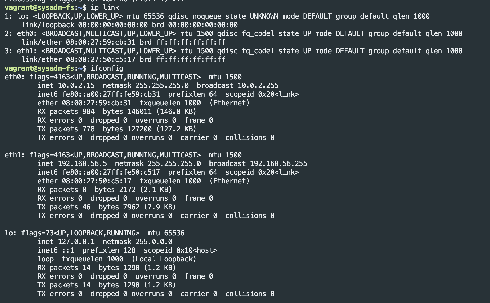
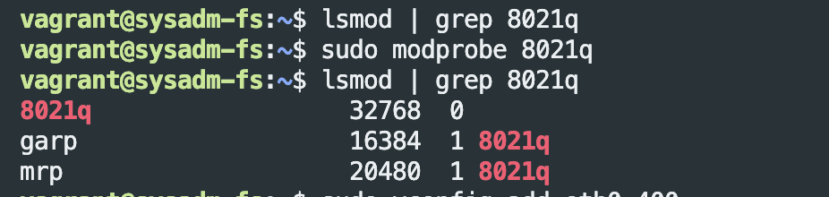
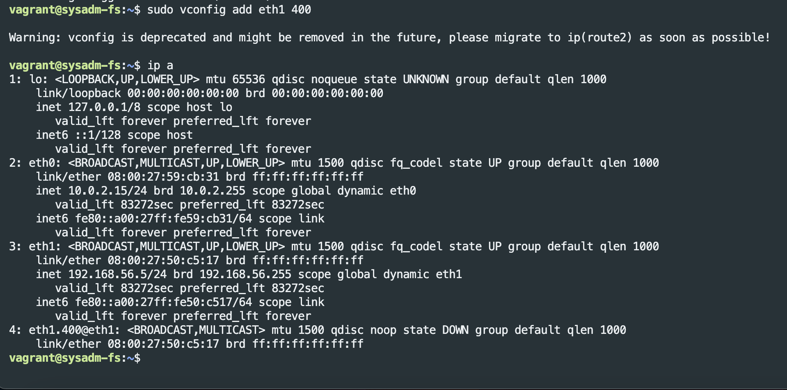
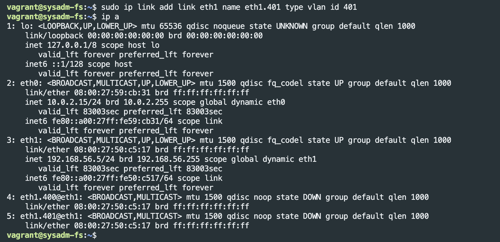

# Домашнее задание к занятию «Компьютерные сети. Лекция 2»

------

## Задание

1. Проверьте список доступных сетевых интерфейсов на вашем компьютере. Какие команды есть для этого в Linux и в Windows?
   
   ---
   ### Ответ:
   ```
   Linux:
    - ip link
    - ifconfig
   Windows:
    - ipconfig
    - Get-NetIPInterface
    - Get-NetAdapter
   ```
    
   ---

2. Какой протокол используется для распознавания соседа по сетевому интерфейсу? Какой пакет и команды есть в Linux для этого?
      
   ---
   ### Ответ:
    Для распозования используется протокол lldp и ip.
    Утилиты ставиться из пакета lldpd и net-tools
    ```
        - sudo apt install lldpd
        - lldpcli show neighbors
        - ip neigh show
    ```

   ---


3. Какая технология используется для разделения L2-коммутатора на несколько виртуальных сетей? Какой пакет и команды есть в Linux для этого? Приведите пример конфига.
      
   ---
   ### Ответ:
   Для разделения L2 коммутатора на несколько виртуальных сетей используется технология VLAN (Virtual Local Area Network).

    На Linux необходимо проверить наличие модуля 8021q. Если он не подгружен, то выполнить команду `sudo modprobe 8021q`

    
    
    

   ---


4. Какие типы агрегации интерфейсов есть в Linux? Какие опции есть для балансировки нагрузки? Приведите пример конфига.
      
   ---
   ### Ответ:
   Агрегаци осуществляется через - bonding

```
Опции балансировки:
    - mode=0 (balance-rr)
    - mode=1 (active-backup)
    - mode=2 (balance-xor)
    - mode=3 (broadcast)
    - mode=4 (802.3ad)
    - mode=5 (balance-tlb)
    - mode=6 (balance-alb)
```

```
Config:

auto bond0
iface bond0 inet static
	address 10.0.0.5
	gateway 10.0.0.1
	broadcast 10.0.0.255
	netmask 255.255.255.0
	up /sbin/ifenslave bond0 eth1 eth2
	down /sbin/ifenslave -d bond0 eth0 eth1
```

   ---


1. Сколько IP-адресов в сети с маской /29 ? Сколько /29 подсетей можно получить из сети с маской /24. Приведите несколько примеров /29 подсетей внутри сети 10.10.10.0/24.
      
   ---
   ### Ответ:
    * 6 IP адресов в сети с маской /29
    * 32 подсети с маской /29 можно получить в /24 подсети  

    Пример - 10.10.10.8/29, 10.10.10.16/29

   ---


2. Задача: вас попросили организовать стык между двумя организациями. Диапазоны 10.0.0.0/8, 172.16.0.0/12, 192.168.0.0/16 уже заняты. Из какой подсети допустимо взять частные IP-адреса? Маску выберите из расчёта — максимум 40–50 хостов внутри подсети.
      
   ---
   ### Ответ:
   `100.64.0.0/26`

   ---


7. Как проверить ARP-таблицу в Linux, Windows? Как очистить ARP-кеш полностью? Как из ARP-таблицы удалить только один нужный IP?
      
   ---
   ### Ответ:
    * Ubuntu:
        - `ip neighbour show` - показать ARP таблицу
        - `ip neighbour del [ip address] dev [interface]` - удалить из ARP таблицы конкретный адрес
        - `ip neighbour flush all` - очищает таблицу ARP

    * Windows
        - ` arp -a` - показать ARP таблицу
        - `arp -d *` - очистить таблицу ARP
        - `arp -d [ip address]` - удалить из ARP таблицы конкретный адрес 

   ---

-----