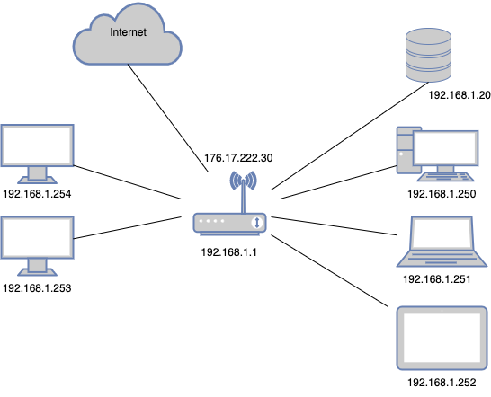

# Домашнее задание к занятию «Компьютерные сети. Лекция 3»

------

## Задание

1. Подключитесь к публичному маршрутизатору в интернет. Найдите маршрут к вашему публичному IP.

 ```
telnet route-views.routeviews.org
Username: rviews
show ip route x.x.x.x/32
show bgp x.x.x.x/32
```
---
### Ответ:

    ```
    route-views>show ip route 94.19.13.xxx   
        Routing entry for 94.19.0.0/20
        Known via "bgp 6447", distance 20, metric 0
        Tag 3267, type external
        Last update from 194.85.40.15 14:47:55 ago
        Routing Descriptor Blocks:
        * 194.85.40.15, from 194.85.40.15, 14:47:55 ago
            Route metric is 0, traffic share count is 1
            AS Hops 2
            Route tag 3267
            MPLS label: none
    route-views>show bgp 94.19.13.xxx     
        BGP routing table entry for 94.19.0.0/20, version 2791774352
        Paths: (1 available, best #1, table default)
        Not advertised to any peer
        Refresh Epoch 1
        3267 35807
            194.85.40.15 from 194.85.40.15 (185.141.126.1)
            Origin IGP, metric 0, localpref 100, valid, external, best
            path 7FE134BAEBA8 RPKI State not found
            rx pathid: 0, tx pathid: 0x0
    ```

    ---

2. Создайте dummy-интерфейс в Ubuntu. Добавьте несколько статических маршрутов. Проверьте таблицу маршрутизации.
   
    ---
    ### Ответ:
    ```bash
    root@sysadm-fs:/home/vagrant# modprobe -v dummy
    insmod /lib/modules/5.4.0-135-generic/kernel/drivers/net/dummy.ko numdummies=0 
    root@sysadm-fs:/home/vagrant# ip link add dummy0 type dummy
    root@sysadm-fs:/home/vagrant# ip link set dev dummy0 up
    root@sysadm-fs:/home/vagrant# ip addr add 192.168.1.57/24 dev dummy0
    root@sysadm-fs:/home/vagrant# ip route add 172.16.36.27/32 dev dummy0
    root@sysadm-fs:/home/vagrant# ip -c a
    1: lo: <LOOPBACK,UP,LOWER_UP> mtu 65536 qdisc noqueue state UNKNOWN group default qlen 1000
        link/loopback 00:00:00:00:00:00 brd 00:00:00:00:00:00
        inet 127.0.0.1/8 scope host lo
        valid_lft forever preferred_lft forever
        inet6 ::1/128 scope host 
        valid_lft forever preferred_lft forever
    2: eth0: <BROADCAST,MULTICAST,UP,LOWER_UP> mtu 1500 qdisc fq_codel state UP group default qlen 1000
        link/ether 08:00:27:59:cb:31 brd ff:ff:ff:ff:ff:ff
        inet 10.0.2.15/24 brd 10.0.2.255 scope global dynamic eth0
        valid_lft 85877sec preferred_lft 85877sec
        inet6 fe80::a00:27ff:fe59:cb31/64 scope link 
        valid_lft forever preferred_lft forever
    3: dummy0: <BROADCAST,NOARP,UP,LOWER_UP> mtu 1500 qdisc noqueue state UNKNOWN group default qlen 1000
        link/ether 52:e3:4a:7d:66:c6 brd ff:ff:ff:ff:ff:ff
        inet 192.168.1.57/24 scope global dummy0
        valid_lft forever preferred_lft forever
        inet6 fe80::50e3:4aff:fe7d:66c6/64 scope link 
        valid_lft forever preferred_lft forever
    root@sysadm-fs:/home/vagrant# ip r
    default via 10.0.2.2 dev eth0 proto dhcp src 10.0.2.15 metric 100 
    10.0.2.0/24 dev eth0 proto kernel scope link src 10.0.2.15 
    10.0.2.2 dev eth0 proto dhcp scope link src 10.0.2.15 metric 100 
    172.16.36.27 dev dummy0 scope link 
    192.168.1.0/24 dev dummy0 proto kernel scope link src 192.168.1.57 
    root@sysadm-fs:/home/vagrant# 
    ```
    
    ---

3. Проверьте открытые TCP-порты в Ubuntu. Какие протоколы и приложения используют эти порты? Приведите несколько примеров.
   
    ---
    ### Ответ:
    ```bash
    root@sysadm-fs:/home/vagrant# ss -tlpn
    State           Recv-Q          Send-Q                   Local Address:Port                     Peer Address:Port          Process                                             
    LISTEN          0               4096                     127.0.0.53%lo:53                            0.0.0.0:*              users:(("systemd-resolve",pid=619,fd=13))          
    LISTEN          0               128                            0.0.0.0:22                            0.0.0.0:*              users:(("sshd",pid=812,fd=3))                      
    LISTEN          0               128                               [::]:22                               [::]:*              users:(("sshd",pid=812,fd=4))                      
    root@sysadm-fs:/home/vagrant# 
    ```

    ---

4. Проверьте используемые UDP-сокеты в Ubuntu. Какие протоколы и приложения используют эти порты?
    
    ---
    ### Ответ:
    ```bash
    root@sysadm-fs:/home/vagrant# ss -ulpn
    State           Recv-Q          Send-Q                    Local Address:Port                    Peer Address:Port          Process                                             
    UNCONN          0               0                         127.0.0.53%lo:53                           0.0.0.0:*              users:(("systemd-resolve",pid=619,fd=12))          
    UNCONN          0               0                        10.0.2.15%eth0:68                           0.0.0.0:*              users:(("systemd-network",pid=1362,fd=17))         
    root@sysadm-fs:/home/vagrant# 
    ```

    ---

5. Используя diagrams.net, создайте L3-диаграмму вашей домашней сети или любой другой сети, с которой вы работали.
    
    ---
    ### Ответ:
    
    
    
    ---