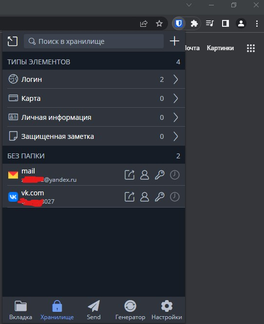
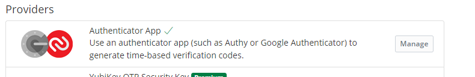
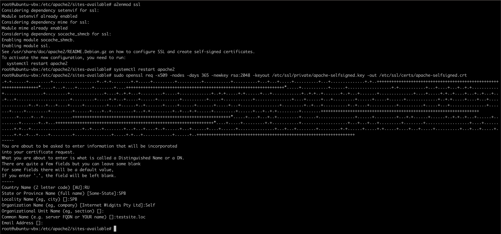
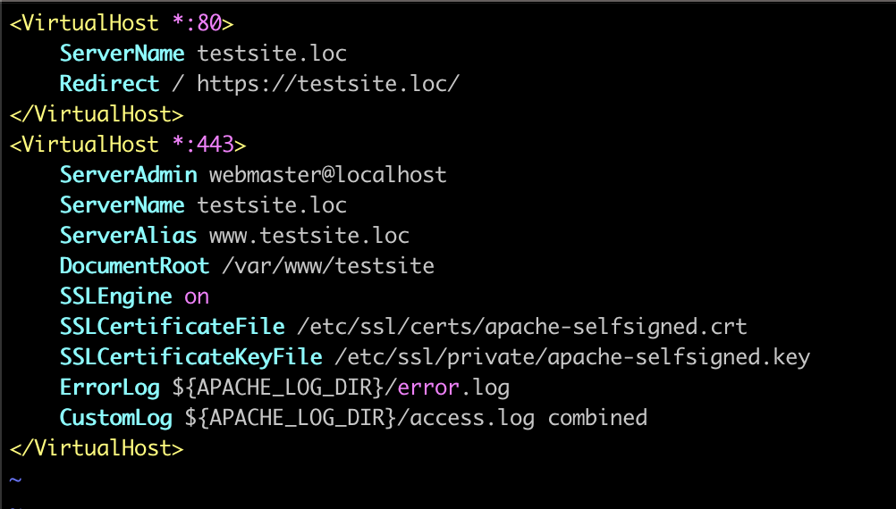
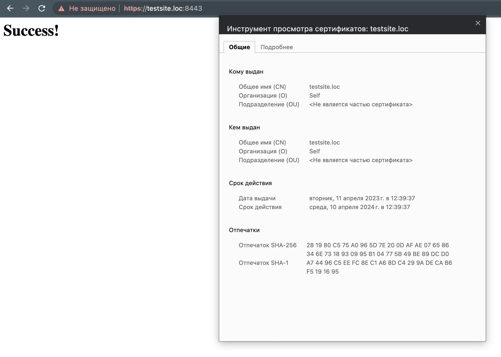
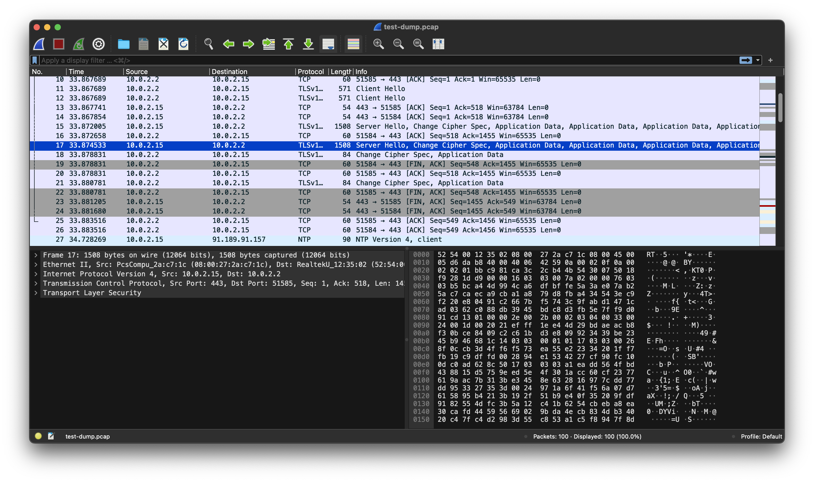

# Домашнее задание к занятию «Элементы безопасности информационных систем»


## Задание

1. Установите плагин Bitwarden для браузера. Зарегестрируйтесь и сохраните несколько паролей.
   
   ### Ответ:

   ---
   
   
   ---

2. Установите Google Authenticator на мобильный телефон. Настройте вход в Bitwarden-акаунт через Google Authenticator OTP.
   
   ### Ответ:
   
   ---
   
  
   ---

3. Установите apache2, сгенерируйте самоподписанный сертификат, настройте тестовый сайт для работы по HTTPS.
   
   ### Ответ:
   
   ---
   
   
   
   ---

4. Проверьте на TLS-уязвимости произвольный сайт в интернете (кроме сайтов МВД, ФСБ, МинОбр, НацБанк, РосКосмос, РосАтом, РосНАНО и любых госкомпаний, объектов КИИ, ВПК и т. п.).
   
   ### Ответ:
   
   ---
   ```bash
   root@ubuntu-vbx:~/123/testssl.sh-3.0.8# ./testssl.sh -U --sneaky https://netology.ru/

   ###########################################################
      testssl.sh       3.0.8 from https://testssl.sh/

         This program is free software. Distribution and
               modification under GPLv2 permitted.
         USAGE w/o ANY WARRANTY. USE IT AT YOUR OWN RISK!

         Please file bugs @ https://testssl.sh/bugs/

   ###########################################################

   Using "OpenSSL 1.0.2-bad (1.0.2k-dev)" [~179 ciphers]
   on ubuntu-vbx:./bin/openssl.Linux.x86_64
   (built: "Sep  1 14:03:44 2022", platform: "linux-x86_64")


   Testing all IPv4 addresses (port 443): 188.114.99.224 188.114.98.224
   ----------------------------------------------------------------------------------------------------------------------------------------
   Start 2023-04-11 10:43:55        -->> 188.114.99.224:443 (netology.ru) <<--

   Further IP addresses:   188.114.98.224 2a06:98c1:3123:e000:: 2a06:98c1:3122:e000::
   rDNS (188.114.99.224):  --
   Service detected:       HTTP


   Testing vulnerabilities

   Heartbleed (CVE-2014-0160)                not vulnerable (OK), no heartbeat extension
   CCS (CVE-2014-0224)                       not vulnerable (OK)
   Ticketbleed (CVE-2016-9244), experiment.  not vulnerable (OK)
   ROBOT                                     not vulnerable (OK)
   Secure Renegotiation (RFC 5746)           supported (OK)
   Secure Client-Initiated Renegotiation     not vulnerable (OK)
   CRIME, TLS (CVE-2012-4929)                not vulnerable (OK)
   BREACH (CVE-2013-3587)                    potentially NOT ok, "gzip" HTTP compression detected. - only supplied "/" tested
                                             Can be ignored for static pages or if no secrets in the page
   POODLE, SSL (CVE-2014-3566)               not vulnerable (OK)
   TLS_FALLBACK_SCSV (RFC 7507)              Downgrade attack prevention supported (OK)
   SWEET32 (CVE-2016-2183, CVE-2016-6329)    VULNERABLE, uses 64 bit block ciphers
   FREAK (CVE-2015-0204)                     not vulnerable (OK)
   DROWN (CVE-2016-0800, CVE-2016-0703)      not vulnerable on this host and port (OK)
                                             make sure you don't use this certificate elsewhere with SSLv2 enabled services
                                             https://search.censys.io/search?resource=hosts&virtual_hosts=INCLUDE&q=F9CE27B13216B2F865AEEC7949955F41C5DCB62EEE821E76C7C70BFE10D8615F
   LOGJAM (CVE-2015-4000), experimental      not vulnerable (OK): no DH EXPORT ciphers, no DH key detected with <= TLS 1.2
   BEAST (CVE-2011-3389)                     TLS1: ECDHE-RSA-AES128-SHA AES128-SHA ECDHE-RSA-AES256-SHA AES256-SHA DES-CBC3-SHA
                                             VULNERABLE -- but also supports higher protocols  TLSv1.1 TLSv1.2 (likely mitigated)
   LUCKY13 (CVE-2013-0169), experimental     potentially VULNERABLE, uses cipher block chaining (CBC) ciphers with TLS. Check patches
   RC4 (CVE-2013-2566, CVE-2015-2808)        no RC4 ciphers detected (OK)


   Done 2023-04-11 10:44:33 [  41s] -->> 188.114.99.224:443 (netology.ru) <<--

   ----------------------------------------------------------------------------------------------------------------------------------------
   Start 2023-04-11 10:44:33        -->> 188.114.98.224:443 (netology.ru) <<--

   Further IP addresses:   188.114.99.224 2a06:98c1:3123:e000:: 2a06:98c1:3122:e000::
   rDNS (188.114.98.224):  --
   Service detected:       HTTP


   Testing vulnerabilities

   Heartbleed (CVE-2014-0160)                not vulnerable (OK), no heartbeat extension
   CCS (CVE-2014-0224)                       not vulnerable (OK)
   Ticketbleed (CVE-2016-9244), experiment.  not vulnerable (OK)
   ROBOT                                     not vulnerable (OK)
   Secure Renegotiation (RFC 5746)           supported (OK)
   Secure Client-Initiated Renegotiation     not vulnerable (OK)
   CRIME, TLS (CVE-2012-4929)                not vulnerable (OK)
   BREACH (CVE-2013-3587)                    potentially NOT ok, "gzip" HTTP compression detected. - only supplied "/" tested
                                             Can be ignored for static pages or if no secrets in the page
   POODLE, SSL (CVE-2014-3566)               not vulnerable (OK)
   TLS_FALLBACK_SCSV (RFC 7507)              Downgrade attack prevention supported (OK)
   SWEET32 (CVE-2016-2183, CVE-2016-6329)    VULNERABLE, uses 64 bit block ciphers
   FREAK (CVE-2015-0204)                     not vulnerable (OK)
   DROWN (CVE-2016-0800, CVE-2016-0703)      not vulnerable on this host and port (OK)
                                             make sure you don't use this certificate elsewhere with SSLv2 enabled services
                                             https://search.censys.io/search?resource=hosts&virtual_hosts=INCLUDE&q=F9CE27B13216B2F865AEEC7949955F41C5DCB62EEE821E76C7C70BFE10D8615F
   LOGJAM (CVE-2015-4000), experimental      not vulnerable (OK): no DH EXPORT ciphers, no DH key detected with <= TLS 1.2
   BEAST (CVE-2011-3389)                     TLS1: ECDHE-RSA-AES128-SHA AES128-SHA ECDHE-RSA-AES256-SHA AES256-SHA DES-CBC3-SHA
                                             VULNERABLE -- but also supports higher protocols  TLSv1.1 TLSv1.2 (likely mitigated)
   LUCKY13 (CVE-2013-0169), experimental     potentially VULNERABLE, uses cipher block chaining (CBC) ciphers with TLS. Check patches
   RC4 (CVE-2013-2566, CVE-2015-2808)        no RC4 ciphers detected (OK)


   Done 2023-04-11 10:45:12 [  80s] -->> 188.114.98.224:443 (netology.ru) <<--

   ----------------------------------------------------------------------------------------------------------------------------------------
   Done testing now all IP addresses (on port 443): 188.114.99.224 188.114.98.224

   root@ubuntu-vbx:~/123/testssl.sh-3.0.8#
   ```
   ---

5. Установите на Ubuntu SSH-сервер, сгенерируйте новый приватный ключ. Скопируйте свой публичный ключ на другой сервер. Подключитесь к серверу по SSH-ключу.
   
   ### Ответ:
   
   ---
   ```
   vm1: 
   ssh-keygen -t rsa
   cd ./ssh
   ssh-copy-id -i id_rsa.pub vagrant@10.20.2.5

   vm2:
   vim /etc/ssh/sshd_config
   PermitRootLogin no 
   PasswordAuthentication no 

   systemctl restart ssh.service
   ufw allow ssh
   ```
   ---
 
6. Переименуйте файлы ключей из задания 5. Настройте файл конфигурации SSH-клиента так, чтобы вход на удалённый сервер осуществлялся по имени сервера.
   
   ### Ответ:
   
   ---
   ```
   mv ~/.ssh/id_dsa ~/.ssh/id_dsa_bla_bla
   vim ~/.ssh/config
   Host *
      IdentitiesOnly yes
   Host test-vm2
      Hostname 10.20.2.5
      User vagrant
      IdentityFile ~/.ssh/id_dsa_bla_bla
   ```
   ---

7. Соберите дамп трафика утилитой tcpdump в формате pcap, 100 пакетов. Откройте файл pcap в Wireshark.
   
   ### Ответ:
   
   ---
   ```bash
   root@ubuntu-vbx:~# tcpdump -c 100 -w test-dump.pcap -i enp0s3
      tcpdump: listening on enp0s3, link-type EN10MB (Ethernet), snapshot length 262144 bytes
      100 packets captured
      127 packets received by filter
      0 packets dropped by kernel
   ```

   
   
   ---
