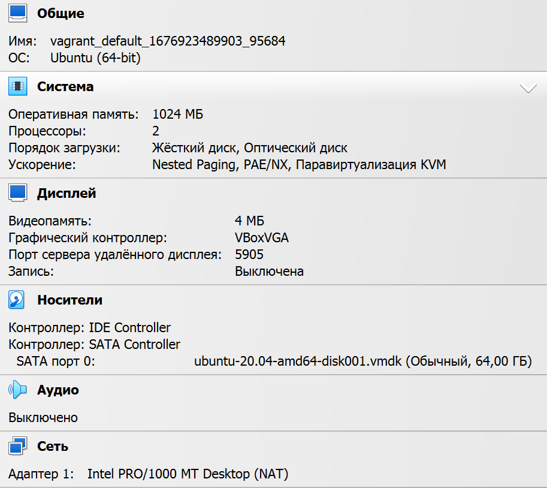

# Домашнее задание к занятию "Работа в терминале. Лекция 1"

## Задание

1. С помощью базового файла конфигурации запустите Ubuntu 20.04 в VirtualBox посредством Vagrant:

	* Создайте директорию, в которой будут храниться конфигурационные файлы Vagrant. В ней выполните `vagrant init`. Замените содержимое Vagrantfile по умолчанию следующим:

		```bash
		Vagrant.configure("2") do |config|
			config.vm.box = "bento/ubuntu-20.04"
		end
		```

	* Выполнение в этой директории `vagrant up` установит провайдер VirtualBox для Vagrant, скачает необходимый образ и запустит виртуальную машину.

	* `vagrant suspend` выключит виртуальную машину с сохранением ее состояния (т.е., при следующем `vagrant up` будут запущены все процессы внутри, которые работали на момент вызова suspend), `vagrant halt` выключит виртуальную машину штатным образом.

---
### Ответ:
Результат выполнения комманды `vagrant up`


---
2. Ознакомьтесь с графическим интерфейсом VirtualBox, посмотрите как выглядит виртуальная машина, которую создал для вас Vagrant, какие аппаратные ресурсы ей выделены. Какие ресурсы выделены по-умолчанию?
---
### Ответ:
Вид графического интерфейса VirtualBox


Аппаратные ресурсы по-умолчанию



---

3. Ознакомьтесь с возможностями конфигурации VirtualBox через Vagrantfile: [документация](https://www.vagrantup.com/docs/providers/virtualbox/configuration.html). Как добавить оперативной памяти или ресурсов процессора виртуальной машине?

---
### Ответ:        
Для добавления ресурсов процессора(`vb.cpus`) и оперативной памяти(`vb.memory`), необходимо добавить следующий код в ***Vagrantfile***
```bash
Vagrant.configure("2") do |config|
# здесь может быть какой-то код
    config.vm.provider "virtualbox" do |vb|
        vb.cpus = "2"
        vb.memory = "2048"
    end
end
```
---

4. Команда `vagrant ssh` из директории, в которой содержится Vagrantfile, позволит вам оказаться внутри виртуальной машины без каких-либо дополнительных настроек. Попрактикуйтесь в выполнении обсуждаемых команд в терминале Ubuntu.

---
### Ответ:
Подключение с помощью `vagrant ssh` и выполнение команд в терминале виртуальной машины


---

5. Ознакомьтесь с разделами `man bash`, почитайте о настройках самого bash:
    * какой переменной можно задать длину журнала `history`, и на какой строчке manual это описывается?
    * что делает директива `ignoreboth` в bash?
---
### Ответ:
   - Для изменения длины журнала нужно задать значение переменной `HISTSIZE` 660 строка мануала
    
   - `ignoreboth` сокращение от `ignorespace` и `ignoredups`, соответсвенно игнорирует строки начинающиеся с символа пробела и игнорирует строки соответствующие предыдущей записи истории.
---
6. В каких сценариях использования применимы скобки `{}` и на какой строчке `man bash` это описано?
---
### Ответ:

*Brace Expansion* - это механизм, с помощью которого могут быть сгенерированы произвольные строки.
Описание на строке 891.

**Например:**
```bash
mkdir /tmp/{old,new,dist,bugs}
```
Данная команда создаст 4 каталога `old,new,dist,bugs` по пути `/tmp/`


---
7. С учётом ответа на предыдущий вопрос, как создать однократным вызовом `touch` 100000 файлов? Получится ли аналогичным образом создать 300000? Если нет, то почему?
---
### Ответ:

- Создать **100000** файлов командой `touch {1..100000}.txt`
- Создать **300000** файлов командой `touch {1..300000}.txt` не получиться т.к. будет исключение `-bash: /usr/bin/touch: Argument list too long` вызванное ограничением ОС. Посмотреть максимальное число можно командой `getconf ARG_MAX` у меня это `2097152`
---
8. В man bash поищите по `/\[\[`. Что делает конструкция `[[ -d /tmp ]]`
---
### Ответ:

Конструкция `[[ -d /tmp ]]` проверяет что путь `/tmp` существует и являеться каталогом.
Можно проверить следующим образом:
```bash
if [[ -d /tmp ]]; then echo true; else echo false; fi
```
вернет `true`

```bash
if [[ -d /tmp/test.txt ]]; then echo true; else echo false; fi
```
вернет `false`

---

9. Сделайте так, чтобы в выводе команды `type -a bash` первым стояла запись с нестандартным путем, например bash is ... 
Используйте знания о просмотре существующих и создании новых переменных окружения, обратите внимание на переменную окружения PATH 

	```bash
	bash is /tmp/new_path_directory/bash
	bash is /usr/local/bin/bash
	bash is /bin/bash
	```

	(прочие строки могут отличаться содержимым и порядком)
    В качестве ответа приведите команды, которые позволили вам добиться указанного вывода или соответствующие скриншоты.
---
### Ответ:


---

10. Чем отличается планирование команд с помощью `batch` и `at`?

---
### Ответ:
- `at` выполняет команды в указанное время.
- `batch` выполняет команды, когда позволяют уровни загрузки системы; другими словами, когда среднее значение нагрузки падает ниже 1,5 или значения, указанного при вызове `atd`.

---


11. Завершите работу виртуальной машины чтобы не расходовать ресурсы компьютера и/или батарею ноутбука.
---
### Ответ:


---

