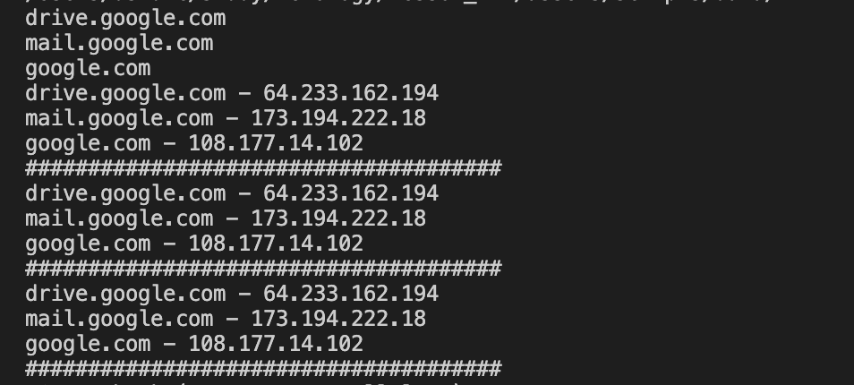

# Домашнее задание к занятию «Языки разметки JSON и YAML»


------

## Задание 1

Мы выгрузили JSON, который получили через API-запрос к нашему сервису:

```
    { "info" : "Sample JSON output from our service\t",
        "elements" :[
            { "name" : "first",
            "type" : "server",
            "ip" : 7175 
            }
            { "name" : "second",
            "type" : "proxy",
            "ip : 71.78.22.43
            }
        ]
    }
```
  Нужно найти и исправить все ошибки, которые допускает наш сервис.

### Ваш скрипт:

Исправил структуру, также не правильно записан ip адрес (поставил произвольный).
```json
{
    "info": "Sample JSON output from our service\t",
    "elements": [
        {
            "name": "first",
            "type": "server",
            "ip": "71.78.22.42"
        },
        {
            "name": "second",
            "type": "proxy",
            "ip": "71.78.22.43"
        }
    ]
}
```

---

## Задание 2

В прошлый рабочий день мы создавали скрипт, позволяющий опрашивать веб-сервисы и получать их IP. К уже реализованному функционалу нам нужно добавить возможность записи JSON и YAML-файлов, описывающих наши сервисы. 

Формат записи JSON по одному сервису: `{ "имя сервиса" : "его IP"}`. 

Формат записи YAML по одному сервису: `- имя сервиса: его IP`. 

Если в момент исполнения скрипта меняется IP у сервиса — он должен так же поменяться в YAML и JSON-файле.

### Ваш скрипт:

```python
import os
import socket
import time
import json
import yaml

PATH = os.path.join(os.path.dirname(__file__), "data", "") 

service_addr = {
    'drive.google.com': '0',
    'mail.google.com': '0',
    'google.com': '0'
}

def write_data (name_service, data):
    # json
    with open (os.path.join(PATH, name_service + ".json"), "w") as f:
        payload = json.dumps({name_service: data})
        f.write(payload)
    
    # yaml
    with open (os.path.join(PATH, name_service + ".yaml"), "w") as f:
        payload = yaml.dump({name_service: data}, explicit_start=True, explicit_end=True)
        f.write(payload)

for item in service_addr:
    initial_addr = socket.gethostbyname(item)
    service_addr[item] = initial_addr
    print(item)
    write_data(item, service_addr[item])


while True:
    for item in service_addr:
        old_addr = service_addr[item]
        new_addr = socket.gethostbyname(item)
        if new_addr != old_addr:
            service_addr[item] = new_addr

            print("[ERROR] "+item+" IP mismatch: old IP "+old_addr+", new IP "+new_addr)
        print(item + " - " + service_addr[item])
        write_data(item, service_addr[item])
    print("######################################")
    time.sleep(10)
```

### Вывод скрипта при запуске во время тестирования:



[Выходные данные](assets/scripts/data)

### JSON-файл(ы), который(е) записал ваш скрипт:

```json
{
    "drive.google.com": "64.233.162.194"
}
```


### YAML-файл(ы), который(е) записал ваш скрипт:

```yaml
---
drive.google.com: 64.233.162.194
...

```

---