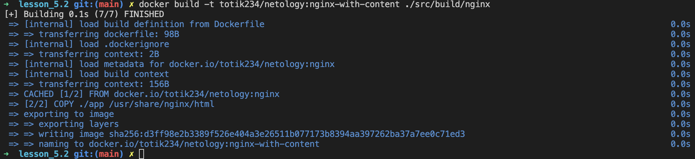

# Домашнее задание к занятию 3. «Введение. Экосистема. Архитектура. Жизненный цикл Docker-контейнера»

## Задача 1

Сценарий выполнения задачи:

- создайте свой репозиторий на https://hub.docker.com;
- выберите любой образ, который содержит веб-сервер Nginx;
- создайте свой fork образа;
- реализуйте функциональность:
запуск веб-сервера в фоне с индекс-страницей, содержащей HTML-код ниже:
```
<html>
<head>
Hey, Netology
</head>
<body>
<h1>I’m DevOps Engineer!</h1>
</body>
</html>
```

Опубликуйте созданный fork в своём репозитории и предоставьте ответ в виде ссылки на https://hub.docker.com/username_repo.

### Ответ:

---
1. Создать репозиторий
   

   [Репозиторий](https://hub.docker.com/r/totik234/netology)

2. Выбрать и создайте свой fork образа
    ```bash
    $ docker pull nginx:1.24.0
    $ docker tag nginx:1.24.0 totik234/netology:nginx
    $ docker push totik234/netology:nginx
    ```
    

3. Запуск веб-сервера в фоне с индекс-страницей
   * Сборка образа
   
   * Демонстрация работы
   ```bash
   $ docker run -d -p 8080:80 totik234/netology:nginx-with-content
   ```
   

---

## Задача 2

Посмотрите на сценарий ниже и ответьте на вопрос:
«Подходит ли в этом сценарии использование Docker-контейнеров или лучше подойдёт виртуальная машина, физическая машина? Может быть, возможны разные варианты?»

Детально опишите и обоснуйте свой выбор.

--

Сценарий:

- высоконагруженное монолитное Java веб-приложение;
- Nodejs веб-приложение;
- мобильное приложение c версиями для Android и iOS;
- шина данных на базе Apache Kafka;
- Elasticsearch-кластер для реализации логирования продуктивного веб-приложения — три ноды elasticsearch, два logstash и две ноды kibana;
- мониторинг-стек на базе Prometheus и Grafana;
- MongoDB как основное хранилище данных для Java-приложения;
- Gitlab-сервер для реализации CI/CD-процессов и приватный (закрытый) Docker Registry.

### Ответ:

---
- высоконагруженное монолитное Java веб-приложение;
  - Контейнерезация больше подходит для микросервисов или не больших монолитов, в данном случае я бы использовал виртуализацию или физическую машину. Но никто не запрещает использовать Docker
- Nodejs веб-приложение;
  - Docker контейнер. Тут в полной мере проявляются все преимущества контенеризации: скорость развертывания, масштабируемость, производительность, независимость от инфрастуктуры и тд.
- мобильное приложение c версиями для Android и iOS;
  - iOS - физический хост, так как разработка возможна только в пределах macOS. Под Android можно использовать Docker
- шина данных на базе Apache Kafka;
  - Docker легко масштабируется
- Elasticsearch-кластер для реализации логирования продуктивного веб-приложения — три ноды elasticsearch, два logstash и две ноды kibana;
  - Docker легко масштабируется
- мониторинг-стек на базе Prometheus и Grafana;
  - Docker легко масштабируется
- MongoDB как основное хранилище данных для Java-приложения;
  - Можно как в контейнере так и на виртуальной машине
- Gitlab-сервер для реализации CI/CD-процессов и приватный (закрытый) Docker Registry.
  - Docker подойдет

---

## Задача 3

- Запустите первый контейнер из образа ***centos*** c любым тегом в фоновом режиме, подключив папку ```/data``` из текущей рабочей директории на хостовой машине в ```/data``` контейнера.
- Запустите второй контейнер из образа ***debian*** в фоновом режиме, подключив папку ```/data``` из текущей рабочей директории на хостовой машине в ```/data``` контейнера.
- Подключитесь к первому контейнеру с помощью ```docker exec``` и создайте текстовый файл любого содержания в ```/data```.
- Добавьте ещё один файл в папку ```/data``` на хостовой машине.
- Подключитесь во второй контейнер и отобразите листинг и содержание файлов в ```/data``` контейнера.

### Ответ:
Запуск контейнеров

Создание файлов и вывод содержимого


---

