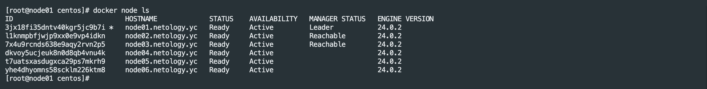
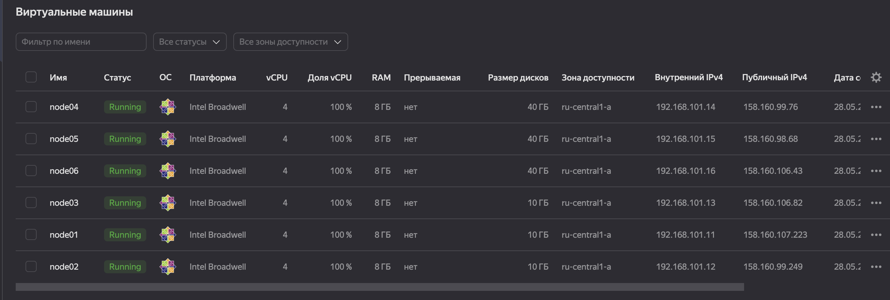
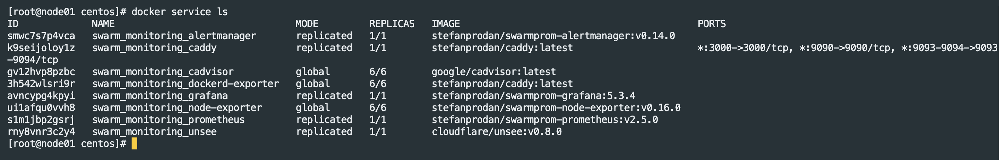
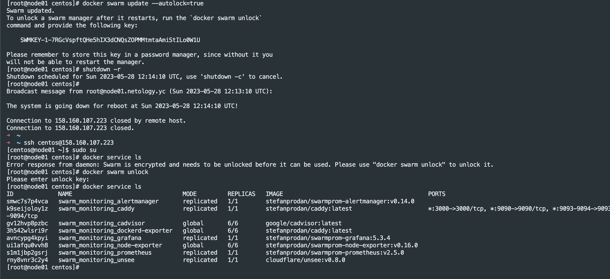

# Домашнее задание к занятию 5. «Оркестрация кластером Docker контейнеров на примере Docker Swarm»


## Задача 1

Дайте письменые ответы на вопросы:

- В чём отличие режимов работы сервисов в Docker Swarm-кластере: replication и global?
- Какой алгоритм выбора лидера используется в Docker Swarm-кластере?
- Что такое Overlay Network?

### Ответ:

---
- В чём отличие режимов работы сервисов в Docker Swarm кластере: replication и global?
    - Для replicated сервисов мы указываем количество идентичных задач, которых хотим запустить. Swarm отслеживает текущее количество запущенных задач и в случае падения какой-либо ноды - запустит задачу на другой (поддерживает заданное количество реплик).
    - Global сервис запускает одну задачу на каждой ноде. То есть при добавлении в кластер новых нод, глобальный сервис будет запущен и на ней автоматически

- Какой алгоритм выбора лидера используется в Docker Swarm кластере?
    - Docker Swarm использует алгоритм консенсуса Raft для определения лидера. Этот алгоритм обеспечивает согласованное состояние кластера. Raft требует, чтобы большинство членов кластера согласились на изменение, и допускает (N-1)/2сбоев. В случае недоступности лидера, его роль берет на себя одна из нод-менеджеров (если за нее проголосовало большинство менеджеров). Реализуется это за счет таймаутов. Если в течение определенного времени менеджер не получил данные от лидера - он объявляет себя кандидатом и другие ноды голосуют за него.

- Что такое Overlay Network?
    - Overlay сеть - это сеть между несколькими демонами Docker. Она перекрывает сети хоста и позволяет контейнерам безопасно обмениваться данными (с использованием сертификатов и шифрования). Docker маршрутизирует пакеты к нужному хосту и контейнеру.

---

## Задача 2

Создайте ваш первый Docker Swarm-кластер в Яндекс Облаке.

Чтобы получить зачёт, предоставьте скриншот из терминала (консоли) с выводом команды:
```
docker node ls
```

### Ответ:

---



---

## Задача 3

Создайте ваш первый, готовый к боевой эксплуатации кластер мониторинга, состоящий из стека микросервисов.

Чтобы получить зачёт, предоставьте скриншот из терминала (консоли), с выводом команды:
```
docker service ls
```

### Ответ:

---


---

## Задача 4 (*)

Выполните на лидере Docker Swarm-кластера команду, указанную ниже, и дайте письменное описание её функционала — что она делает и зачем нужна:
```
# см.документацию: https://docs.docker.com/engine/swarm/swarm_manager_locking/
docker swarm update --autolock=true
```

### Ответ:

---
Данная команда нужна для включения автоблокировки Swarm после перезагрузки ноды.
Когда демон Docker перезапускается, ключи шифрования журналов Raft и ключи TLS для взаимодействия серверов загружаются в память каждой ноды. Чтобы защитить эти ключи, Docker может включить механизм блокировки ноды (по сути шифрование этих ключей).
После активации данного механизма при перезагрузке ноды необходимо каждый раз вводить вручную ключ шифрования, чтобы нода успешно запустилась и продолжила работу в составе кластера.



---

