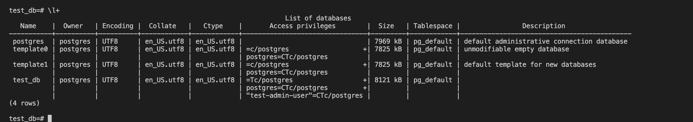
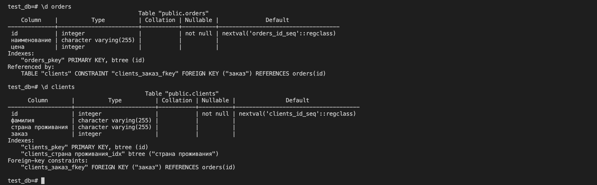
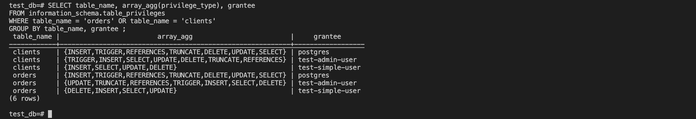
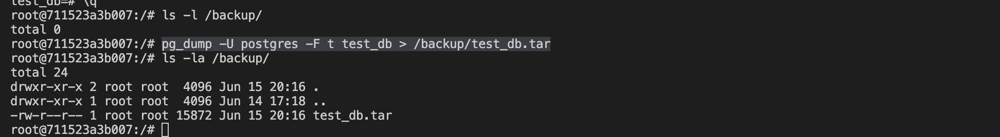

# Домашнее задание к занятию 2. «SQL»


## Задача 1

Используя Docker, поднимите инстанс PostgreSQL (версию 12) c 2 volume, 
в который будут складываться данные БД и бэкапы.

Приведите получившуюся команду или docker-compose-манифест.

### Ответ:
---
```yaml
version: "3.9"

services:
  db:
    image: postgres:12
    restart: unless-stopped
    volumes:
      - db_data:/var/lib/postgresql/data
      - db_backup:/backup
    environment:
      POSTGRES_PASSWORD: "123"
    ports:
      - "5432:5432"

volumes:
  db_data:
  db_backup:

```
---

## Задача 2

В БД из задачи 1: 

- создайте пользователя test-admin-user и БД test_db;
- в БД test_db создайте таблицу orders и clients (спeцификация таблиц ниже);
- предоставьте привилегии на все операции пользователю test-admin-user на таблицы БД test_db;
- создайте пользователя test-simple-user;
- предоставьте пользователю test-simple-user права на SELECT/INSERT/UPDATE/DELETE этих таблиц БД test_db.

Таблица orders:

- id (serial primary key);
- наименование (string);
- цена (integer).

Таблица clients:

- id (serial primary key);
- фамилия (string);
- страна проживания (string, index);
- заказ (foreign key orders).

Приведите:

- итоговый список БД после выполнения пунктов выше;
- описание таблиц (describe);
- SQL-запрос для выдачи списка пользователей с правами над таблицами test_db;
- список пользователей с правами над таблицами test_db.

### Ответ:

---
- итоговый список БД после выполнения пунктов выше;

- описание таблиц (describe);

- SQL-запрос для выдачи списка пользователей с правами над таблицами test_db;
    ```SQL
    SELECT table_name, array_agg(privilege_type), grantee
    FROM information_schema.table_privileges
    WHERE table_name = 'orders' OR table_name = 'clients'
    GROUP BY table_name, grantee;
    ```
- список пользователей с правами над таблицами test_db;

---

## Задача 3

Используя SQL-синтаксис, наполните таблицы следующими тестовыми данными:

Таблица orders

|Наименование|цена|
|------------|----|
|Шоколад| 10 |
|Принтер| 3000 |
|Книга| 500 |
|Монитор| 7000|
|Гитара| 4000|

Таблица clients

|ФИО|Страна проживания|
|------------|----|
|Иванов Иван Иванович| USA |
|Петров Петр Петрович| Canada |
|Иоганн Себастьян Бах| Japan |
|Ронни Джеймс Дио| Russia|
|Ritchie Blackmore| Russia|

Используя SQL-синтаксис:
- вычислите количество записей для каждой таблицы.

Приведите в ответе:

    - запросы,
    - результаты их выполнения.

### Ответ:
---
- Таблица orders
```sql
test_db=# INSERT INTO orders (наименование, цена )
VALUES 
    ('Шоколад', '10'),
    ('Принтер', '3000'),
    ('Книга', '500'),
    ('Монитор', '7000'),
    ('Гитара', '4000')
;
INSERT 0 5
```

- Таблица clients
```sql
test_db=# INSERT INTO clients ("фамилия", "страна проживания")
VALUES 
    ('Иванов Иван Иванович', 'USA'),
    ('Петров Петр Петрович', 'Canada'),
    ('Иоганн Себастьян Бах', 'Japan'),
    ('Ронни Джеймс Дио', 'Russia'),
    ('Ritchie Blackmore', 'Russia')
;
INSERT 0 5
```

- вычислите количество записей для каждой таблицы.
  - для orders
    ```sql
    test_db=# SELECT COUNT(*) FROM orders;
    count 
    -------
        5
    (1 row)
    ```
  - для clients
    ```sql
    test_db=# SELECT COUNT(*) FROM clients;
    count 
    -------
        5
    (1 row)
    ```
---

## Задача 4

Часть пользователей из таблицы clients решили оформить заказы из таблицы orders.

Используя foreign keys, свяжите записи из таблиц, согласно таблице:

|ФИО|Заказ|
|------------|----|
|Иванов Иван Иванович| Книга |
|Петров Петр Петрович| Монитор |
|Иоганн Себастьян Бах| Гитара |

Приведите SQL-запросы для выполнения этих операций.

Приведите SQL-запрос для выдачи всех пользователей, которые совершили заказ, а также вывод этого запроса.
 
Подсказка: используйте директиву `UPDATE`.

### Ответ:
---
```sql
UPDATE clients SET "заказ"=3 WHERE id=1; 
UPDATE clients SET "заказ"=4 WHERE id=2; 
UPDATE clients SET "заказ"=5 WHERE id=3; 
```
```sql
test_db=# SELECT * FROM clients WHERE заказ IS NOT NULL;
 id |       фамилия        | страна проживания | заказ 
----+----------------------+-------------------+-------
  1 | Иванов Иван Иванович | USA               |     3
  2 | Петров Петр Петрович | Canada            |     4
  3 | Иоганн Себастьян Бах | Japan             |     5
(3 rows)
```

---

## Задача 5

Получите полную информацию по выполнению запроса выдачи всех пользователей из задачи 4 
(используя директиву EXPLAIN).

Приведите получившийся результат и объясните, что значат полученные значения.

### Ответ:
---
```sql
test_db=# explain SELECT * FROM clients WHERE заказ IS NOT NULL;
                         QUERY PLAN                         
------------------------------------------------------------
 Seq Scan on clients  (cost=0.00..10.70 rows=70 width=1040)
   Filter: ("заказ" IS NOT NULL)
(2 rows)
```
  - Читаем последовательно данные из таблицы `clients`
  - `cost`
    - Стоимость получения первого значения `0.00`.
    - Стоимость получения всех строк `18.10`.
  - `rows`
    - Приблизительное количество проверенных строк `70`
  - `width`
    - Средний размер каждой строки в байтах составил `1040`
  - Используется фильтр `"заказ" IS NOT NULL`

---

## Задача 6

Создайте бэкап БД test_db и поместите его в volume, предназначенный для бэкапов (см. задачу 1).

Остановите контейнер с PostgreSQL, но не удаляйте volumes.

Поднимите новый пустой контейнер с PostgreSQL.

Восстановите БД test_db в новом контейнере.

Приведите список операций, который вы применяли для бэкапа данных и восстановления. 

### Ответ:
---
- backup
```sql
pg_dump -U postgres -F t test_db > /backup/test_db.tar
```


- restore
```sql
pg_restore -U postgres --verbose -C -d postgres /backup/test_db.tar
```


---


