# Домашнее задание к занятию 4. «PostgreSQL»

## Задача 1

Используя Docker, поднимите инстанс PostgreSQL (версию 13). Данные БД сохраните в volume.

Подключитесь к БД PostgreSQL, используя `psql`.

Воспользуйтесь командой `\?` для вывода подсказки по имеющимся в `psql` управляющим командам.

**Найдите и приведите** управляющие команды для:

- вывода списка БД,
- подключения к БД,
- вывода списка таблиц,
- вывода описания содержимого таблиц,
- выхода из psql.

### Ответ:
---

[docker-compose](assets/docker-compose/docker-compose.yml)

- вывода списка БД
  - 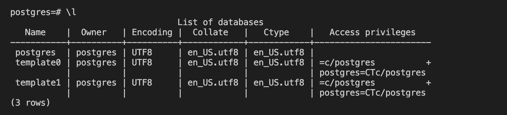
- подключения к БД
  - 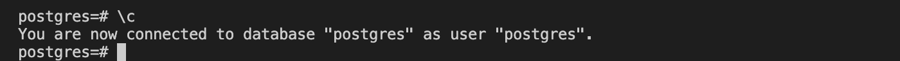
- вывода списка таблиц
  - 
- вывода описания содержимого таблиц
  - 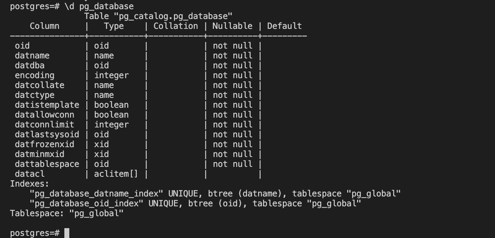
- выхода из psql
  - 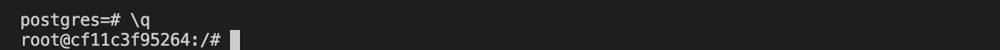
---

## Задача 2

Используя `psql`, создайте БД `test_database`.

Изучите [бэкап БД](https://github.com/netology-code/virt-homeworks/tree/virt-11/06-db-04-postgresql/test_data).

Восстановите бэкап БД в `test_database`.

Перейдите в управляющую консоль `psql` внутри контейнера.

Подключитесь к восстановленной БД и проведите операцию ANALYZE для сбора статистики по таблице.

Используя таблицу [pg_stats](https://postgrespro.ru/docs/postgresql/12/view-pg-stats), найдите столбец таблицы `orders` 
с наибольшим средним значением размера элементов в байтах.

**Приведите в ответе** команду, которую вы использовали для вычисления, и полученный результат.

### Ответ:
---
- 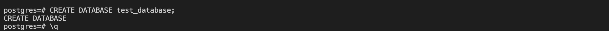
- 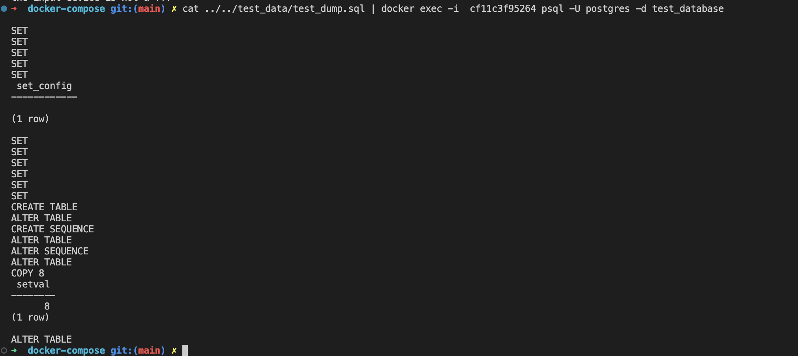
- 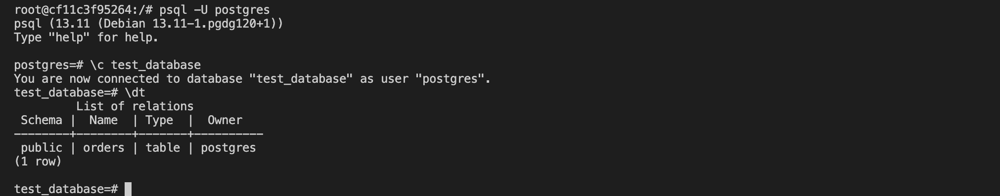
- 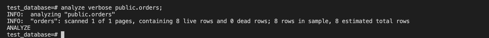
- 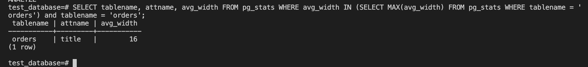
---

## Задача 3

Архитектор и администратор БД выяснили, что ваша таблица orders разрослась до невиданных размеров и
поиск по ней занимает долгое время. Вам как успешному выпускнику курсов DevOps в Нетологии предложили
провести разбиение таблицы на 2: шардировать на orders_1 - price>499 и orders_2 - price<=499.

Предложите SQL-транзакцию для проведения этой операции.

Можно ли было изначально исключить ручное разбиение при проектировании таблицы orders?

### Ответ:
---

Для шардинга таблиц мы делаем следующие шаги:

1. Переименовываем текущую таблицу в orders_old
1. Создаем пустую таблицу с исходным именем orders
1. Создаем две пустые таблицы orders_1 и orders_2 с наследованием от orders
1. Определяем в этих таблицах ограничения на значение ключа price
1. Определяем правила, при котором INSERT в таблицу orders будет заменяться на INSERT в соответствующую дочернюю таблицу (в зависимости от значения ключа price)
1. Копируем через INSERT таблицу orders_old в orders SQL транзакция

```sql
BEGIN;
ALTER TABLE orders RENAME TO orders_old;

CREATE TABLE orders AS table orders_old WITH NO DATA;

CREATE TABLE orders_1 (
    CHECK (price > 499)
) INHERITS (orders);

CREATE TABLE orders_2 (
    CHECK (price <= 499)
) INHERITS (orders);

CREATE RULE orders_1_insert AS
ON INSERT TO orders WHERE
    (price > 499)
DO INSTEAD
    INSERT INTO orders_1 VALUES (NEW.*);
       
CREATE RULE orders_2_insert AS
ON INSERT TO orders WHERE
    (price <= 499)
DO INSTEAD
    INSERT INTO orders_2 VALUES (NEW.*);
    
INSERT INTO orders
SELECT * FROM orders_old;
COMMIT;
```

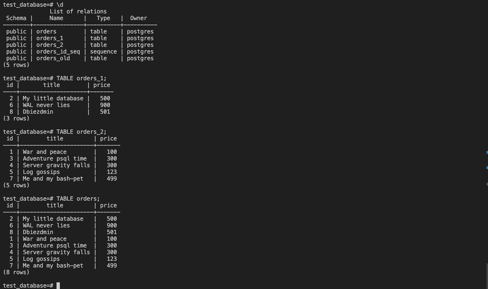

Если мы сделали это в ручном режиме, то конечно же можно было предусмотреть и при проектирование.

---

## Задача 4

Используя утилиту `pg_dump`, создайте бекап БД `test_database`.

Как бы вы доработали бэкап-файл, чтобы добавить уникальность значения столбца `title` для таблиц `test_database`?

### Ответ:
---

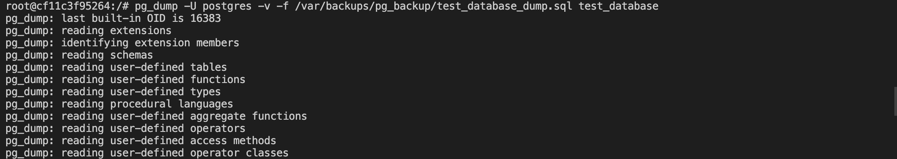

Добавив параметр UNIQUE в описание столбца таблицы (в случае шадрированной таблицы соответственно в описание всех 3-х таблиц)

```sql
CREATE TABLE public.orders (
    id integer DEFAULT NULL NOT NULL,
    title character varying(80) NOT NULL UNIQUE,
    price integer DEFAULT 0
);
CREATE TABLE public.orders_2 (
    id integer DEFAULT NULL NOT NULL,
    title character varying(80) NOT NULL UNIQUE,
    price integer DEFAULT 0
);
CREATE TABLE public.orders_1 (
    id integer DEFAULT NULL NOT NULL,
    title character varying(80) NOT NULL UNIQUE,
    price integer DEFAULT 0
);
```

---
