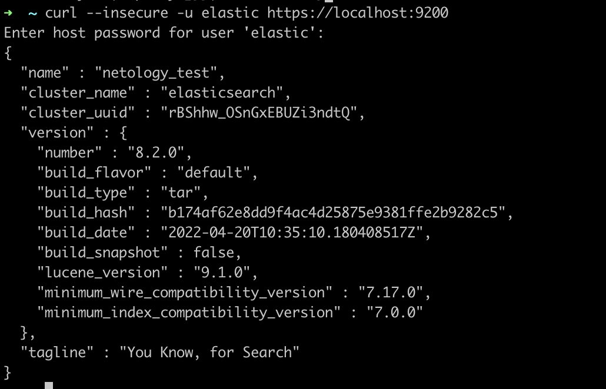
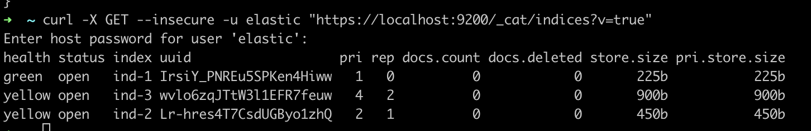
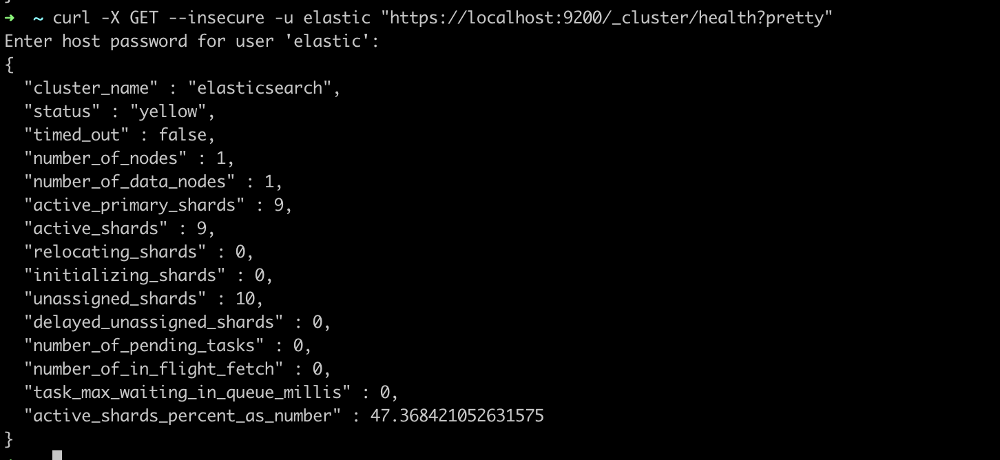
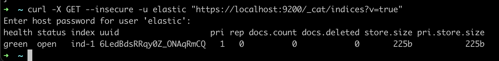
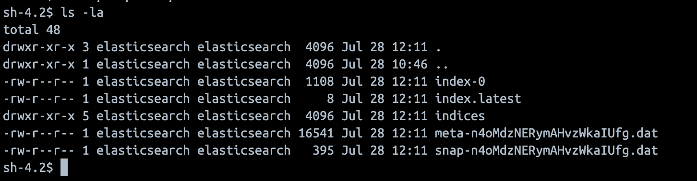
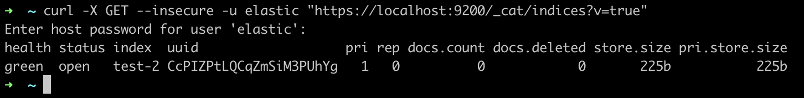
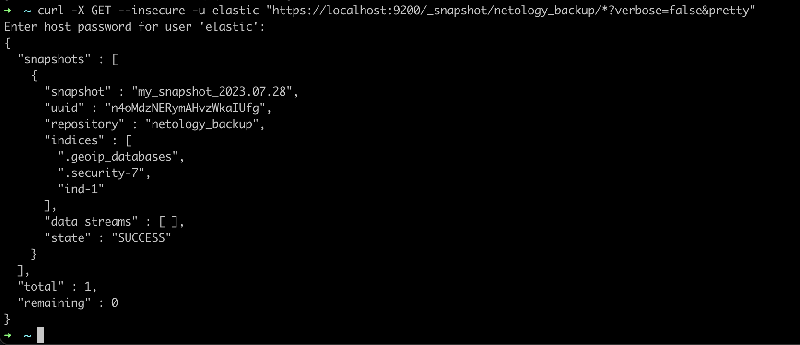

# Домашнее задание к занятию 5. «Elasticsearch»

## Задача 1

В этом задании вы потренируетесь в:

- установке Elasticsearch,
- первоначальном конфигурировании Elasticsearch,
- запуске Elasticsearch в Docker.

Используя Docker-образ [centos:7](https://hub.docker.com/_/centos) как базовый и 
[документацию по установке и запуску Elastcisearch](https://www.elastic.co/guide/en/elasticsearch/reference/current/targz.html):

- составьте Dockerfile-манифест для Elasticsearch,
- соберите Docker-образ и сделайте `push` в ваш docker.io-репозиторий,
- запустите контейнер из получившегося образа и выполните запрос пути `/` c хост-машины.

Требования к `elasticsearch.yml`:

- данные `path` должны сохраняться в `/var/lib`,
- имя ноды должно быть `netology_test`.

В ответе приведите:

- текст Dockerfile-манифеста,
- ссылку на образ в репозитории dockerhub,
- ответ `Elasticsearch` на запрос пути `/` в json-виде.

Подсказки:

- возможно, вам понадобится установка пакета perl-Digest-SHA для корректной работы пакета shasum,
- при сетевых проблемах внимательно изучите кластерные и сетевые настройки в elasticsearch.yml,
- при некоторых проблемах вам поможет Docker-директива ulimit,
- Elasticsearch в логах обычно описывает проблему и пути её решения.

Далее мы будем работать с этим экземпляром Elasticsearch.

### Отввет:
---
- текст Dockerfile-манифеста
```Dockerfile
FROM centos:7
RUN cd /opt && \
    groupadd elasticsearch && \
    useradd -c "elasticsearch" -g elasticsearch elasticsearch &&\
    yum update -y && yum -y install wget perl-Digest-SHA && \
    wget https://artifacts.elastic.co/downloads/elasticsearch/elasticsearch-8.2.0-linux-x86_64.tar.gz && \
    wget https://artifacts.elastic.co/downloads/elasticsearch/elasticsearch-8.2.0-linux-x86_64.tar.gz.sha512 && \
    shasum -a 512 -c elasticsearch-8.2.0-linux-x86_64.tar.gz.sha512 && \
    tar -xzf elasticsearch-8.2.0-linux-x86_64.tar.gz && \
	rm elasticsearch-8.2.0-linux-x86_64.tar.gz elasticsearch-8.2.0-linux-x86_64.tar.gz.sha512 && \ 
	mkdir /var/lib/data && chmod -R 777 /var/lib/data && \
	chown -R elasticsearch:elasticsearch /opt/elasticsearch-8.2.0 && \
	yum -y remove wget perl-Digest-SHA && \
	yum clean all
USER elasticsearch
WORKDIR /opt/elasticsearch-8.2.0/
COPY elasticsearch.yml  config/
EXPOSE 9200 9300
ENTRYPOINT ["bin/elasticsearch"]
```

- ссылка на [образ](https://hub.docker.com/r/totik234/elasticsearch) в репозитории dockerhub 

- ответ `Elasticsearch` на запрос пути `/` в json-виде.
```json
{
  "name" : "netology_test",
  "cluster_name" : "elasticsearch",
  "cluster_uuid" : "rBShhw_OSnGxEBUZi3ndtQ",
  "version" : {
    "number" : "8.2.0",
    "build_flavor" : "default",
    "build_type" : "tar",
    "build_hash" : "b174af62e8dd9f4ac4d25875e9381ffe2b9282c5",
    "build_date" : "2022-04-20T10:35:10.180408517Z",
    "build_snapshot" : false,
    "lucene_version" : "9.1.0",
    "minimum_wire_compatibility_version" : "7.17.0",
    "minimum_index_compatibility_version" : "7.0.0"
  },
  "tagline" : "You Know, for Search"
}
```


---


## Задача 2

В этом задании вы научитесь:

- создавать и удалять индексы,
- изучать состояние кластера,
- обосновывать причину деградации доступности данных.

Ознакомьтесь с [документацией](https://www.elastic.co/guide/en/elasticsearch/reference/current/indices-create-index.html) 
и добавьте в `Elasticsearch` 3 индекса в соответствии с таблицей:

| Имя | Количество реплик | Количество шард |
|-----|-------------------|-----------------|
| ind-1| 0 | 1 |
| ind-2 | 1 | 2 |
| ind-3 | 2 | 4 |

Получите список индексов и их статусов, используя API, и **приведите в ответе** на задание.

Получите состояние кластера `Elasticsearch`, используя API.

Как вы думаете, почему часть индексов и кластер находятся в состоянии yellow?

Удалите все индексы.

**Важно**

При проектировании кластера Elasticsearch нужно корректно рассчитывать количество реплик и шард,
иначе возможна потеря данных индексов, вплоть до полной, при деградации системы.


### Ответ:
---
- добавить в `Elasticsearch` 3 индекса

```bash
curl -X PUT --insecure -u elastic "https://localhost:9200/ind-1?pretty" -H 'Content-Type: application/json' -d'
{
  "settings": {
    "index": {
      "number_of_shards": 1,  
      "number_of_replicas": 0 
    }
  }
}
'

curl -X PUT --insecure -u elastic "https://localhost:9200/ind-2?pretty" -H 'Content-Type: application/json' -d'
{
  "settings": {
    "index": {
      "number_of_shards": 2,  
      "number_of_replicas": 1 
    }
  }
}
'

curl -X PUT --insecure -u elastic "https://localhost:9200/ind-3?pretty" -H 'Content-Type: application/json' -d'
{
  "settings": {
    "index": {
      "number_of_shards": 4,  
      "number_of_replicas": 2 
    }
  }
}
'
```

- Получить список индексов и их статусов


- Получить состояние кластера `Elasticsearch`


- Как вы думаете, почему часть индексов и кластер находятся в состоянии yellow?
  Полагаю, индексы и кластер находятся в yellow, так как при создании индексов мы указали количество реплик больше 1. В кластере у нас 1 нода, поэтому реплицировать индексы некуда.

- Удалите все индексы.
```bash
curl -X DELETE --insecure -u elastic "https://localhost:9200/ind-1?pretty"
curl -X DELETE --insecure -u elastic "https://localhost:9200/ind-2?pretty"
curl -X DELETE --insecure -u elastic "https://localhost:9200/ind-3?pretty"
```
---

## Задача 3

В этом задании вы научитесь:

- создавать бэкапы данных,
- восстанавливать индексы из бэкапов.

Создайте директорию `{путь до корневой директории с Elasticsearch в образе}/snapshots`.

Используя API, [зарегистрируйте](https://www.elastic.co/guide/en/elasticsearch/reference/current/snapshots-register-repository.html#snapshots-register-repository) 
эту директорию как `snapshot repository` c именем `netology_backup`.

**Приведите в ответе** запрос API и результат вызова API для создания репозитория.

Создайте индекс `test` с 0 реплик и 1 шардом и **приведите в ответе** список индексов.

[Создайте `snapshot`](https://www.elastic.co/guide/en/elasticsearch/reference/current/snapshots-take-snapshot.html) 
состояния кластера `Elasticsearch`.

**Приведите в ответе** список файлов в директории со `snapshot`.

Удалите индекс `test` и создайте индекс `test-2`. **Приведите в ответе** список индексов.

[Восстановите](https://www.elastic.co/guide/en/elasticsearch/reference/current/snapshots-restore-snapshot.html) состояние
кластера `Elasticsearch` из `snapshot`, созданного ранее. 

**Приведите в ответе** запрос к API восстановления и итоговый список индексов.

Подсказки:

- возможно, вам понадобится доработать `elasticsearch.yml` в части директивы `path.repo` и перезапустить `Elasticsearch`.


### Ответ:
---
- Создание репозитория.
    В [Dokerfile](src/Dockerfile) добавил `mkdir /opt/elasticsearch-8.2.0/snapshots`
```bash
curl -X PUT --insecure -u elastic https://localhost:9200/_snapshot/netology_backup -H 'Content-Type: application/json' -d'
{
  "type": "fs",
    "settings": {
    "location": "/opt/elasticsearch-8.2.0/snapshots"
  }
}'
```
- Создайте индекс `test` с 0 реплик и 1 шардом

```bash
curl -X PUT --insecure -u elastic "https://localhost:9200/ind-1?pretty" -H 'Content-Type: application/json' -d'
{
  "settings": {
    "index": {
      "number_of_shards": 1,  
      "number_of_replicas": 0 
    }
  }
}
'
```

- Создайть snapshot
  
```bash
curl -X PUT --insecure -u elastic "https://localhost:9200/_snapshot/netology_backup/%3Cmy_snapshot_%7Bnow%2Fd%7D%3E?pretty"
```


- Удалите индекс `test` и создайте индекс `test-2`.
```bash
curl -X DELETE --insecure -u elastic "https://localhost:9200/ind-1?pretty"
```

```bash
curl -X PUT --insecure -u elastic "https://localhost:9200/test-2?pretty" -H 'Content-Type: application/json' -d'
{
  "settings": {
    "index": {
      "number_of_shards": 1,  
      "number_of_replicas": 0 
    }
  }
}
'
```



- Восстановите состояние кластера


```bash
curl -X POST --insecure -u elastic "https://localhost:9200/_snapshot/netology_backup/my_snapshot_2023.07.28/_restore?pretty" -H 'Content-Type: application/json' -d'
{
  "indices": "*",
  "include_global_state": true
}
```


---
