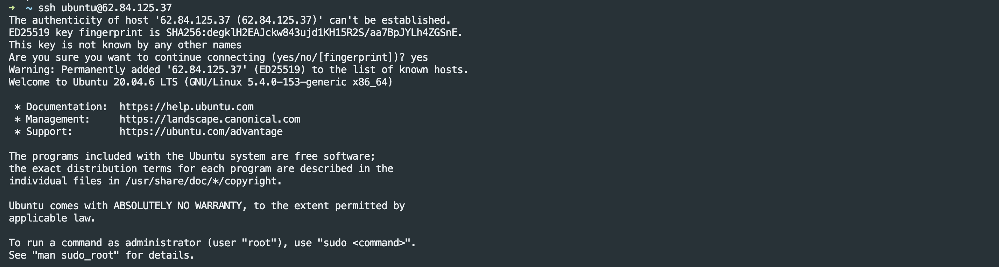

# Домашнее задание к занятию «Основы Terraform. Yandex Cloud»


### Задание 1

1. Изучите проект. В файле variables.tf объявлены переменные для yandex provider.
2. Переименуйте файл personal.auto.tfvars_example в personal.auto.tfvars. Заполните переменные (идентификаторы облака, токен доступа). Благодаря .gitignore этот файл не попадет в публичный репозиторий. **Вы можете выбрать иной способ безопасно передать секретные данные в terraform.**
3. Сгенерируйте или используйте свой текущий ssh ключ. Запишите его открытую часть в переменную **vms_ssh_root_key**.
4. Инициализируйте проект, выполните код. Исправьте намеренное допущенные ошибки. Ответьте в чем заключается их суть?
5. Ответьте, как в процессе обучения могут пригодиться параметры ```preemptible = true``` и ```core_fraction=5``` в параметрах ВМ? Ответ в документации Yandex cloud.

В качестве решения приложите:
- скриншот ЛК Yandex Cloud с созданной ВМ,
- скриншот успешного подключения к консоли ВМ через ssh,
- ответы на вопросы.

### Ответ:
---
- Инициализируйте проект, выполните код. Исправьте намеренное допущенные ошибки. Ответьте в чем заключается их суть?
    
    Ошибка заключалась в том что не существует `standart-v4` платформы. посмотреть доступные можно в [документации](https://cloud.yandex.ru/docs/compute/concepts/vm-platforms). Я выбрал `standart-v1`
    
    Следующая ошибка связана с тем, что у нас явно указан уровень производительности, при этом он имеет определенные требования, которые можно посмотреть в [документации](https://cloud.yandex.ru/docs/compute/concepts/performance-levels). Добавил еще одно ядро.

    ВМ в консоле YC
    

    Подключение по ssh
    
- Ответьте, как в процессе обучения могут пригодиться параметры ```preemptible = true``` и ```core_fraction=5``` в параметрах ВМ? Ответ в документации Yandex cloud.
  - ```preemptible = true``` исходя из [документации](https://cloud.yandex.ru/docs/compute/concepts/preemptible-vm) могу предположить поможет съэкономить средства.
  - ```core_fraction=5``` исходя из [документации](https://cloud.yandex.ru/docs/compute/concepts/performance-levels) так же как ```preemptible = true``` поможет съэкономить средства.


---

### Задание 2

1. Изучите файлы проекта.
2. Замените все "хардкод" **значения** для ресурсов **yandex_compute_image** и **yandex_compute_instance** на **отдельные** переменные. К названиям переменных ВМ добавьте в начало префикс **vm_web_** .  Пример: **vm_web_name**.
2. Объявите нужные переменные в файле variables.tf, обязательно указывайте тип переменной. Заполните их **default** прежними значениями из main.tf. 
3. Проверьте terraform plan (изменений быть не должно). 

### Ответ:
---
- Объявите нужные переменные в файле variables.tf.
  

  
- Проверьте terraform plan (изменений быть не должно).
  
---


### Задание 3

1. Создайте в корне проекта файл 'vms_platform.tf' . Перенесите в него все переменные первой ВМ.
2. Скопируйте блок ресурса и создайте с его помощью вторую ВМ(в файле main.tf): **"netology-develop-platform-db"** ,  cores  = 2, memory = 2, core_fraction = 20. Объявите ее переменные с префиксом **vm_db_** в том же файле('vms_platform.tf').
3. Примените изменения.

### Ответ:
---

<details>

<summary>Код main.tf</summary>

```hcl
resource "yandex_vpc_network" "develop" {
  name = var.vpc_name
}
resource "yandex_vpc_subnet" "develop" {
  name           = var.vpc_name
  zone           = var.default_zone
  network_id     = yandex_vpc_network.develop.id
  v4_cidr_blocks = var.default_cidr
}


data "yandex_compute_image" "ubuntu" {
  family = var.vm_image_family
}

# vm_web
resource "yandex_compute_instance" "platform_web" {
  name        = var.vm_web_instance_name
  platform_id = var.vm_web_platform_id
  resources {
    cores         = var.vm_web_platform_cores
    memory        = var.vm_web_platform_memory
    core_fraction = var.vm_web_platform_core_fraction
  }

  boot_disk {
    initialize_params {
      image_id = data.yandex_compute_image.ubuntu.image_id
    }
  }
  scheduling_policy {
    preemptible = true
  }
  network_interface {
    subnet_id = yandex_vpc_subnet.develop.id
    nat       = true
  }

  metadata = {
    serial-port-enable = 1
    ssh-keys           = "ubuntu:${var.vms_ssh_root_key}"
  }

}

# vm_db
resource "yandex_compute_instance" "platform_db" {
  name        = var.vm_db_instance_name
  platform_id = var.vm_db_platform_id
  resources {
    cores         = var.vm_db_platform_cores
    memory        = var.vm_db_platform_memory
    core_fraction = var.vm_db_platform_core_fraction
  }

  boot_disk {
    initialize_params {
      image_id = data.yandex_compute_image.ubuntu.image_id
    }
  }
  scheduling_policy {
    preemptible = true
  }
  network_interface {
    subnet_id = yandex_vpc_subnet.develop.id
    nat       = true
  }

  metadata = {
    serial-port-enable = 1
    ssh-keys           = "ubuntu:${var.vms_ssh_root_key}"
  }

}

```

</details>

<details>

<summary>Код vms_platform.tf</summary>

```hcl
### image

variable "vm_image_family" {
  type = string
  default = "ubuntu-2004-lts"
  description = "Образ ВМ"
}

### vm_web
variable "vm_web_instance_name" {
  type = string
  default = "netology-develop-platform-web"
  description = "Имя ВМ"
}

variable "vm_web_platform_id" {
  type = string
  default = "standard-v1"
  description = "Платформа"
}

variable "vm_web_platform_cores" {
  type = number
  default = 2
  description = "Количество ядер"
}

variable "vm_web_platform_memory" {
  type = number
  default = 2
  description = "Оперативная память"
}

variable "vm_web_platform_core_fraction" {
  type = number
  default = 5
  description = "https://cloud.yandex.ru/docs/compute/concepts/performance-levels"
}

### vm_db

variable "vm_db_instance_name" {
  type = string
  default = "netology-develop-platform-db"
  description = "Имя ВМ"
}

variable "vm_db_platform_id" {
  type = string
  default = "standard-v1"
  description = "Платформа"
}

variable "vm_db_platform_cores" {
  type = number
  default = 2
  description = "Количество ядер"
}

variable "vm_db_platform_memory" {
  type = number
  default = 2
  description = "Оперативная память"
}

variable "vm_db_platform_core_fraction" {
  type = number
  default = 20
  description = "https://cloud.yandex.ru/docs/compute/concepts/performance-levels"
}
```

</details>


---

### Задание 4

1. Объявите в файле outputs.tf output типа map, содержащий { instance_name = external_ip } для каждой из ВМ.
2. Примените изменения.

В качестве решения приложите вывод значений ip-адресов команды ```terraform output```

### Ответ:
---

<details>

<summery>Код outputs.tf</summery>

```hcl
output "vms_external_ip" {
  value = {
    "${yandex_compute_instance.platform_web.name}" = yandex_compute_instance.platform_web.network_interface[0].nat_ip_address
    "${yandex_compute_instance.platform_db.name}" = yandex_compute_instance.platform_db.network_interface[0].nat_ip_address
  }
}
```

</details>


---

### Задание 5

1. В файле locals.tf опишите в **одном** local-блоке имя каждой ВМ, используйте интерполяцию ${..} с несколькими переменными по примеру из лекции.
2. Замените переменные с именами ВМ из файла variables.tf на созданные вами local переменные.
3. Примените изменения.

---
```hcl
locals {
  vm_web_instance_name = "${var.words.netology}-${var.words.develop}-${var.words.platform}-${var.words.web}"
  vm_db_instance_name = "${var.words.netology}-${var.words.develop}-${var.words.platform}-${var.words.db}"
}
```


---

### Задание 6

1. Вместо использования 3-х переменных  ".._cores",".._memory",".._core_fraction" в блоке  resources {...}, объедените их в переменные типа **map** с именами "vm_web_resources" и "vm_db_resources". В качестве продвинутой практики попробуйте создать одну map переменную **vms_resources** и уже внутри нее конфиги обеих ВМ(вложенный map).
2. Так же поступите с блоком **metadata {serial-port-enable, ssh-keys}**, эта переменная должна быть общая для всех ваших ВМ.
3. Найдите и удалите все более не используемые переменные проекта.
4. Проверьте terraform plan (изменений быть не должно).

### Ответ:
---
- Вместо использования 3-х переменных
  
  variables.tf
  ```hcl
  variable "vm_configs" {
    type = map(map(number))
    default = {
      "vm_web_resources" = {
        "cores"         = 2
        "memory"        = 2
        "core_fraction" = 5
      }
      "vm_db_resources" = {
        "cores"         = 2
        "memory"        = 2
        "core_fraction" = 20
      }
    }
  }
  ```
- Так же поступите с блоком **metadata {serial-port-enable, ssh-keys}**
  
  locals.tf
  ```hcl
  vm_metadata={
    serial-port-enable = 1
    ssh-keys           = "ubuntu:${var.vms_ssh_root_key}"
  }
  ```
  