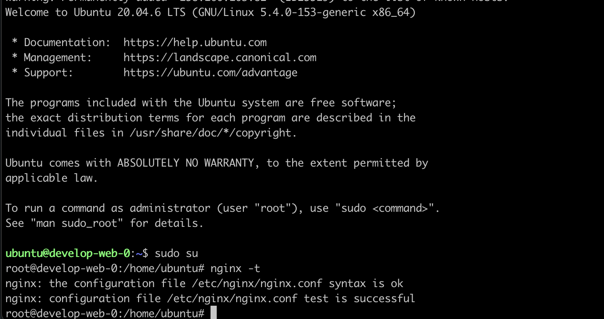
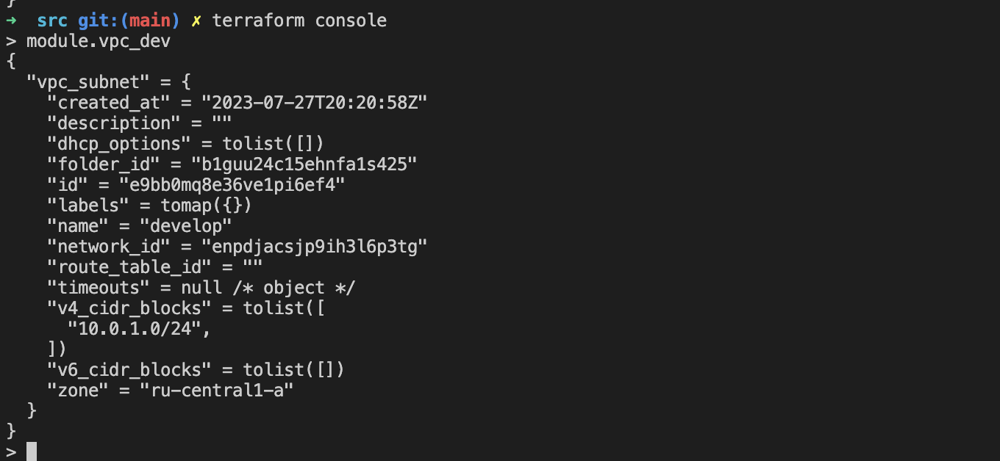
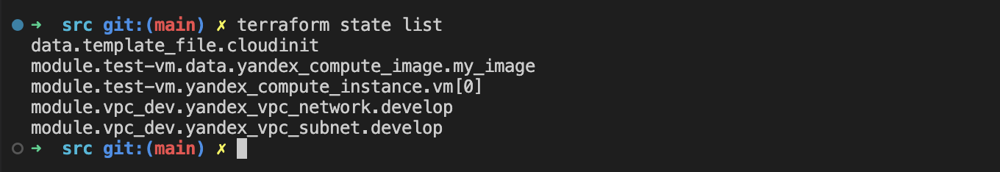
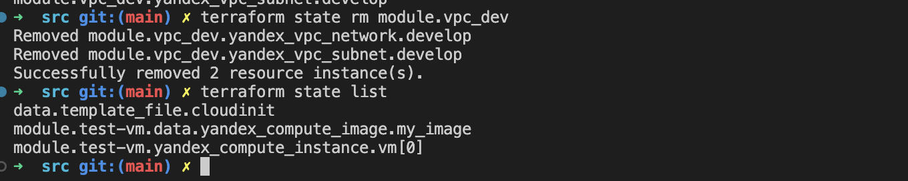
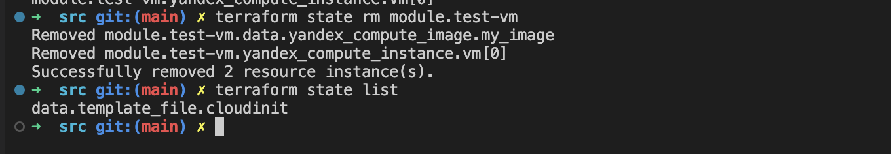
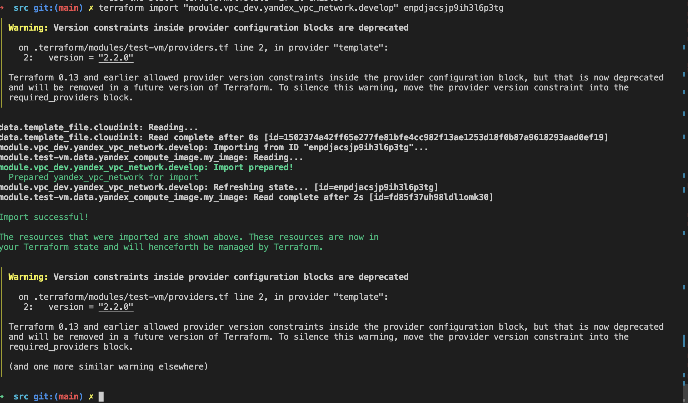
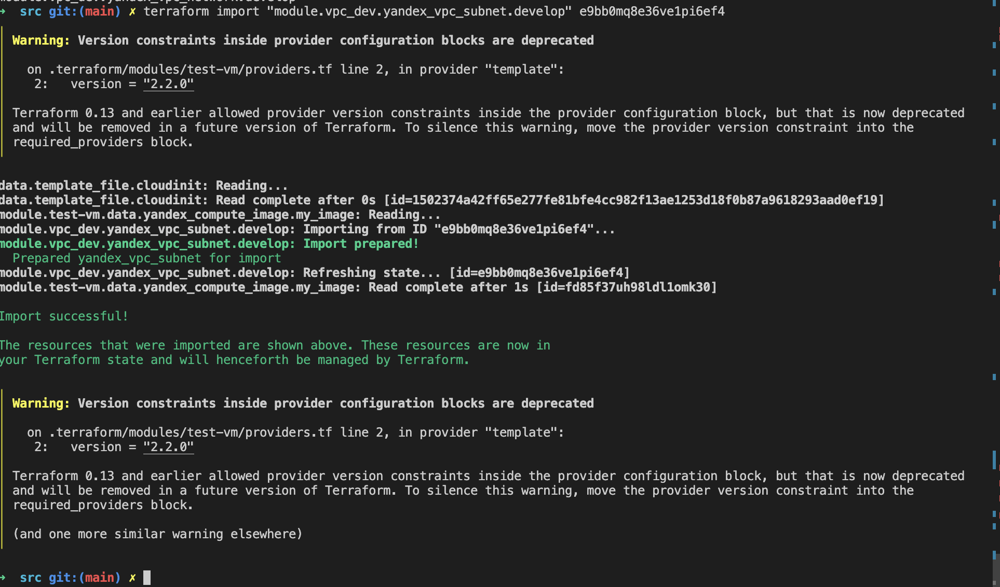
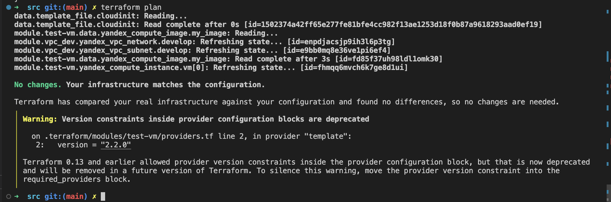
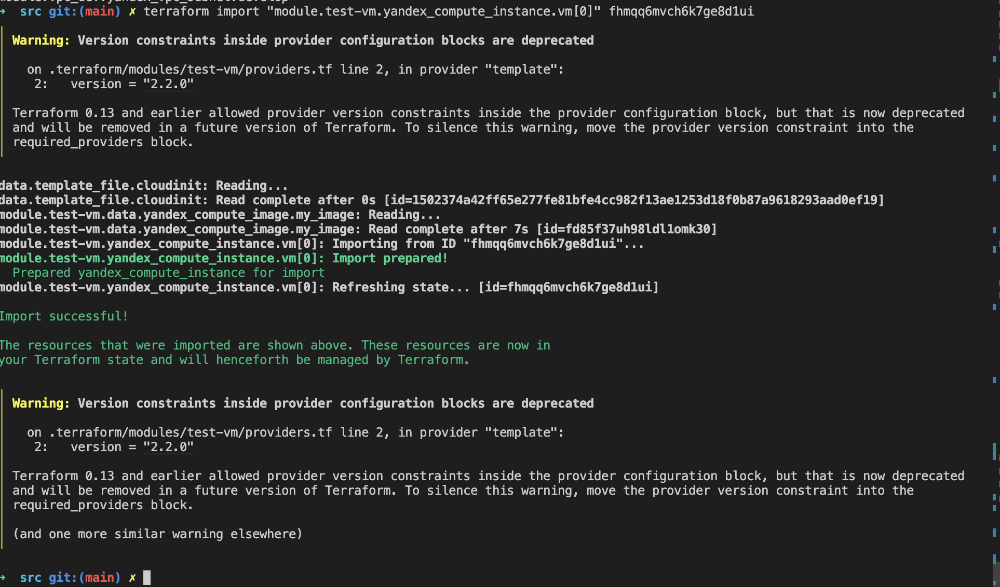

# Домашнее задание к занятию "Продвинутые методы работы с Terraform"


### Задание 1

1. Возьмите из [демонстрации к лекции готовый код](https://github.com/netology-code/ter-homeworks/tree/main/04/demonstration1) для создания ВМ с помощью remote модуля.
2. Создайте 1 ВМ, используя данный модуль. В файле cloud-init.yml необходимо использовать переменную для ssh ключа вместо хардкода. Передайте ssh-ключ в функцию template_file в блоке vars ={} .
Воспользуйтесь [**примером**](https://grantorchard.com/dynamic-cloudinit-content-with-terraform-file-templates/). Обратите внимание что ssh-authorized-keys принимает в себя список, а не строку!
3. Добавьте в файл cloud-init.yml установку nginx.
4. Предоставьте скриншот подключения к консоли и вывод команды ```sudo nginx -t```.

### Ответ:
---
Доработанные файлы: 
- [cloud-init.yml](demonstration1/cloud-init.yml)
- [main.tf](demonstration1/main.tf)

Вывод команды `nginx -t`


------

### Задание 2

1. Напишите локальный модуль vpc, который будет создавать 2 ресурса: **одну** сеть и **одну** подсеть в зоне, объявленной при вызове модуля. например: ```ru-central1-a```.
2. Модуль должен возвращать значения vpc.id и subnet.id
3. Замените ресурсы yandex_vpc_network и yandex_vpc_subnet, созданным модулем.
4. Сгенерируйте документацию к модулю с помощью terraform-docs.    
 
Пример вызова:
```
module "vpc_dev" {
  source       = "./vpc"
  env_name     = "develop"
  zone = "ru-central1-a"
  cidr = "10.0.1.0/24"
}
```
### Ответ:
---

- Модуль - [vpc_dev](src/modules/vpc_dev/)
- Модуль возвращает значения - [ output vpc_dev](src/modules/vpc_dev/output.tf)
- Замените ресурсы yandex_vpc_network и yandex_vpc_subnet - [main.tf](src/modules/vpc_dev/main.tf)
- Документация к модулю [vpc_dev.md](src/modules/vpc_dev/vpc_dev.md)
  

---

### Задание 3
1. Выведите список ресурсов в стейте.
2. Полностью удалите из стейта модуль vpc.
3. Полностью удалите из стейта модуль vm.
4. Импортируйте все обратно. Проверьте terraform plan - изменений быть не должно.
Приложите список выполненных команд и скриншоты процессы.

### Ответ:
---

1. Выведите список ресурсов в стейте.
   
2. Полностью удалите из стейта модуль vpc.
   
3. Полностью удалите из стейта модуль vm.
   
4. Импортируйте все обратно.
   

   

   

   
---


