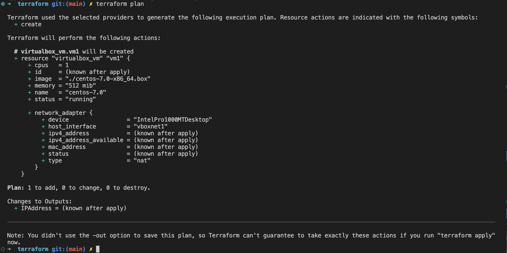

# Домашнее задание к занятию «Введение в Terraform»

### Задание 1

1. Перейдите в каталог [**src**](https://github.com/netology-code/ter-homeworks/tree/main/01/src). Скачайте все необходимые зависимости, использованные в проекте. 
2. Изучите файл **.gitignore**. В каком terraform файле согласно этому .gitignore допустимо сохранить личную, секретную информацию?
3. Выполните код проекта. Найдите  в State-файле секретное содержимое созданного ресурса **random_password**, пришлите в качестве ответа конкретный ключ и его значение.
4. Раскомментируйте блок кода, примерно расположенный на строчках 29-42 файла **main.tf**.
Выполните команду ```terraform validate```. Объясните в чем заключаются намеренно допущенные ошибки? Исправьте их.
5. Выполните код. В качестве ответа приложите вывод команды ```docker ps```
6. Замените имя docker-контейнера в блоке кода на ```hello_world```, выполните команду ```terraform apply -auto-approve```.
Объясните своими словами, в чем может быть опасность применения ключа  ```-auto-approve``` ? В качестве ответа дополнительно приложите вывод команды ```docker ps```
8. Уничтожьте созданные ресурсы с помощью **terraform**. Убедитесь, что все ресурсы удалены. Приложите содержимое файла **terraform.tfstate**. 
9. Объясните, почему при этом не был удален docker образ **nginx:latest** ? Ответ подкрепите выдержкой из документации провайдера.

### Ответ:
---
- Изучите файл **.gitignore**. В каком terraform файле согласно этому .gitignore допустимо сохранить личную, секретную информацию?
  - Согласно файлу **.gitignore**
    ```
    # Local .terraform directories and files
    **/.terraform/*
    .terraform*

    # .tfstate files
    *.tfstate
    *.tfstate.*

    # own secret vars store.
    personal.auto.tfvars
    ```
    Нет, не допустимо сохранить личную, секретную информацию, если она не прописана напрямую в файлах проекта.
- Выполните код проекта. Найдите  в State-файле секретное содержимое созданного ресурса **random_password**, пришлите в качестве ответа конкретный ключ и его значение.
  - `"result": "u1LJ9Eb19IFrHKni"`
- Раскомментируйте блок кода, примерно расположенный на строчках 29-42 файла **main.tf**.
Выполните команду ```terraform validate```. Объясните в чем заключаются намеренно допущенные ошибки? Исправьте их.
  - Команда проверяет синтаксис.

    ---
    
    Ошибка связана с неправильным именованием, имя должно начинаться с буквы или символа подчеркивания. Исправим на `nginx1`

    ---
    
    Ошибка связана с тем что блок ресурса должен содержать `type` и `name`. Допишем имя ресурса `nginx`.

    ---
    
    Ошибка связана с тем что блок ресурса `random_password` с именем `random_string_fake` не задекларирован. Исправим на `random_string`.

    ---
    
    Ошибка связана с тем что объект `random_password.random_string` не содержит атрибута `resuld`. Исправим на `result`.

    В результате получаем:
    main.tf
    ```hcl
    terraform {
        required_providers {
            docker = {
            source  = "kreuzwerker/docker"
            version = "~> 3.0.1"
            }
        }
        required_version = ">=0.13" /*Многострочный комментарий.
        Требуемая версия terraform */
    }
    provider "docker" {}

    #однострочный комментарий

    resource "random_password" "random_string" {
        length      = 16
        special     = false
        min_upper   = 1
        min_lower   = 1
        min_numeric = 1
    }


    resource "docker_image" "nginx" {
        name         = "nginx:latest"
        keep_locally = true
    }

    resource "docker_container" "nginx1" {
        image = docker_image.nginx.image_id
        name  = "example_${random_password.random_string.result}"

        ports {
            internal = 80
            external = 8000
        }
    }


    ```
    

    ---
- Выполните код. В качестве ответа приложите вывод команды ```docker ps```
  
- Замените имя docker-контейнера в блоке кода на ```hello_world```, выполните команду ```terraform apply -auto-approve```.
  
  - Объясните своими словами, в чем может быть опасность применения ключа  ```-auto-approve``` ?
    - ```-auto-approve``` опасен тем, что при исполнение кода не требуется подтверждение человека, и может произойти не приятная ситуация, когда не валидный код попадет в продакшн среду, что как минимум повлечет временные затраты на восстановление инфраструктуры. Подходит для тестирования.
- Уничтожьте созданные ресурсы с помощью **terraform**. Убедитесь, что все ресурсы удалены. Приложите содержимое файла **terraform.tfstate**. 
  - `terraform destroy`
    
- Объясните, почему при этом не был удален docker образ **nginx:latest** ?
  - `force_remove` (Boolean) If true, then the image is removed forcibly when the resource is destroyed. Думаю по умолчанию используеться `false`

## Дополнительные задания (со звездочкой*)

**Настоятельно рекомендуем выполнять все задания под звёздочкой.**   Их выполнение поможет глубже разобраться в материале.   
Задания под звёздочкой дополнительные (необязательные к выполнению) и никак не повлияют на получение вами зачета по этому домашнему заданию. 

### Задание 2*

1. Изучите в документации provider [**Virtualbox**](https://docs.comcloud.xyz/providers/shekeriev/virtualbox/latest/docs) от 
shekeriev.
2. Создайте с его помощью любую виртуальную машину. Чтобы не использовать VPN советуем выбрать любой образ с расположением в github из [**списка**](https://www.vagrantbox.es/)

В качестве ответа приложите plan для создаваемого ресурса и скриншот созданного в VB ресурса. 

### Ответ:
---
Код проекта [main.tf](assets/terraform/main.tf)

`terraform plan`




---

