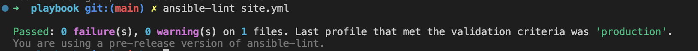
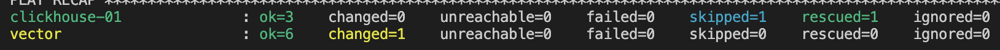
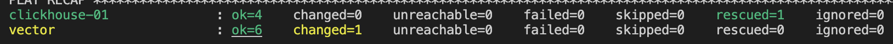
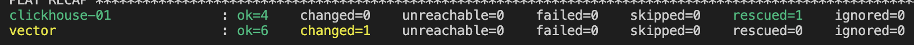

# Домашнее задание к занятию 2 «Работа с Playbook»

## Задание

1. Подготовьте свой inventory-файл `prod.yml`.
2. Допишите playbook: нужно сделать ещё один play, который устанавливает и настраивает [vector](https://vector.dev). Конфигурация vector должна деплоиться через template файл jinja2.
3. При создании tasks рекомендую использовать модули: `get_url`, `template`, `unarchive`, `file`.
4. Tasks должны: скачать дистрибутив нужной версии, выполнить распаковку в выбранную директорию, установить vector.
5. Запустите `ansible-lint site.yml` и исправьте ошибки, если они есть.
6. Попробуйте запустить playbook на этом окружении с флагом `--check`.
7. Запустите playbook на `prod.yml` окружении с флагом `--diff`. Убедитесь, что изменения на системе произведены.
8. Повторно запустите playbook с флагом `--diff` и убедитесь, что playbook идемпотентен.
9. Подготовьте README.md-файл по своему playbook. В нём должно быть описано: что делает playbook, какие у него есть параметры и теги. Пример качественной документации ansible playbook по [ссылке](https://github.com/opensearch-project/ansible-playbook).
10. Готовый playbook выложите в свой репозиторий, поставьте тег `08-ansible-02-playbook` на фиксирующий коммит, в ответ предоставьте ссылку на него.

---

### Ответ:

1. inventory-файл [prod.yml](playbook/inventory/prod.yml).
2. Допишите playbook:

    ```yaml
    - name: Install vector
    hosts: clickhouse
    become: true
    tags: vector
    tasks:
    - name: Get vector distrib
        ansible.builtin.get_url:
        url: "https://github.com/vectordotdev/vector/releases/download/v{{ vector_version }}/vector-{{ vector_version }}-1.x86_64.rpm"
        dest: ./vector-{{ vector_version }}-1.x86_64.rpm
    - name: install packs
        dnf:
        name:
            - vector-{{ vector_version }}-1.x86_64.rpm
        disable_gpg_check: yes
    - name: Configure vector
        ansible.builtin.template:
        src: vector.toml.j2
        dest: "{{ vector_config_dir }}/vector.toml"
    - name: Configure vector
        ansible.builtin.template:
        src: vector.service.j2
        dest: "/etc/systemd/system/vector.service"  
    - name: Start vector as service
        ansible.builtin.systemd:
        state: restarted
        daemon_reload: true
        enabled: true
        name: vector
    ```
3. Запустите `ansible-lint site.yml` 
    

4. Попробуйте запустить playbook на этом окружении с флагом `--check` 
   
5. Запустите playbook на `prod.yml` окружении с флагом `--diff`. Убедитесь, что изменения на системе произведены.
   
   
   Повторно запустите playbook с флагом `--diff` и убедитесь, что playbook идемпотентен.
   
6. [README.md-файл](playbook/README.md) по playbook.
---
