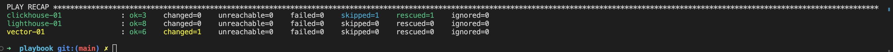

# Домашнее задание к занятию 3 «Использование Ansible»

## Подготовка к выполнению

1. Подготовьте в Yandex Cloud три хоста: для `clickhouse`, для `vector` и для `lighthouse`.
2. Репозиторий LightHouse находится [по ссылке](https://github.com/VKCOM/lighthouse).

## Основная часть

1. Допишите playbook: нужно сделать ещё один play, который устанавливает и настраивает LightHouse.
2. При создании tasks рекомендую использовать модули: `get_url`, `template`, `yum`, `apt`.
3. Tasks должны: скачать статику LightHouse, установить Nginx или любой другой веб-сервер, настроить его конфиг для открытия LightHouse, запустить веб-сервер.
4. Подготовьте свой inventory-файл `prod.yml`.
5. Запустите `ansible-lint site.yml` и исправьте ошибки, если они есть.
6. Попробуйте запустить playbook на этом окружении с флагом `--check`.
7. Запустите playbook на `prod.yml` окружении с флагом `--diff`. Убедитесь, что изменения на системе произведены.
8. Повторно запустите playbook с флагом `--diff` и убедитесь, что playbook идемпотентен.
9. Подготовьте README.md-файл по своему playbook. В нём должно быть описано: что делает playbook, какие у него есть параметры и теги.
10. Готовый playbook выложите в свой репозиторий, поставьте тег `08-ansible-03-yandex` на фиксирующий коммит, в ответ предоставьте ссылку на него.

---

### Ответ:

---
- Допишите playbook: нужно сделать ещё один play, который устанавливает и настраивает LightHouse.
<details>
  <summary>lighthouse tasks</summary>

```yaml
- name: Install nginx
  hosts: lighthouse
  become: true
  tags: lighthouse
  handlers:
    - name: Started nginx
      ansible.builtin.service:
        name: nginx
        state: started
    - name: Start reloaded
      ansible.builtin.service:
        name: nginx
        state: reloaded
  tasks:
    - name: Intsall epel-release
      become: true
      ansible.builtin.dnf:
        name: epel-release
        state: present
    - name: Intsall nginx
      become: true
      ansible.builtin.dnf:
        name: nginx
        state: present
      notify: Started nginx
    - name: Configure nginx
      become: true
      ansible.builtin.template:
        src: nginx.conf.j2
        dest: /etc/nginx/nginx.conf
        mode: "0644"
      notify: Start reloaded

- name: Install lighthouse
  hosts: lighthouse
  become: true
  tags: lighthouse
  handlers:
    - name: Start reloaded
      ansible.builtin.service:
        name: nginx
        state: reloaded
  pre_tasks:
    - name: Install git
      become: true
      ansible.builtin.dnf:
        name: git
        state: present
  tasks:
    - name: Get ligthhouse repo
      ansible.builtin.git:
        repo: "{{ lighthouse_repo }}"
        version: master
        dest: "{{ lighthouse_dir }}"
    - name: Configure lighthouse
      ansible.builtin.template:
        src: lighthouse.conf.j2
        dest: /etc/nginx/conf.d/lighthouse.conf
        mode: "0644"
      notify: Start reloaded

```
</details>

---

- Подготовьте свой inventory-файл `prod.yml`.
<details>
  <summary>prod.yml</summary>

```yaml
clickhouse:
  hosts:
    clickhouse-01:
      ansible_host: <ip>
      # host_key_checking: False
      # ansible_ssh_common_args: '-o StrictHostKeyChecking=no'
vector:
  hosts:
    vector-01:
      ansible_host: <ip>
      # host_key_checking: False
      # ansible_ssh_common_args: '-o StrictHostKeyChecking=no'
lighthouse:
  hosts:
    lighthouse-01:
      ansible_host: <ip>
      # host_key_checking: False
      # ansible_ssh_common_args: '-o StrictHostKeyChecking=no'
```
</details>

---

- Запустите `ansible-lint site.yml` и исправьте ошибки, если они есть.
  

---

- Попробуйте запустить playbook на этом окружении с флагом `--check`.
  

---

- Запустите playbook на `prod.yml` окружении с флагом `--diff`. Убедитесь, что изменения на системе произведены.
  

---
- [README.md-файл](playbook/README.md) по playbook.