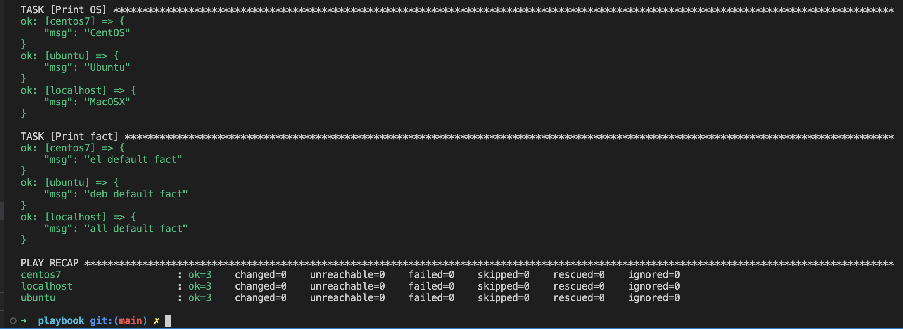

# Домашнее задание к занятию 1 «Введение в Ansible»

## Основная часть

1. Попробуйте запустить playbook на окружении из `test.yml`, зафиксируйте значение, которое имеет факт `some_fact` для указанного хоста при выполнении playbook.
2. Найдите файл с переменными (group_vars), в котором задаётся найденное в первом пункте значение, и поменяйте его на `all default fact`.
3. Воспользуйтесь подготовленным (используется `docker`) или создайте собственное окружение для проведения дальнейших испытаний.
4. Проведите запуск playbook на окружении из `prod.yml`. Зафиксируйте полученные значения `some_fact` для каждого из `managed host`.
5. Добавьте факты в `group_vars` каждой из групп хостов так, чтобы для `some_fact` получились значения: для `deb` — `deb default fact`, для `el` — `el default fact`.
6.  Повторите запуск playbook на окружении `prod.yml`. Убедитесь, что выдаются корректные значения для всех хостов.
7. При помощи `ansible-vault` зашифруйте факты в `group_vars/deb` и `group_vars/el` с паролем `netology`.
8. Запустите playbook на окружении `prod.yml`. При запуске `ansible` должен запросить у вас пароль. Убедитесь в работоспособности.
9. Посмотрите при помощи `ansible-doc` список плагинов для подключения. Выберите подходящий для работы на `control node`.
10. В `prod.yml` добавьте новую группу хостов с именем  `local`, в ней разместите localhost с необходимым типом подключения.
11. Запустите playbook на окружении `prod.yml`. При запуске `ansible` должен запросить у вас пароль. Убедитесь, что факты `some_fact` для каждого из хостов определены из верных `group_vars`.
12. Заполните `README.md` ответами на вопросы. Сделайте `git push` в ветку `master`. В ответе отправьте ссылку на ваш открытый репозиторий с изменённым `playbook` и заполненным `README.md`.

### Ответ:
---

1.  
2.  Файл расположен в `/playbook/group_vars/all/examp.yml` 
3.  Создал 2 вм centos и ubuntu 
4.  
5.  `/playbook/group_vars/deb/examp.yml`
    ```yml
    ---
    some_fact: "deb default fact"
    ```
    `/playbook/group_vars/el/examp.yml`
    ```yml
    ---
    some_fact: "el default fact"
    ```
6. 
7. 
   
   
8. 
9. Посмотреть список плагинов подключения `ansible-doc -l -t connection`, наиболее подходящий плагин: `ansible.builtin.local          execute on controller `
    
10. В `prod.yml` добавьте новую группу хостов
    
    

11. Запустите playbook на окружении `prod.yml`
    
